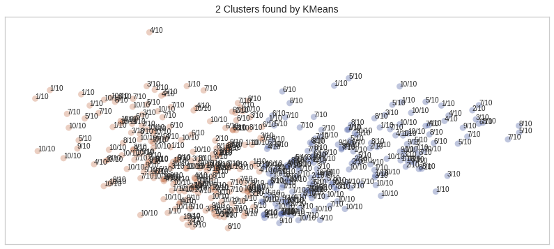
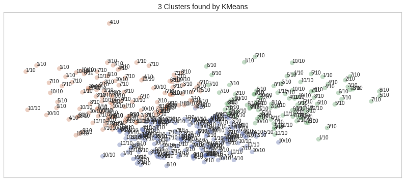
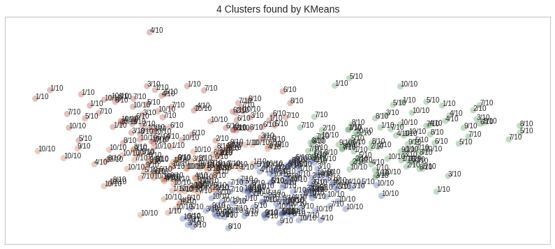
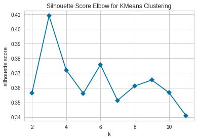
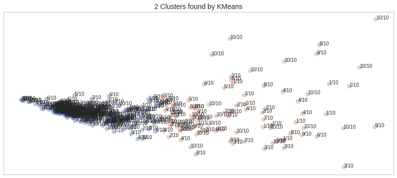
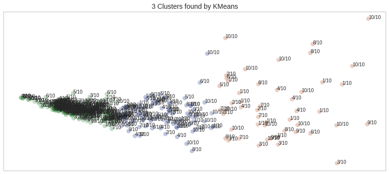
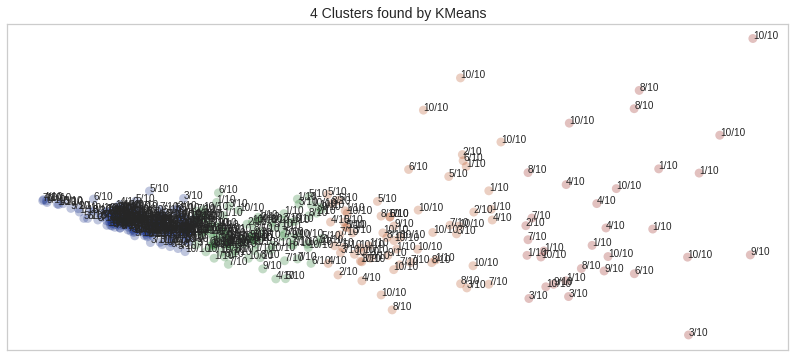
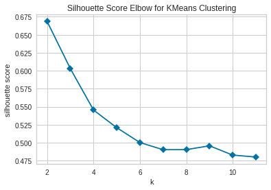

## IMDB Movie Reviews Clustering
#### Author: Kevin Okiah

#### 03/29/2019

**What is Covered in this Notebook?**

In this notebook, I explore clustering of ~198 movie Action reviews collected from imdb link "https://www.imdb.com/search/title?title_type=feature&user_rating=3.5,&num_votes=10000,&genres=action&sort=user_rating,desc" via webscrapping. 

For each movie one <font color='green'>**positive**</font> and one <font color='red'>**negative**</font> review was collected. A positive review is identified as a review with a rating greater than 6/10 where as a negative review is identified as a review with a rating less 5/10.

The reviews were preprocessed {Tokenized, Changed to lower contractions expanded, Stopwords and punctuations removed, lemmatized,  and vectorised using TF-IDF for Clustering.

PCA was leveraged to change the high dimensional vectorized data into 2 dimension for clustering and easy visualization.

`"Kmean"`, `"MiniBatch"`, `"Spectral"` and `"Agglomerative"` clustering are explored. The number of clusters is varied from 2 to 4 to get the optimal grouping visually. Since we are working with know two review classes (postive Review and negative Review) ideally you would have expected to have two distinct classess.

I get interesting results where all the 4 clustering algorithm listed above show 3 as the optimal number of clusters to group the movie reviews. KMEANS elbow method with `silhouette`. Silhouette coefficients near +1 indicate that the sample is far away from the neighboring clusters. A value of 0 indicates that the sample is on or very close to the decision boundary between two neighboring clusters and negative values indicate that those samples might have been assigned to the wrong cluster. The Silhouette scores are less than 0.5 indicating the clusters formed are weak and not well separated.

I proceed to engineer new features, `number_of_words`, `number_of_unique_words`, and  `Average_length_of Words` and repeat clustering. The new clusters are well separated as indicated by the increase in silhouette score indicating improved cluster formation as a result of the new features. Silhouette scores for 2 clusters `(0.66)` and  3 `(0.60)` clusters are greater than 0.6 indicating improved cluster formation.

Using Doman knowledge on the data, two clusters are the realistic grouping for this data. This is based on the known fact that the reviews fall into two categories  positive and negative. 

For this particular analysis since PCA is used, we loose the granuality of what features drive the clustering/grouping of  movie reviews.


```python
import numpy as np
import pandas as pd
import selenium
from lxml import html
import urllib3
from bs4 import BeautifulSoup
import lxml
import urllib 
import nltk
import string
from urllib3 import request
from string import punctuation
import pickle
import seaborn as sns
import matplotlib.pyplot as plt
from nltk.stem import RegexpStemmer #user defined rules
from TextCleaningToolkit import *
import re
from sklearn.feature_extraction.text import CountVectorizer, TfidfVectorizer
rg = nltk.RegexpTokenizer(pattern=r'\s+',gaps =True)
ps = nltk.PorterStemmer()
stopwords = nltk.corpus.stopwords.words('english')

%matplotlib inline

#leveraging Sarkar's codes
from normalization import normalize_corpus 
from utils import build_feature_matrix 
import numpy as np
```


```python
# The starting data was scrapped from webscrapping. See "4. IMDB MovieReviews WebScrapping" directory
with open('Final_Movie_List_clean.p', 'rb') as f:
     MoviesReviews = pickle.load(f)
```


```python
MoviesReviews.head(2)
```


<div>
<style scoped>
    .dataframe tbody tr th:only-of-type {
        vertical-align: middle;
    }

    .dataframe tbody tr th {
        vertical-align: top;
    }

    .dataframe thead th {
        text-align: right;
    }
</style>
<table border="1" class="dataframe">
  <thead>
    <tr style="text-align: right;">
      <th></th>
      <th>Movie</th>
      <th>Review_Title</th>
      <th>Review_Author</th>
      <th>Review_Date</th>
      <th>Review_Rating</th>
      <th>Review</th>
      <th>Rating</th>
      <th>Tokens</th>
      <th>Chunks</th>
    </tr>
  </thead>
  <tbody>
    <tr>
      <th>0</th>
      <td>1 - Nenokkadine (2014) - IMDb</td>
      <td>Its like watching a color film during the bla...</td>
      <td>s-vinaykumar12345610</td>
      <td>January/2014</td>
      <td>9/10</td>
      <td>Its the same excitement that bring to every to...</td>
      <td>1</td>
      <td>[excitement, bring, every, tollywood, movie, g...</td>
      <td>[its the same excitement, bring, to, every tol...</td>
    </tr>
    <tr>
      <th>1</th>
      <td>24 (2016) - IMDb</td>
      <td>Worth the TIME!!</td>
      <td>naveensankaran186</td>
      <td>May/2016</td>
      <td>9/10</td>
      <td>Vikram K Kumar is the real hero! All his work ...</td>
      <td>1</td>
      <td>[vikram, k, kumar, real, hero, work, make, det...</td>
      <td>[vikram k kumar, is, the real hero, all his wo...</td>
    </tr>
  </tbody>
</table>
</div>


```python
MoviesReviews.shape
```


    (387, 9)


```python
# normalize and extract features from the 387 movie reviews from imdb
'''
Steps to clean text
1. Break text into sentences/lines
2. Change senteces to lower case
3. Expland contractions for each sentence. Turning shortforms like Can't to Can not
4. Perform lemmatization
'''
Reviews_corpus = normalize_corpus(MoviesReviews.Review, lemmatize=False ) 
```


```python
Reviews_corpus[1]
```


    u'vikram k kumar real hero work making detailed script payed screenplay slightly hard digest commercial movie lovers loved way penned screenplay romantic part well combined sci fi part engaging enjoyable greatest comeback surya theri vijay 24 surya basks whole movie delivers great performance aathraya role needs special mention literally steals show sleek villainous role watch arr silently keeps flow movie bgm disturbed unlike others art direction cinematography completes visual cycle beautifully special appreciations every character given importance waiting sci fi thriller thamizh cinema good detailing takes time good look completely although lines indru netru naalai 24 movie watch purely screenplay aathraya highlight whole movie must watch theater sci fi thamizh 9 10'


```python
def Tokenize_text(text):
    '''
    Function to tokenize text
    '''
    tokens = rg.tokenize(text)#Tokenize the text
    Tokens =lemming(tokens) #Lemmetization of the tokens to get root words
    return Tokens
```


```python
# Feature Engineering 
"""
    1. Number of unique words
    2. Average length of words
    3. number of words
"""
 
tempDict = {}
number_of_words =[]
number_of_uniquewords =[]
wordlengths =[]
for review in range(0, len(Reviews_corpus)): 
    tempWordsList =Tokenize_text(Reviews_corpus[review])
    tempUniqueList = list(np.unique(tempWordsList))
    lengths = []
    for i in tempUniqueList:
        lengths = lengths+ [len(i)]
    number_of_words = number_of_words + [len(tempWordsList)]
    number_of_uniquewords = number_of_uniquewords + [len(tempUniqueList)]
    wordlengths = wordlengths + [np.mean(lengths)]
        
tempDict.update({"NumberOfWords":number_of_words, "NumberOfUniqueWords":number_of_uniquewords,"AvgWordLength":wordlengths })

Engineered_Features = pd.DataFrame.from_dict(tempDict)
Engineered_Features 
#tempDict
```


<div>
<style scoped>
    .dataframe tbody tr th:only-of-type {
        vertical-align: middle;
    }

    .dataframe tbody tr th {
        vertical-align: top;
    }

    .dataframe thead th {
        text-align: right;
    }
</style>
<table border="1" class="dataframe">
  <thead>
    <tr style="text-align: right;">
      <th></th>
      <th>AvgWordLength</th>
      <th>NumberOfUniqueWords</th>
      <th>NumberOfWords</th>
    </tr>
  </thead>
  <tbody>
    <tr>
      <th>0</th>
      <td>5.551020</td>
      <td>98</td>
      <td>134</td>
    </tr>
    <tr>
      <th>1</th>
      <td>5.853933</td>
      <td>89</td>
      <td>112</td>
    </tr>
    <tr>
      <th>2</th>
      <td>5.055556</td>
      <td>54</td>
      <td>81</td>
    </tr>
    <tr>
      <th>3</th>
      <td>5.526316</td>
      <td>76</td>
      <td>94</td>
    </tr>
    <tr>
      <th>4</th>
      <td>5.743590</td>
      <td>273</td>
      <td>438</td>
    </tr>
    <tr>
      <th>5</th>
      <td>6.083333</td>
      <td>264</td>
      <td>329</td>
    </tr>
    <tr>
      <th>6</th>
      <td>5.511628</td>
      <td>43</td>
      <td>54</td>
    </tr>
    <tr>
      <th>7</th>
      <td>6.078652</td>
      <td>89</td>
      <td>106</td>
    </tr>
    <tr>
      <th>8</th>
      <td>5.446602</td>
      <td>206</td>
      <td>310</td>
    </tr>
    <tr>
      <th>9</th>
      <td>5.478723</td>
      <td>94</td>
      <td>133</td>
    </tr>
    <tr>
      <th>10</th>
      <td>5.669145</td>
      <td>269</td>
      <td>394</td>
    </tr>
    <tr>
      <th>11</th>
      <td>5.437500</td>
      <td>64</td>
      <td>69</td>
    </tr>
    <tr>
      <th>12</th>
      <td>4.875000</td>
      <td>144</td>
      <td>202</td>
    </tr>
    <tr>
      <th>13</th>
      <td>6.000000</td>
      <td>48</td>
      <td>64</td>
    </tr>
    <tr>
      <th>14</th>
      <td>6.145455</td>
      <td>165</td>
      <td>183</td>
    </tr>
    <tr>
      <th>15</th>
      <td>6.517857</td>
      <td>112</td>
      <td>163</td>
    </tr>
    <tr>
      <th>16</th>
      <td>5.781022</td>
      <td>137</td>
      <td>187</td>
    </tr>
    <tr>
      <th>17</th>
      <td>5.805970</td>
      <td>67</td>
      <td>75</td>
    </tr>
    <tr>
      <th>18</th>
      <td>5.834254</td>
      <td>181</td>
      <td>250</td>
    </tr>
    <tr>
      <th>19</th>
      <td>6.053571</td>
      <td>56</td>
      <td>65</td>
    </tr>
    <tr>
      <th>20</th>
      <td>5.720000</td>
      <td>50</td>
      <td>69</td>
    </tr>
    <tr>
      <th>21</th>
      <td>5.867725</td>
      <td>189</td>
      <td>278</td>
    </tr>
    <tr>
      <th>22</th>
      <td>5.270833</td>
      <td>96</td>
      <td>110</td>
    </tr>
    <tr>
      <th>23</th>
      <td>5.738220</td>
      <td>191</td>
      <td>246</td>
    </tr>
    <tr>
      <th>24</th>
      <td>6.178571</td>
      <td>112</td>
      <td>125</td>
    </tr>
    <tr>
      <th>25</th>
      <td>5.134615</td>
      <td>52</td>
      <td>61</td>
    </tr>
    <tr>
      <th>26</th>
      <td>5.338028</td>
      <td>71</td>
      <td>88</td>
    </tr>
    <tr>
      <th>27</th>
      <td>4.588235</td>
      <td>34</td>
      <td>41</td>
    </tr>
    <tr>
      <th>28</th>
      <td>5.696078</td>
      <td>102</td>
      <td>127</td>
    </tr>
    <tr>
      <th>29</th>
      <td>5.961853</td>
      <td>367</td>
      <td>518</td>
    </tr>
    <tr>
      <th>...</th>
      <td>...</td>
      <td>...</td>
      <td>...</td>
    </tr>
    <tr>
      <th>357</th>
      <td>6.204819</td>
      <td>83</td>
      <td>101</td>
    </tr>
    <tr>
      <th>358</th>
      <td>6.382166</td>
      <td>157</td>
      <td>187</td>
    </tr>
    <tr>
      <th>359</th>
      <td>5.128571</td>
      <td>70</td>
      <td>98</td>
    </tr>
    <tr>
      <th>360</th>
      <td>6.032258</td>
      <td>93</td>
      <td>120</td>
    </tr>
    <tr>
      <th>361</th>
      <td>5.375000</td>
      <td>120</td>
      <td>145</td>
    </tr>
    <tr>
      <th>362</th>
      <td>6.205128</td>
      <td>78</td>
      <td>86</td>
    </tr>
    <tr>
      <th>363</th>
      <td>5.728682</td>
      <td>129</td>
      <td>159</td>
    </tr>
    <tr>
      <th>364</th>
      <td>5.861538</td>
      <td>65</td>
      <td>81</td>
    </tr>
    <tr>
      <th>365</th>
      <td>7.029412</td>
      <td>34</td>
      <td>34</td>
    </tr>
    <tr>
      <th>366</th>
      <td>5.605634</td>
      <td>71</td>
      <td>91</td>
    </tr>
    <tr>
      <th>367</th>
      <td>5.856061</td>
      <td>132</td>
      <td>175</td>
    </tr>
    <tr>
      <th>368</th>
      <td>5.931624</td>
      <td>234</td>
      <td>339</td>
    </tr>
    <tr>
      <th>369</th>
      <td>5.836364</td>
      <td>55</td>
      <td>73</td>
    </tr>
    <tr>
      <th>370</th>
      <td>6.051724</td>
      <td>58</td>
      <td>65</td>
    </tr>
    <tr>
      <th>371</th>
      <td>5.273973</td>
      <td>73</td>
      <td>88</td>
    </tr>
    <tr>
      <th>372</th>
      <td>5.182927</td>
      <td>82</td>
      <td>110</td>
    </tr>
    <tr>
      <th>373</th>
      <td>5.392157</td>
      <td>51</td>
      <td>56</td>
    </tr>
    <tr>
      <th>374</th>
      <td>6.020513</td>
      <td>195</td>
      <td>260</td>
    </tr>
    <tr>
      <th>375</th>
      <td>4.833333</td>
      <td>36</td>
      <td>43</td>
    </tr>
    <tr>
      <th>376</th>
      <td>5.285714</td>
      <td>175</td>
      <td>246</td>
    </tr>
    <tr>
      <th>377</th>
      <td>6.293233</td>
      <td>399</td>
      <td>570</td>
    </tr>
    <tr>
      <th>378</th>
      <td>5.372093</td>
      <td>172</td>
      <td>246</td>
    </tr>
    <tr>
      <th>379</th>
      <td>5.245614</td>
      <td>57</td>
      <td>61</td>
    </tr>
    <tr>
      <th>380</th>
      <td>5.237864</td>
      <td>206</td>
      <td>361</td>
    </tr>
    <tr>
      <th>381</th>
      <td>6.094595</td>
      <td>74</td>
      <td>96</td>
    </tr>
    <tr>
      <th>382</th>
      <td>5.814815</td>
      <td>135</td>
      <td>174</td>
    </tr>
    <tr>
      <th>383</th>
      <td>5.504854</td>
      <td>103</td>
      <td>135</td>
    </tr>
    <tr>
      <th>384</th>
      <td>5.000000</td>
      <td>81</td>
      <td>115</td>
    </tr>
    <tr>
      <th>385</th>
      <td>5.570175</td>
      <td>114</td>
      <td>146</td>
    </tr>
    <tr>
      <th>386</th>
      <td>5.816754</td>
      <td>191</td>
      <td>227</td>
    </tr>
  </tbody>
</table>
<p>387 rows × 3 columns</p>
</div>


```python
# tfidf Vectorizer text
tfidf_vect = TfidfVectorizer(analyzer=Tokenize_text)
tfidf_vect_fit = tfidf_vect.fit(Reviews_corpus)
tfidf_vect_review = tfidf_vect_fit.transform(Reviews_corpus) #vectorised reviews
data_tfidf = pd.concat([pd.DataFrame(tfidf_vect_review.toarray())], axis=1)
```


```python
data_tfidf.head()
```


<div>
<style scoped>
    .dataframe tbody tr th:only-of-type {
        vertical-align: middle;
    }

    .dataframe tbody tr th {
        vertical-align: top;
    }

    .dataframe thead th {
        text-align: right;
    }
</style>
<table border="1" class="dataframe">
  <thead>
    <tr style="text-align: right;">
      <th></th>
      <th>0</th>
      <th>1</th>
      <th>2</th>
      <th>3</th>
      <th>4</th>
      <th>5</th>
      <th>6</th>
      <th>7</th>
      <th>8</th>
      <th>9</th>
      <th>...</th>
      <th>9869</th>
      <th>9870</th>
      <th>9871</th>
      <th>9872</th>
      <th>9873</th>
      <th>9874</th>
      <th>9875</th>
      <th>9876</th>
      <th>9877</th>
      <th>9878</th>
    </tr>
  </thead>
  <tbody>
    <tr>
      <th>0</th>
      <td>0.0</td>
      <td>0.0</td>
      <td>0.0</td>
      <td>0.0</td>
      <td>0.0</td>
      <td>0.0</td>
      <td>0.043754</td>
      <td>0.0</td>
      <td>0.0</td>
      <td>0.0</td>
      <td>...</td>
      <td>0.0</td>
      <td>0.0</td>
      <td>0.0</td>
      <td>0.0</td>
      <td>0.0</td>
      <td>0.0</td>
      <td>0.0</td>
      <td>0.0</td>
      <td>0.0</td>
      <td>0.0</td>
    </tr>
    <tr>
      <th>1</th>
      <td>0.0</td>
      <td>0.0</td>
      <td>0.0</td>
      <td>0.0</td>
      <td>0.0</td>
      <td>0.0</td>
      <td>0.047589</td>
      <td>0.0</td>
      <td>0.0</td>
      <td>0.0</td>
      <td>...</td>
      <td>0.0</td>
      <td>0.0</td>
      <td>0.0</td>
      <td>0.0</td>
      <td>0.0</td>
      <td>0.0</td>
      <td>0.0</td>
      <td>0.0</td>
      <td>0.0</td>
      <td>0.0</td>
    </tr>
    <tr>
      <th>2</th>
      <td>0.0</td>
      <td>0.0</td>
      <td>0.0</td>
      <td>0.0</td>
      <td>0.0</td>
      <td>0.0</td>
      <td>0.000000</td>
      <td>0.0</td>
      <td>0.0</td>
      <td>0.0</td>
      <td>...</td>
      <td>0.0</td>
      <td>0.0</td>
      <td>0.0</td>
      <td>0.0</td>
      <td>0.0</td>
      <td>0.0</td>
      <td>0.0</td>
      <td>0.0</td>
      <td>0.0</td>
      <td>0.0</td>
    </tr>
    <tr>
      <th>3</th>
      <td>0.0</td>
      <td>0.0</td>
      <td>0.0</td>
      <td>0.0</td>
      <td>0.0</td>
      <td>0.0</td>
      <td>0.000000</td>
      <td>0.0</td>
      <td>0.0</td>
      <td>0.0</td>
      <td>...</td>
      <td>0.0</td>
      <td>0.0</td>
      <td>0.0</td>
      <td>0.0</td>
      <td>0.0</td>
      <td>0.0</td>
      <td>0.0</td>
      <td>0.0</td>
      <td>0.0</td>
      <td>0.0</td>
    </tr>
    <tr>
      <th>4</th>
      <td>0.0</td>
      <td>0.0</td>
      <td>0.0</td>
      <td>0.0</td>
      <td>0.0</td>
      <td>0.0</td>
      <td>0.000000</td>
      <td>0.0</td>
      <td>0.0</td>
      <td>0.0</td>
      <td>...</td>
      <td>0.0</td>
      <td>0.0</td>
      <td>0.0</td>
      <td>0.0</td>
      <td>0.0</td>
      <td>0.0</td>
      <td>0.0</td>
      <td>0.0</td>
      <td>0.0</td>
      <td>0.0</td>
    </tr>
  </tbody>
</table>
<p>5 rows × 9879 columns</p>
</div>


```python
data_tfidf.shape
```


    (387, 9879)


```python
#merge engineered features to vectorised data
tfidf_feat = pd.concat([Engineered_Features,data_tfidf], axis=1)
tfidf_feat.head()
```


<div>
<style scoped>
    .dataframe tbody tr th:only-of-type {
        vertical-align: middle;
    }

    .dataframe tbody tr th {
        vertical-align: top;
    }

    .dataframe thead th {
        text-align: right;
    }
</style>
<table border="1" class="dataframe">
  <thead>
    <tr style="text-align: right;">
      <th></th>
      <th>AvgWordLength</th>
      <th>NumberOfUniqueWords</th>
      <th>NumberOfWords</th>
      <th>0</th>
      <th>1</th>
      <th>2</th>
      <th>3</th>
      <th>4</th>
      <th>5</th>
      <th>6</th>
      <th>...</th>
      <th>9869</th>
      <th>9870</th>
      <th>9871</th>
      <th>9872</th>
      <th>9873</th>
      <th>9874</th>
      <th>9875</th>
      <th>9876</th>
      <th>9877</th>
      <th>9878</th>
    </tr>
  </thead>
  <tbody>
    <tr>
      <th>0</th>
      <td>5.551020</td>
      <td>98</td>
      <td>134</td>
      <td>0.0</td>
      <td>0.0</td>
      <td>0.0</td>
      <td>0.0</td>
      <td>0.0</td>
      <td>0.0</td>
      <td>0.043754</td>
      <td>...</td>
      <td>0.0</td>
      <td>0.0</td>
      <td>0.0</td>
      <td>0.0</td>
      <td>0.0</td>
      <td>0.0</td>
      <td>0.0</td>
      <td>0.0</td>
      <td>0.0</td>
      <td>0.0</td>
    </tr>
    <tr>
      <th>1</th>
      <td>5.853933</td>
      <td>89</td>
      <td>112</td>
      <td>0.0</td>
      <td>0.0</td>
      <td>0.0</td>
      <td>0.0</td>
      <td>0.0</td>
      <td>0.0</td>
      <td>0.047589</td>
      <td>...</td>
      <td>0.0</td>
      <td>0.0</td>
      <td>0.0</td>
      <td>0.0</td>
      <td>0.0</td>
      <td>0.0</td>
      <td>0.0</td>
      <td>0.0</td>
      <td>0.0</td>
      <td>0.0</td>
    </tr>
    <tr>
      <th>2</th>
      <td>5.055556</td>
      <td>54</td>
      <td>81</td>
      <td>0.0</td>
      <td>0.0</td>
      <td>0.0</td>
      <td>0.0</td>
      <td>0.0</td>
      <td>0.0</td>
      <td>0.000000</td>
      <td>...</td>
      <td>0.0</td>
      <td>0.0</td>
      <td>0.0</td>
      <td>0.0</td>
      <td>0.0</td>
      <td>0.0</td>
      <td>0.0</td>
      <td>0.0</td>
      <td>0.0</td>
      <td>0.0</td>
    </tr>
    <tr>
      <th>3</th>
      <td>5.526316</td>
      <td>76</td>
      <td>94</td>
      <td>0.0</td>
      <td>0.0</td>
      <td>0.0</td>
      <td>0.0</td>
      <td>0.0</td>
      <td>0.0</td>
      <td>0.000000</td>
      <td>...</td>
      <td>0.0</td>
      <td>0.0</td>
      <td>0.0</td>
      <td>0.0</td>
      <td>0.0</td>
      <td>0.0</td>
      <td>0.0</td>
      <td>0.0</td>
      <td>0.0</td>
      <td>0.0</td>
    </tr>
    <tr>
      <th>4</th>
      <td>5.743590</td>
      <td>273</td>
      <td>438</td>
      <td>0.0</td>
      <td>0.0</td>
      <td>0.0</td>
      <td>0.0</td>
      <td>0.0</td>
      <td>0.0</td>
      <td>0.000000</td>
      <td>...</td>
      <td>0.0</td>
      <td>0.0</td>
      <td>0.0</td>
      <td>0.0</td>
      <td>0.0</td>
      <td>0.0</td>
      <td>0.0</td>
      <td>0.0</td>
      <td>0.0</td>
      <td>0.0</td>
    </tr>
  </tbody>
</table>
<p>5 rows × 9882 columns</p>
</div>


```python
pickle.dump(data_tfidf, open( "data_tfidf.p", "wb" ) , protocol=2) # save list as pickle
pickle.dump(tfidf_feat, open( "tfidf_feat.p", "wb" ) , protocol=2) # save list as pickle
```

# Clustering


```python
import numpy as np
import matplotlib.pyplot as plt
import seaborn as sns
import sklearn.cluster as cluster
from sklearn.metrics import accuracy_score
import time
import plotly_express as px
%matplotlib inline
#.set_context('poster')
sns.set_color_codes()
plot_kwds = {'alpha' : 0.25, 's' : 80, 'linewidths':0}
```


```python
with open('data_tfidf.p', 'rb') as f:
     data_tfidf = pickle.load(f)
```


```python
# diplay clustering results
#https://github.com/scikit-learn-contrib/hdbscan/blob/master/notebooks/Comparing%20Clustering%20Algorithms.ipynb
def plot_clusters(data,n_clusters, algorithm, args, kwds, n, show_labels =False):
    '''
    Function to cluster data and plot them
    
    n = real labels from the dataset to display
    show_label = flag to display original data labels if any
    algorithm = takes any algorithm supported by sklearn
    
    '''
    start_time = time.time()
    labels = algorithm(*args, **kwds).fit_predict(data)
    end_time = time.time()
    palette = sns.color_palette('dark', np.unique(labels).max() + 1)
    colors = [palette[x] if x >= 0 else (0.0, 0.0, 0.0) for x in labels]
    fig, ax = plt.subplots(figsize=(14,6))
    plt.scatter(data.T[0], data.T[1], c=colors, **plot_kwds)
    #px.scatter(data.T, data.T[0], data.T[1])

    z = data.T[0]
    y = data.T[1]
    # label the points
    if show_labels:
        for i, txt in enumerate(n):
            ax.annotate(txt, (z[i], y[i]))
        
    frame = plt.gca()
    frame.axes.get_xaxis().set_visible(False)
    frame.axes.get_yaxis().set_visible(False)
    plt.title(str(n_clusters) +' Clusters found by {}'.format(str(algorithm.__name__)), fontsize=14)
    #plt.text(-0.3, 0.4, 'Clustering took {:.2f} s'.format(end_time - start_time), fontsize=14)
    return(labels)
```


```python
# dimensionality reduction
```


```python
from sklearn.decomposition import PCA as sklearnPCA
sklearn_pca = sklearnPCA(n_components=2)
Movies_Reviews_pca = sklearn_pca.fit_transform(data_tfidf)
```


```python
Movies_Reviews_pca.shape
```


    (387, 2)


```python
#https://scikit-learn.org/stable/modules/classes.html#module-sklearn.cluster
import hdbscan
import debacl
import fastcluster
import scipy.cluster
from sklearn.metrics import silhouette_samples, silhouette_score
#plot_clusters(data, hdbscan.HDBSCAN, (), {'min_cluster_size':15})

AlgosDict ={"Kmean":cluster.KMeans,
            #"MiniBatch":cluster.MiniBatchKMeans,
            #"Spectral":cluster.SpectralClustering,
            #"Agglomerative":cluster.AgglomerativeClustering,
            #"MeanShift":cluster.MeanShift,
            #"AffinityProgation":cluster.AffinityPropagation,
            #"hdbscan":hdbscan.HDBSCAN            
           }

def run_Clustering_Algo(n_clusters = [2,3,4], Algos_Dict = AlgosDict, data =Movies_Reviews_pca, showlabels =True, flag = False):
    """
    Function to run multiple clustering algos and plot results
    Setup for clustering Algos that require number of clusters to be specified
    Stores clustering labels
    flag =True (run algos that don't required cluster size)
    """
    temp = pd.DataFrame()
    temp["PCA1"] = data.T[0]
    temp["PCA2"] = data.T[1]
    Silhoute_scores = pd.DataFrame()
    for i in n_clusters:
        for key, value in Algos_Dict.items():
            if (key!="AffinityProgation") and (key!="MeanShift") and (key!="hdbscan"):
                labels = plot_clusters(data,i, value, (), {'n_clusters':i}, 
                                      n = MoviesReviews.Review_Rating, show_labels=showlabels)
                temp[key+"_"+str(i)] = labels
                print("# of Clusters for " + key +" " + str(len(np.unique(labels)))) 
                silhouette_avg = silhouette_score(data, labels)
                print("#Avg silhouette "+ str(silhouette_avg))
                Silhoute_scores[key+"_"+str(i)] = silhouette_avg
                print("---------------------------------------")
                # Compute the silhouette scores for each sample
                sample_silhouette_values = silhouette_samples(data, labels)
            else:
                if flag:
                    labels = plot_clusters(data,i, value, (), {}, 
                                           n = MoviesReviews.Review_Rating, show_labels=showlabels)
                    temp[key] = labels
                    print("# of Clusters for " + key +" " + str(len(np.unique(labels)))) 
                    
        
    return(temp, sample_silhouette_values)
    
ClusterLabels, Silhoute_scores = run_Clustering_Algo()
```

    # of Clusters for Kmean 2
    #Avg silhouette 0.3562364065293229
    ---------------------------------------
    # of Clusters for Kmean 3
    #Avg silhouette 0.40891174968726174
    ---------------------------------------
    # of Clusters for Kmean 4
    #Avg silhouette 0.37113110008161426
    ---------------------------------------











### Finding the optimal number of Clusters using the elbow Method


```python
from sklearn.cluster import KMeans
from sklearn import metrics
from scipy.spatial.distance import cdist
import numpy as np
import matplotlib.pyplot as plt
from yellowbrick.cluster import KElbowVisualizer
#https://www.scikit-yb.org/en/latest/api/cluster/elbow.html

x1 = np.array(Movies_Reviews_pca.T[0])
x2 = np.array(Movies_Reviews_pca.T[1])
X = np.array(list(zip(x1, x2))).reshape(len(x1), 2)

# Instantiate the clustering model and visualizer
model = KMeans()
visualizer = KElbowVisualizer(model, k=(2,12), metric='silhouette', timings=False)

visualizer.fit(X)    # Fit the data to the visualizer
visualizer.poof()    # Draw/show/poof the data
```





```python
Final_data = pd.concat([MoviesReviews,ClusterLabels], axis=1)
```


```python
# Saving Data for future analysis
Final_data.to_csv('ClusteredReviews.csv', header=True, index=False, encoding='utf-8')
```

### Extra Exploring Clustering data with engineered features


```python
Movies_Reviews_pca_engineered = sklearn_pca.fit_transform(tfidf_feat) #data with engineered features
```


```python
ClusterLabels2, Silhoute_scores2 = run_Clustering_Algo(data=Movies_Reviews_pca_engineered)
```

    # of Clusters for Kmean 2
    #Avg silhouette 0.668563499567019
    ---------------------------------------
    # of Clusters for Kmean 3
    #Avg silhouette 0.6030352609183266
    ---------------------------------------
    # of Clusters for Kmean 4
    #Avg silhouette 0.5472750916456651
    ---------------------------------------











```python
x1 = np.array(Movies_Reviews_pca_engineered.T[0])
x2 = np.array(Movies_Reviews_pca_engineered.T[1])
X = np.array(list(zip(x1, x2))).reshape(len(x1), 2)

# Instantiate the clustering model and visualizer
model = KMeans()
visualizer = KElbowVisualizer(model, k=(2,12), metric='silhouette', timings=False)

visualizer.fit(X)    # Fit the data to the visualizer
visualizer.poof()    # Draw/show/poof the data
```





```python
%load_ext version_information
%version_information pandas, numpy, nltk, re, contractions, pattern, requests, bs4, selenium, lxml, urllib3, pyvirtualdisplay, spacy
```


<table><tr><th>Software</th><th>Version</th></tr><tr><td>Python</td><td>2.7.15 64bit [GCC 7.3.0]</td></tr><tr><td>IPython</td><td>5.8.0</td></tr><tr><td>OS</td><td>Linux 4.15.0 46 generic x86_64 with debian buster sid</td></tr><tr><td>pandas</td><td>0.24.2</td></tr><tr><td>numpy</td><td>1.16.2</td></tr><tr><td>nltk</td><td>3.4</td></tr><tr><td>re</td><td>2.2.1</td></tr><tr><td>contractions</td><td>0.0.17</td></tr><tr><td>pattern</td><td>2.6</td></tr><tr><td>requests</td><td>2.21.0</td></tr><tr><td>bs4</td><td>4.7.1</td></tr><tr><td>selenium</td><td>3.141.0</td></tr><tr><td>lxml</td><td>4.3.2</td></tr><tr><td>urllib3</td><td>1.24.1</td></tr><tr><td>pyvirtualdisplay</td><td>0.2.1</td></tr><tr><td>spacy</td><td>2.0.18</td></tr><tr><td colspan='2'>Fri Mar 29 13:20:05 2019 CDT</td></tr></table>


