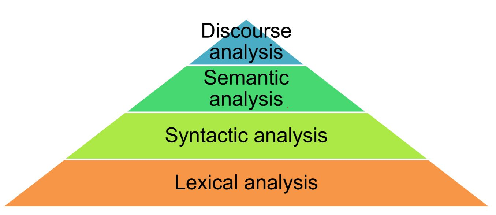

### Author: Kevin Okiah
### Lexical Density and Vocabulary Count Analysis
**01/10/2019**

This notebook is a teaser to Natural Language Processing (NLP). It explores calculation of Lexical density and Vocabulary Count.

Lexical analysis is the lowest level of NLP. See figure 1 below for the levels of NLP. Lexical analysis involves identifying and analyzing the structure of words.




                                              
                                                   Fig 1. Levels of NLP

 

In this notebook a download 3 graded readers books from http://www.gutenberg.org/wiki/Children%27s_Instructional_Books_(Bookshelf) and leverage NLTK library to preprocess the books by:

1. Remove Guternberg headers and footers
2. Parse the texts breaking the books into tokens
3. Expand contractions
4. Remove stop words, punctuations and Alpha numeric
5. stem and lemmatize the tokens

I then proceed to perform lexical density and Vocabulary analysis on the books. 


### 1.	Install Python (if you don’t have it already), and install NLTK.  


```python
!pip install NLTK
```

    Requirement already satisfied: NLTK in /home/kevimwe/anaconda3/envs/py36/lib/python3.6/site-packages (3.4)
    Requirement already satisfied: singledispatch in /home/kevimwe/anaconda3/envs/py36/lib/python3.6/site-packages (from NLTK) (3.4.0.3)
    Requirement already satisfied: six in /home/kevimwe/anaconda3/envs/py36/lib/python3.6/site-packages (from NLTK) (1.12.0)


### 2. Follow the instructions in chapter 1 of Bird-Klein for implementing a “lexical diversity” scoring routine.


```python
from __future__ import division
```


```python
#Library Imports
import nltk
from urllib import request
from nltk import word_tokenize
import re
import string
from string import punctuation
from nltk.probability import FreqDist
from nltk.stem import PorterStemmer 
```


```python
def lexical_diversity(text):
        return len(set(text)) / len(text) 
def percentage(count, total):
    return 100 * count / total
def FreqDistPlot(data, show =10):
    fdist1 = FreqDist(data) 
    fdist1.plot(show, cumulative=True)
```

### 3.	Go to http://www.gutenberg.org/wiki/Children%27s_Instructional_Books_(Bookshelf), and obtain three texts (of different grade levels) from the “Graded Readers” section. Report the lexical diversity score of each. Explain whether the result was surprising.


```python
urls = {"2nd":"http://www.gutenberg.org/cache/epub/15659/pg15659.txt", #2nd grader book
        "4th":"http://www.gutenberg.org/cache/epub/18702/pg18702.txt", #4th grader book
        "HS":"http://www.gutenberg.org/cache/epub/19923/pg19923.txt"}  #High School grader 
```

#### Quick look at the lexical_diversity scores on raw uncleaned Text Data


```python
def Score(book ='2nd'):
    url =urls[book]
    respose = request.urlopen(url)
    raw = respose.read().decode('utf8')
    return lexical_diversity(raw.split())
```


```python
Score('2nd')
```


    0.2515451943418924


```python
Score('4th')
```


    0.22280725890165964


```python
Score('HS')
```


    0.20531262962644106


#### Data Cleaning

Below we clean the data removing gutenberg headers sections, footnotes sections, contents sections, stopwords  and stem the tokens for the book before running the lexical assessment. All the tokens are converted to lower to avoid double counting


```python
#this are markers for the first and last lines for the books to filter only the needed sections
FirstLine = {'2nd': "[Illustration]", 
             '4th': 'The Good Land',
              'HS':'INTRODUCTORY.'}
LastLine  = {'2nd': "End of Project Gutenberg's The Beacon Second Reader, by James H. Fassett",
             '4th': "***END OF THE PROJECT GUTENBERG EBOOK THE ONTARIO READERS: FOURTH BOOK***",
              'HS':'End of the Project Gutenberg EBook of The Ontario Readers: The High School'}
```


```python
#code adopted from text Text-analytics-with-python-a-practical-dipanjan-sarkar
def remove_stopwords(tokens): 
    stopword_list = nltk.corpus.stopwords.words('english') 
    filtered_tokens = [token for token in tokens if token not in stopword_list] 
    return filtered_tokens 

#this function stems the tokens to get the root
def stemming(tokens):
    ps = PorterStemmer()
    stemmed_list =[]
    for i in tokens:
        stemmed_list = stemmed_list+[ps.stem(i)]
    return stemmed_list
```


```python
'''
This function reads in books url, filters out this Sections: Content, preface and gutenberg header and footer.
The funtion then splits the data into tokens for analysis.
'''

def CleanBookTokens(book ='HS'):
    url =urls[book]
    respose = request.urlopen(url)
    raw = respose.read().decode('utf8')
    remove = string.punctuation
    remove = remove.replace("-", "") # don't remove hyphens
    pattern = r"[{}]".format(remove) # create the pattern
    Temp = list(raw.splitlines()) #Split raw the test in raw and store in an array
    flag = 0 #flag to track when to read and close a book
    CleanBook = [] #array to hold the desired sentences
    CleanTokens = []
    Tokens =[]
    for i in Temp:
        if(i==FirstLine[book]):
            flag =1
        if(i==LastLine[book]):
            flag =2
        if(flag==1):
            CleanBook.append(i)
            Tokens = Tokens + re.sub(pattern, "", i.lower()).split() #tokens to lower
            #print(i)
    CleanTokens = remove_stopwords(Tokens)  # Remove stopwords
    CleanTokens = stemming(CleanTokens) #stem the tokens to get root words
    return CleanTokens, CleanBook


HighSchoolerReaderTokens,HighSchoolerReaderBook = CleanBookTokens('HS')
SecondReaderTokens, SecondReaderBook = CleanBookTokens('2nd')
FourthReaderTokens, FourthReaderBook = CleanBookTokens('4th')
    
```

#### Lexical diverisity for the cleaned data


```python
lexical_diversity(SecondReaderTokens)
```


    0.2477844735909252


```python
lexical_diversity(FourthReaderTokens)
```


    0.19038230097559727


```python
lexical_diversity(HighSchoolerReaderTokens)
```


    0.16669608897305452


The results above are not suprising.  It is expected that the Lexical Diversity increases as children progresses with grade level. For 2nd grade,  you would expect to have alot more text repetation thus a lower Lexical Diversity compared to high school text which would have a higher Lexical Diversity as 

### 4.	Also compare the vocabulary size of the same three texts. Explain whether the result was surprising.  


```python
len(set(SecondReaderTokens))
```


    2796


```python
len(set(FourthReaderTokens))
```


    7435


```python
len(set(HighSchoolerReaderTokens))
```


    10387


The results above are not suprising. Children's Vocabulary size increases as they progress with grade levels. It is expected that a child at grades 2 would learn less Vocabulary than a student at grade 4 whose vocabulary size would potentially have doubled. On an average student is likely to learn approximately 3,000 new vocabulary words each year. 

**Reference:** http://www.ascd.org/publications/books/113040/chapters/What-Does-the-Research-Say-About-Vocabulary%C2%A2.aspx

### 5.	Write a paragraph arguing whether vocabulary size and lexical diversity in combination could be a better measure of text difficulty (or reading level) than either measure is by itself.

Using them both would give a better measure of text difficulty. Lexical Diversity refers to “the range of different words used in a text, with a greater range indicating a higher diversity but is is pretty sensitive to text length. In our comparison above Lexical diversity might not be that effective as a measure as the three books are of different sizes thus using vocabulary size as a measure could help suppliment the assessment.
