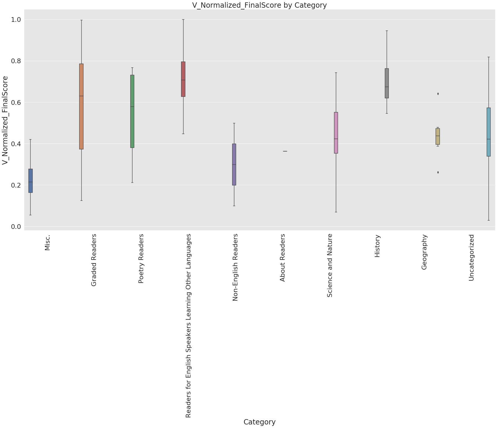
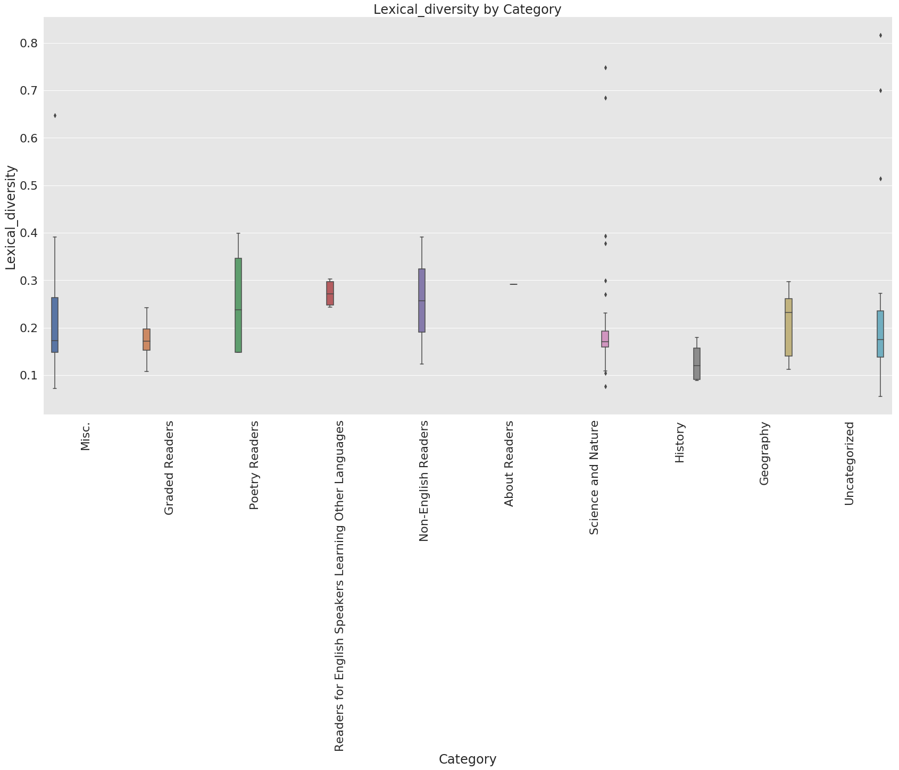
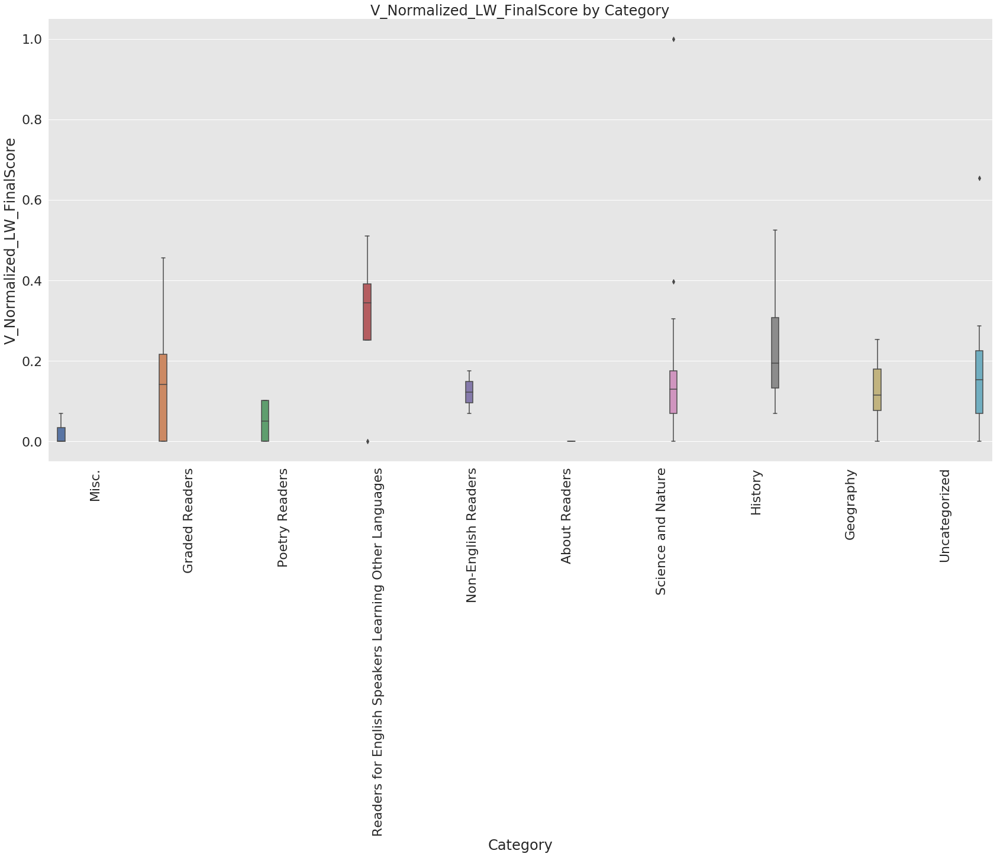
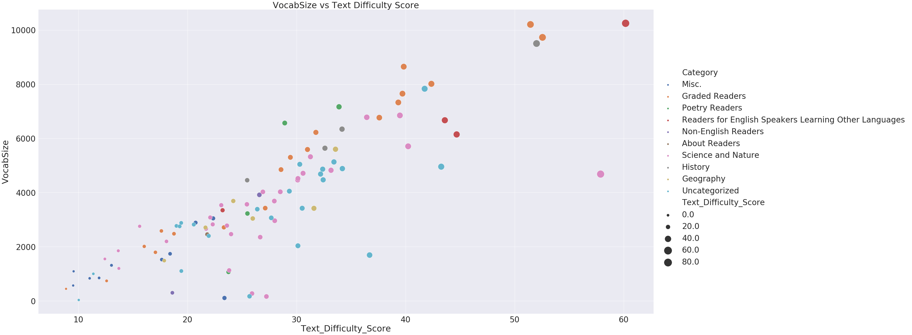

## Normalized Vocabulary Size Score and Text difficulty score.
### Author: Kevin Okiah
**02/07/2019**

This notebook serves a primer to webscrapping using beautiful soup, selenium , lxml and urllib. In this notebook I scrape 103 graded readers books from Guternberg website http://www.gutenberg.org/wiki/Children%27s_Instructional_Books_(Bookshelf).

I develop and text cleaning function `TextCleaningToolkit.py` leveraging NLTK for the common text cleaning tasks like tokenization, lemming, stemming, etc. The tookit leverages NLTK library.

103 books are scrapped from Guternberg website. I take the following steps to clean and compare the books normalized vocabulary size and Text difficulty score

**Cleaning**
1. Strip GUTENBERG using function above.Book start is assumed to be the contents section
2. Break books into sentences/lines
3. Change senteces to lower case
4. Expland contractions for each sentence. Turning shortforms like Can't to Can not
5. Break lines into tokens
6. Remove punctuation marks
7. remove stopwords
8. Perform lemmatization
9. Store the cleaned book tones in a books dictionary for analysis.

The books are then compared in terms of Normalized_Vocab_Score


```python
import numpy as np
import pandas as pd
import selenium
from lxml import html
import urllib3
from bs4 import BeautifulSoup
import lxml
import urllib 
import nltk
import string
from urllib import request
from string import punctuation

from TextCleaningToolkit import * 
import pickle
import seaborn as sns
import matplotlib.pyplot as plt
%matplotlib inline

http = urllib3.PoolManager()

def get_url_Bs(url):
    tree = BeautifulSoup(url)
    return tree

def get_url_Sel(url):
    tree = html.document_fromstring(url)
    return tree
```

    /home/kevimwe/anaconda3/lib/python3.6/importlib/_bootstrap.py:219: RuntimeWarning: numpy.dtype size changed, may indicate binary incompatibility. Expected 96, got 88
      return f(*args, **kwds)
    /home/kevimwe/anaconda3/lib/python3.6/importlib/_bootstrap.py:219: RuntimeWarning: numpy.dtype size changed, may indicate binary incompatibility. Expected 96, got 88
      return f(*args, **kwds)


```python
myurl = http.request('GET', "http://www.gutenberg.org/wiki/Children%27s_Instructional_Books_(Bookshelf)").data#http.request('GET', "https://www.brightermonday.co.ke/search/jobs-in-nairobi/").data#http.request('GET', "http://www.jobwebkenya.com").data #desired url

tree = get_url_Sel(myurl)
```


```python
links = tree.xpath('//a/@href')
```


```python
def Book_Titles():
    '''
    Function to scrap book titles
    '''
    categories= tree.xpath('//*[(@id = "mw-content-text")]//*[(((count(preceding-sibling::*)+ 1) = 1) and parent::*)]')
    temp =[]
    temp2 =[]
    for i in categories:
        temp = temp+ i.cssselect('a')
    for j in temp:
            #print(len([j.text_content().split()]))
            t =j.text_content()
            temp2 = temp2+ [t.replace('\n','')]
    temp3 =pd.unique(temp2)
    book_titles = [x for x in temp3 if x]
    book_titles =book_titles[13:]
    return(book_titles)

book_titles = Book_Titles()
book_titles.insert(53, 'Dutch')
```


```python
len(book_titles)
```


    104


```python
#pull all hyperlinks
def Books_Urls():
    '''
    Function to pull books urls. Some books numbers listed below have unique 
    url setup as such reconstructing their addess had to be persomed as in the code below
    '''
    
    SpecialUrls = [23424, 13853, 22795, 18274, 21973, 15950, 24222, 21783,2441, 17160, 22917, 23395]
    
    Bookslinks = tree.xpath('//a/@href')
    Books_urls= {} #declare urls Dictonary 
    Books2_urls= {} #declare urls Dictonary 
    n =0
    for i in Bookslinks :
        T = str.split(i, '/')

        if "www.gutenberg.org" in T and 'http:' not in T: 
            #print(SpecialUrls)
            if(int(T[4]) in SpecialUrls):
                #Format 1: http://www.gutenberg.org/files/23424/23424-0.txt
                Books2_urls.update({n:"http://" + T[2]+"/files/"+T[4]+"/"+T[4]+"-0.txt" })
            else:
                #Format 2:  http://www.gutenberg.org/cache/epub/7841/pg7841.txt 
                Books2_urls.update({n:"http://" + T[2]+"/cache/epub/"+T[4]+"/pg"+T[4]+".txt" })
                #Format 3: http://www.gutenberg.org/files/23424/23424-0.txt

            n =n+1
    return(Books2_urls)
booksUrls = Books_Urls()
```


```python
len(booksUrls)
```


    104


```python
book_titles
```


    ['A Primary Reader: Old-time Stories, Fairy Tales and Myths Retold by Children',
     'The Bird-Woman of the Lewis and Clark Expedition',
     "Dr. Scudder's Tales for Little Readers, About the Heathen.",
     'The Louisa Alcott Reader: a Supplementary Reader for the Fourth Year of School',
     'Boy Blue and his friends, School ed.',
     'The Book of Nature Myths',
     "The Flag of My Country. Shikéyah Bidah Na'at'a'í;Navajo New World Readers 2",
     "Chambers's Elementary Science Readers, Book I",
     'The Little Lame Prince;Rewritten for Young Readers by Margaret Waters',
     "Harry's Ladder to Learning",
     'Little Present',
     'The Beacon Second Reader',
     "The Child's World Third Reader",
     'De La Salle Fifth Reader',
     'The Elson Readers, Book 5',
     'The Literary World Seventh Reader',
     "McGuffey's First Eclectic Reader, Revised Edition",
     "McGuffey's Second Eclectic Reader",
     "McGuffey's Third Eclectic Reader",
     "McGuffey's Fourth Eclectic Reader",
     "McGuffey's Fifth Eclectic Reader",
     "McGuffey's Sixth Eclectic Reader",
     'New National First Reader',
     'New National Fourth Reader',
     'The Ontario Readers: Third Book',
     'The Ontario Readers: Fourth Book',
     'The Ontario Readers: The High School Reader, 1886',
     'The Ontario High School Reader',
     "Parker's Second Reader National Series of Selections for Reading, Designed For The Younger Classes In Schools, Academies, &C.",
     "Sanders' Union Fourth Reader",
     'Story Hour Readers — Book Three',
     'Poems Teachers Ask For Selected by readers of "Normal Instructor-Primary Plans"',
     'Poems Teachers Ask For, Book Two',
     'Graded Poetry: Seventh Year',
     'Gems of Poetry for Boys and Girls',
     "Ritchie's Fabulae Faciles: A First Latin Reader",
     'A First Spanish Reader',
     'An Elementary Spanish Reader',
     'First Italian Readings',
     "Contes et historiettes à l'usage des jeunes enfantsQui commencent à savoir lire",
     "The Flag of My Country. Shikéyah Bidah Na'at'a'íNavajo New World Readers 2",
     'A History of the McGuffey Readers',
     "A Book of Natural HistoryYoung Folks' Library Volume XIV.",
     'Among the Farmyard People',
     'Wildflowers of the Farm',
     'Anecdotes of the Habits and Instinct of Animals',
     'Book about Animals',
     'Bird Day; How to prepare for it',
     "Child's Book of Water Birds",
     'Animal Heroes',
     'Wild Animals I Have Known',
     'Woodland Tales',
     'Wilderness Ways',
     'Dutch',
     'The Burgess Animal Book for Children',
     'Stories about the Instinct of Animals, Their Characters, and Habits',
     'The History of Insects',
     'The Insect Folk',
     'The Curious Book of Birds',
     'Little Busybodies;The Life of Crickets, Ants, Bees, Beetles, and Other Busybodies',
     'Outlines of Lessons in Botany, Part I; from Seed to Leaf',
     'Stories about Animals: with Pictures to Match',
     'Chatterbox Stories of Natural History',
     'Camping For Boys',
     'Quadrupeds, What They Are and Where Found;A Book of Zoology for Boys',
     'A Hundred Anecdotes of Animals',
     'The Story of Eclipses',
     'Country Walks of a Naturalist with His Children',
     'On the Trail: An Outdoor Book for Girls',
     'Our Common Insects;A Popular Account of the Insects of Our Fields, Forests, Gardens and Houses',
     'The Wonders of the Jungle;Book One',
     'A Modern History, From the Time of Luther to the Fall of NapoleonFor the Use of Schools and Colleges',
     'A School History of the United States',
     'The Story of Manhattan',
     "Young Folks' History of Rome",
     'Denmark',
     'The Land of the Long Night',
     'Little Journey to Puerto Rico : for Intermediate and Upper Grades',
     'Where We Live;A Home Geography',
     'Peeps at Many Lands: Norway',
     'Commercial GeographyA Book for High Schools, Commercial Courses, and Business Colleges',
     'A Manual of PronunciationFor Practical Use in Schools and Families',
     'Modern prose and poetry for secondary schools',
     'A Catechism of Familiar Things; Their History, and the Events Which Led to Their Discovery. With a Short Explanation of Some of the Principal Natural Phenomena. For the Use of Schools and Families. Enlarged and Revised Edition.',
     "Children's Classics in Dramatic FormBook Two",
     'The Story of the Mind',
     'The Story of Glass',
     'The Story of Porcelain',
     'The Story of Sugar',
     'The Story of Wool',
     'Steve and the Steam Engine',
     'Carl and the Cotton Gin',
     'Walter and the Wireless',
     'Stanford Achievement Test, Ed. 1922;Advanced Examination, Form A, for Grades 4-8',
     'How to Write Clearly;Rules and Exercises on English Composition',
     'Electricity for Boys',
     "Leçons de cosmographie à l'usage des lycées et collèges et de tous les établissements d'instruction publique",
     'The Boy Mechanic: Volume 1700 Things for Boys to Do',
     'The Story of Young Abraham Lincoln',
     'Orthography;As Outlined in the State Course of Study for Illinois',
     'Stories From Livy',
     'A Little Book for A Little Cook',
     "Ontario Teachers' Manuals: Household Management",
     "Ontario Teachers' Manuals: Household Science in Rural Schools"]


```python
def Book_CategoryMapper():
    '''
    Function tagging unique book categories. and mapping them to book urls
    '''
    
    titles_catagories = tree.xpath('//*[contains(concat( " ", @class, " " ), concat( " ", "mw-headline", " " ))]')
    tempx =[]
    BooksMapped = pd.DataFrame()
    for j in titles_catagories:
            tempx = tempx + [j.text_content()]
    Category_list =[]
    for i in tempx:
        if i =='Misc.':
            for n in range(11):
                Category_list = Category_list+ ['Misc.']
        if i =='Graded Readers':
            for n in range(20):
                Category_list = Category_list+ ['Graded Readers']
        if i =='Poetry Readers':
            for n in range(4):
                Category_list = Category_list+ ['Poetry Readers']
        if i =='Readers for English Speakers Learning Other Languages':
            for n in range(4):
                Category_list = Category_list+ ['Readers for English Speakers Learning Other Languages']
        if i =='Non-English Readers':
            for n in range(2):
                Category_list = Category_list+ ['Non-English Readers']
        if i =='About Readers':
            for n in range(1):
                Category_list = Category_list+ ['About Readers']
        if i =='Science and Nature':
            for n in range(29):
                Category_list = Category_list+ ['Science and Nature']
        if i =='History':
            for n in range(4):
                Category_list = Category_list+ ['History']
        if i =='Geography':
            for n in range(6):
                Category_list = Category_list+ ['Geography']
        if i =='Uncategorized':
            for n in range(23):
                Category_list = Category_list+ ['Uncategorized']
    BooksMapped["BookTitle"] =book_titles
    BooksMapped["Category"] = Category_list
    BooksMapped["url"] =booksUrls.values()
    return(BooksMapped)
```


```python
BooksMapper =Book_CategoryMapper()
```


```python
BooksMapper
```


<div>
<style>
    .dataframe thead tr:only-child th {
        text-align: right;
    }

    .dataframe thead th {
        text-align: left;
    }

    .dataframe tbody tr th {
        vertical-align: top;
    }
</style>
<table border="1" class="dataframe">
  <thead>
    <tr style="text-align: right;">
      <th></th>
      <th>BookTitle</th>
      <th>Category</th>
      <th>url</th>
    </tr>
  </thead>
  <tbody>
    <tr>
      <th>0</th>
      <td>A Primary Reader: Old-time Stories, Fairy Tale...</td>
      <td>Misc.</td>
      <td>http://www.gutenberg.org/cache/epub/7841/pg784...</td>
    </tr>
    <tr>
      <th>1</th>
      <td>The Bird-Woman of the Lewis and Clark Expedition</td>
      <td>Misc.</td>
      <td>http://www.gutenberg.org/cache/epub/5742/pg574...</td>
    </tr>
    <tr>
      <th>2</th>
      <td>Dr. Scudder's Tales for Little Readers, About ...</td>
      <td>Misc.</td>
      <td>http://www.gutenberg.org/cache/epub/13539/pg13...</td>
    </tr>
    <tr>
      <th>3</th>
      <td>The Louisa Alcott Reader: a Supplementary Read...</td>
      <td>Misc.</td>
      <td>http://www.gutenberg.org/cache/epub/7425/pg742...</td>
    </tr>
    <tr>
      <th>4</th>
      <td>Boy Blue and his friends, School ed.</td>
      <td>Misc.</td>
      <td>http://www.gutenberg.org/cache/epub/16046/pg16...</td>
    </tr>
    <tr>
      <th>5</th>
      <td>The Book of Nature Myths</td>
      <td>Misc.</td>
      <td>http://www.gutenberg.org/cache/epub/22420/pg22...</td>
    </tr>
    <tr>
      <th>6</th>
      <td>The Flag of My Country. Shikéyah Bidah Na'at'a...</td>
      <td>Misc.</td>
      <td>http://www.gutenberg.org/files/23424/23424-0.txt</td>
    </tr>
    <tr>
      <th>7</th>
      <td>Chambers's Elementary Science Readers, Book I</td>
      <td>Misc.</td>
      <td>http://www.gutenberg.org/cache/epub/18217/pg18...</td>
    </tr>
    <tr>
      <th>8</th>
      <td>The Little Lame Prince;Rewritten for Young Rea...</td>
      <td>Misc.</td>
      <td>http://www.gutenberg.org/cache/epub/24053/pg24...</td>
    </tr>
    <tr>
      <th>9</th>
      <td>Harry's Ladder to Learning</td>
      <td>Misc.</td>
      <td>http://www.gutenberg.org/cache/epub/24644/pg24...</td>
    </tr>
    <tr>
      <th>10</th>
      <td>Little Present</td>
      <td>Misc.</td>
      <td>http://www.gutenberg.org/cache/epub/24703/pg24...</td>
    </tr>
    <tr>
      <th>11</th>
      <td>The Beacon Second Reader</td>
      <td>Graded Readers</td>
      <td>http://www.gutenberg.org/cache/epub/15659/pg15...</td>
    </tr>
    <tr>
      <th>12</th>
      <td>The Child's World Third Reader</td>
      <td>Graded Readers</td>
      <td>http://www.gutenberg.org/cache/epub/15170/pg15...</td>
    </tr>
    <tr>
      <th>13</th>
      <td>De La Salle Fifth Reader</td>
      <td>Graded Readers</td>
      <td>http://www.gutenberg.org/cache/epub/10811/pg10...</td>
    </tr>
    <tr>
      <th>14</th>
      <td>The Elson Readers, Book 5</td>
      <td>Graded Readers</td>
      <td>http://www.gutenberg.org/cache/epub/9106/pg910...</td>
    </tr>
    <tr>
      <th>15</th>
      <td>The Literary World Seventh Reader</td>
      <td>Graded Readers</td>
      <td>http://www.gutenberg.org/cache/epub/19721/pg19...</td>
    </tr>
    <tr>
      <th>16</th>
      <td>McGuffey's First Eclectic Reader, Revised Edition</td>
      <td>Graded Readers</td>
      <td>http://www.gutenberg.org/cache/epub/14640/pg14...</td>
    </tr>
    <tr>
      <th>17</th>
      <td>McGuffey's Second Eclectic Reader</td>
      <td>Graded Readers</td>
      <td>http://www.gutenberg.org/cache/epub/14668/pg14...</td>
    </tr>
    <tr>
      <th>18</th>
      <td>McGuffey's Third Eclectic Reader</td>
      <td>Graded Readers</td>
      <td>http://www.gutenberg.org/cache/epub/14766/pg14...</td>
    </tr>
    <tr>
      <th>19</th>
      <td>McGuffey's Fourth Eclectic Reader</td>
      <td>Graded Readers</td>
      <td>http://www.gutenberg.org/cache/epub/14880/pg14...</td>
    </tr>
    <tr>
      <th>20</th>
      <td>McGuffey's Fifth Eclectic Reader</td>
      <td>Graded Readers</td>
      <td>http://www.gutenberg.org/cache/epub/15040/pg15...</td>
    </tr>
    <tr>
      <th>21</th>
      <td>McGuffey's Sixth Eclectic Reader</td>
      <td>Graded Readers</td>
      <td>http://www.gutenberg.org/cache/epub/16751/pg16...</td>
    </tr>
    <tr>
      <th>22</th>
      <td>New National First Reader</td>
      <td>Graded Readers</td>
      <td>http://www.gutenberg.org/files/13853/13853-0.txt</td>
    </tr>
    <tr>
      <th>23</th>
      <td>New National Fourth Reader</td>
      <td>Graded Readers</td>
      <td>http://www.gutenberg.org/cache/epub/15825/pg15...</td>
    </tr>
    <tr>
      <th>24</th>
      <td>The Ontario Readers: Third Book</td>
      <td>Graded Readers</td>
      <td>http://www.gutenberg.org/cache/epub/18561/pg18...</td>
    </tr>
    <tr>
      <th>25</th>
      <td>The Ontario Readers: Fourth Book</td>
      <td>Graded Readers</td>
      <td>http://www.gutenberg.org/cache/epub/18702/pg18...</td>
    </tr>
    <tr>
      <th>26</th>
      <td>The Ontario Readers: The High School Reader, 1886</td>
      <td>Graded Readers</td>
      <td>http://www.gutenberg.org/cache/epub/19923/pg19...</td>
    </tr>
    <tr>
      <th>27</th>
      <td>The Ontario High School Reader</td>
      <td>Graded Readers</td>
      <td>http://www.gutenberg.org/files/22795/22795-0.txt</td>
    </tr>
    <tr>
      <th>28</th>
      <td>Parker's Second Reader National Series of Sele...</td>
      <td>Graded Readers</td>
      <td>http://www.gutenberg.org/cache/epub/16936/pg16...</td>
    </tr>
    <tr>
      <th>29</th>
      <td>Sanders' Union Fourth Reader</td>
      <td>Graded Readers</td>
      <td>http://www.gutenberg.org/cache/epub/9078/pg907...</td>
    </tr>
    <tr>
      <th>...</th>
      <td>...</td>
      <td>...</td>
      <td>...</td>
    </tr>
    <tr>
      <th>74</th>
      <td>Young Folks' History of Rome</td>
      <td>History</td>
      <td>http://www.gutenberg.org/cache/epub/16667/pg16...</td>
    </tr>
    <tr>
      <th>75</th>
      <td>Denmark</td>
      <td>Geography</td>
      <td>http://www.gutenberg.org/cache/epub/20107/pg20...</td>
    </tr>
    <tr>
      <th>76</th>
      <td>The Land of the Long Night</td>
      <td>Geography</td>
      <td>http://www.gutenberg.org/cache/epub/22727/pg22...</td>
    </tr>
    <tr>
      <th>77</th>
      <td>Little Journey to Puerto Rico : for Intermedia...</td>
      <td>Geography</td>
      <td>http://www.gutenberg.org/cache/epub/9995/pg999...</td>
    </tr>
    <tr>
      <th>78</th>
      <td>Where We Live;A Home Geography</td>
      <td>Geography</td>
      <td>http://www.gutenberg.org/cache/epub/22911/pg22...</td>
    </tr>
    <tr>
      <th>79</th>
      <td>Peeps at Many Lands: Norway</td>
      <td>Geography</td>
      <td>http://www.gutenberg.org/cache/epub/24676/pg24...</td>
    </tr>
    <tr>
      <th>80</th>
      <td>Commercial GeographyA Book for High Schools, C...</td>
      <td>Geography</td>
      <td>http://www.gutenberg.org/cache/epub/24884/pg24...</td>
    </tr>
    <tr>
      <th>81</th>
      <td>A Manual of PronunciationFor Practical Use in ...</td>
      <td>Uncategorized</td>
      <td>http://www.gutenberg.org/files/21783/21783-0.txt</td>
    </tr>
    <tr>
      <th>82</th>
      <td>Modern prose and poetry for secondary schools</td>
      <td>Uncategorized</td>
      <td>http://www.gutenberg.org/files/17160/17160-0.txt</td>
    </tr>
    <tr>
      <th>83</th>
      <td>A Catechism of Familiar Things; Their History,...</td>
      <td>Uncategorized</td>
      <td>http://www.gutenberg.org/cache/epub/16728/pg16...</td>
    </tr>
    <tr>
      <th>84</th>
      <td>Children's Classics in Dramatic FormBook Two</td>
      <td>Uncategorized</td>
      <td>http://www.gutenberg.org/cache/epub/16379/pg16...</td>
    </tr>
    <tr>
      <th>85</th>
      <td>The Story of the Mind</td>
      <td>Uncategorized</td>
      <td>http://www.gutenberg.org/cache/epub/20522/pg20...</td>
    </tr>
    <tr>
      <th>86</th>
      <td>The Story of Glass</td>
      <td>Uncategorized</td>
      <td>http://www.gutenberg.org/cache/epub/20698/pg20...</td>
    </tr>
    <tr>
      <th>87</th>
      <td>The Story of Porcelain</td>
      <td>Uncategorized</td>
      <td>http://www.gutenberg.org/cache/epub/19423/pg19...</td>
    </tr>
    <tr>
      <th>88</th>
      <td>The Story of Sugar</td>
      <td>Uncategorized</td>
      <td>http://www.gutenberg.org/cache/epub/7803/pg780...</td>
    </tr>
    <tr>
      <th>89</th>
      <td>The Story of Wool</td>
      <td>Uncategorized</td>
      <td>http://www.gutenberg.org/cache/epub/24858/pg24...</td>
    </tr>
    <tr>
      <th>90</th>
      <td>Steve and the Steam Engine</td>
      <td>Uncategorized</td>
      <td>http://www.gutenberg.org/cache/epub/22245/pg22...</td>
    </tr>
    <tr>
      <th>91</th>
      <td>Carl and the Cotton Gin</td>
      <td>Uncategorized</td>
      <td>http://www.gutenberg.org/cache/epub/23560/pg23...</td>
    </tr>
    <tr>
      <th>92</th>
      <td>Walter and the Wireless</td>
      <td>Uncategorized</td>
      <td>http://www.gutenberg.org/cache/epub/23728/pg23...</td>
    </tr>
    <tr>
      <th>93</th>
      <td>Stanford Achievement Test, Ed. 1922;Advanced E...</td>
      <td>Uncategorized</td>
      <td>http://www.gutenberg.org/cache/epub/22425/pg22...</td>
    </tr>
    <tr>
      <th>94</th>
      <td>How to Write Clearly;Rules and Exercises on En...</td>
      <td>Uncategorized</td>
      <td>http://www.gutenberg.org/cache/epub/22600/pg22...</td>
    </tr>
    <tr>
      <th>95</th>
      <td>Electricity for Boys</td>
      <td>Uncategorized</td>
      <td>http://www.gutenberg.org/cache/epub/22766/pg22...</td>
    </tr>
    <tr>
      <th>96</th>
      <td>Leçons de cosmographie à l'usage des lycées et...</td>
      <td>Uncategorized</td>
      <td>http://www.gutenberg.org/files/22917/22917-0.txt</td>
    </tr>
    <tr>
      <th>97</th>
      <td>The Boy Mechanic: Volume 1700 Things for Boys ...</td>
      <td>Uncategorized</td>
      <td>http://www.gutenberg.org/cache/epub/12655/pg12...</td>
    </tr>
    <tr>
      <th>98</th>
      <td>The Story of Young Abraham Lincoln</td>
      <td>Uncategorized</td>
      <td>http://www.gutenberg.org/cache/epub/22925/pg22...</td>
    </tr>
    <tr>
      <th>99</th>
      <td>Orthography;As Outlined in the State Course of...</td>
      <td>Uncategorized</td>
      <td>http://www.gutenberg.org/files/23395/23395-0.txt</td>
    </tr>
    <tr>
      <th>100</th>
      <td>Stories From Livy</td>
      <td>Uncategorized</td>
      <td>http://www.gutenberg.org/cache/epub/24030/pg24...</td>
    </tr>
    <tr>
      <th>101</th>
      <td>A Little Book for A Little Cook</td>
      <td>Uncategorized</td>
      <td>http://www.gutenberg.org/cache/epub/24125/pg24...</td>
    </tr>
    <tr>
      <th>102</th>
      <td>Ontario Teachers' Manuals: Household Management</td>
      <td>Uncategorized</td>
      <td>http://www.gutenberg.org/cache/epub/24656/pg24...</td>
    </tr>
    <tr>
      <th>103</th>
      <td>Ontario Teachers' Manuals: Household Science i...</td>
      <td>Uncategorized</td>
      <td>http://www.gutenberg.org/cache/epub/20557/pg20...</td>
    </tr>
  </tbody>
</table>
<p>104 rows × 3 columns</p>
</div>


```python
def bookstart(strT):
    '''
    Marker for beginning of books. There are ~20 unique ways the books starte
    '''
    possible_starts = ['CONTENTS.', 'CONTENTS', '~CONTENTS~', 
                       '[Illustration]', '[Illustration: ]', 
                       'ILLUSTRATIONS.', 'THE ALPHABET.',
                       'Lessons.', 'SELECTIONS IN PROSE AND POETRY.', 'CONTENTS (5)', "L'IMPRUDENCE.",
                      'POEMS TEACHERS ASK FOR', 'Contents.', 'HOW TO USE THE BOOK', 'STORIES FROM LIVY.', 
                       'TABLE DES MATIÈRES.', 'OUR COMMON INSECTS.', 'CHAPTER ONE', '[Contents of the Books]',
                      '[Illustration: Laplander Travelling.]','CHAPTER ONE.', 'Contents', 'Stories in This Book',
                      'INHOUD.','INTRODUCTION.', '_THE PLAN BOOK SERIES_', 'Stanford Achievement Test']
    
    return(strT.lstrip() in possible_starts)

def bookend(strT):
    '''
    Marker for end of book.
    '''
    possible_ends  = ['End of the Project Gutenberg EBook', "End of Project Gutenberg's"]
    
    return(strT.startswith(possible_ends[0]) or strT.startswith(possible_ends[1]))
```

### Data Cleaning Perfomed in the code blocks that follow include.
1. Strip GUTENBERG using function above.Book start is assumed to be the contents section
2. Break books into sentences/lines
3. Change senteces to lower case
4. Expland contractions for each sentence. Turning shortforms like Can't to Can not
5. Break lines into tokens
6. Remove punctuation marks
7. remove stopwords
8. Perform lemmatization
9. Store the cleaned book tones in a books dictionary for analysis.


```python
def parseBook(key =0,url="http://www.gutenberg.org/files/2441/2441-0.txt"):
    '''
    Strip header and footer GUTENBERG  from a book
    '''
    CleanBook =""
    Title =""
    Author =""
    try:
        respose = request.urlopen(url)
        raw = respose.read().decode("utf-8")
        #table = str.maketrans('', '', string.punctuation)
        Temp = list(raw.splitlines()) #Split raw the test in raw and store in an array
        flag = 0 #flag to track when to read and close a book
        CleanBook = [] #array to hold the desired sentences
        CleanTokens = []
        Author =""
        Title =""
        Tokens =[]
        for i in Temp:
            if(bookstart(i)==True):
                flag =1
            if(bookend(i)==True):
                flag =2
            try:
                Title = book_titles[key]
            except IndexError as e:
                print(e.args)
            Author = "tbd"
            if(flag==1):
                if(len(i)>0):
                    CleanBook.append(i)

    except request.HTTPError as err:
        if err.code == 404:
            print(err.code, " Error!!!")
        else:
            raise
    except UnicodeDecodeError  as e:
        print("UnicodeDecodeError!!  ", e.reason)
        #raise
    return(CleanBook, Title, Author)


book, Title, Author = parseBook()
```


```python
def CleanBookTokens(book, Title, Author):
    '''
    Function to clean and tokenize a book
    '''
    CleanBook = [] #array to hold the desired sentences
    CleanTokens = []
    Tokens =[]    
    for i in book:
        sentence = expand_contractions(i)#expand contractions
        Tokens = Tokens + Tokenizer_Tool(sentence.lower(),'word_tokenize')#tokenize sentences
    words = [word for word in Tokens if word.isalpha()]#Remove punctuations
    CleanTokens = remove_stopwords(words)#Remove stopwords
    CleanTokens =lemming(CleanTokens) #Lemmetization of the tokens to get root words
    return(Title, CleanTokens)
#CleanBookTokens(book, Title, Author)
```


```python
#Main
CleanBooks = {}
for key, value in booksUrls.items():
    try:
        book, Title, Author = parseBook(key, value)
        print ("processing :", key, value )#, "Book Length: ", len(book))
        if book != '':
            booktitle, booktokens =CleanBookTokens(book, Title, Author)
            CleanBooks.update({booktitle:booktokens})
    except IndexError as e:
        print(e.args)
print("processing complete...")
```

    processing : 0 http://www.gutenberg.org/cache/epub/7841/pg7841.txt
    processing : 1 http://www.gutenberg.org/cache/epub/5742/pg5742.txt
    processing : 2 http://www.gutenberg.org/cache/epub/13539/pg13539.txt
    processing : 3 http://www.gutenberg.org/cache/epub/7425/pg7425.txt
    processing : 4 http://www.gutenberg.org/cache/epub/16046/pg16046.txt
    processing : 5 http://www.gutenberg.org/cache/epub/22420/pg22420.txt
    processing : 6 http://www.gutenberg.org/files/23424/23424-0.txt
    processing : 7 http://www.gutenberg.org/cache/epub/18217/pg18217.txt
    processing : 8 http://www.gutenberg.org/cache/epub/24053/pg24053.txt
    processing : 9 http://www.gutenberg.org/cache/epub/24644/pg24644.txt
    processing : 10 http://www.gutenberg.org/cache/epub/24703/pg24703.txt
    processing : 11 http://www.gutenberg.org/cache/epub/15659/pg15659.txt
    processing : 12 http://www.gutenberg.org/cache/epub/15170/pg15170.txt
    processing : 13 http://www.gutenberg.org/cache/epub/10811/pg10811.txt
    processing : 14 http://www.gutenberg.org/cache/epub/9106/pg9106.txt
    processing : 15 http://www.gutenberg.org/cache/epub/19721/pg19721.txt
    processing : 16 http://www.gutenberg.org/cache/epub/14640/pg14640.txt
    processing : 17 http://www.gutenberg.org/cache/epub/14668/pg14668.txt
    processing : 18 http://www.gutenberg.org/cache/epub/14766/pg14766.txt
    processing : 19 http://www.gutenberg.org/cache/epub/14880/pg14880.txt
    processing : 20 http://www.gutenberg.org/cache/epub/15040/pg15040.txt
    processing : 21 http://www.gutenberg.org/cache/epub/16751/pg16751.txt
    processing : 22 http://www.gutenberg.org/files/13853/13853-0.txt
    processing : 23 http://www.gutenberg.org/cache/epub/15825/pg15825.txt
    processing : 24 http://www.gutenberg.org/cache/epub/18561/pg18561.txt
    processing : 25 http://www.gutenberg.org/cache/epub/18702/pg18702.txt
    processing : 26 http://www.gutenberg.org/cache/epub/19923/pg19923.txt
    processing : 27 http://www.gutenberg.org/files/22795/22795-0.txt
    processing : 28 http://www.gutenberg.org/cache/epub/16936/pg16936.txt
    processing : 29 http://www.gutenberg.org/cache/epub/9078/pg9078.txt
    processing : 30 http://www.gutenberg.org/cache/epub/6685/pg6685.txt
    processing : 31 http://www.gutenberg.org/cache/epub/18909/pg18909.txt
    processing : 32 http://www.gutenberg.org/cache/epub/19469/pg19469.txt
    processing : 33 http://www.gutenberg.org/cache/epub/9542/pg9542.txt
    processing : 34 http://www.gutenberg.org/cache/epub/11023/pg11023.txt
    processing : 35 http://www.gutenberg.org/cache/epub/8997/pg8997.txt
    processing : 36 http://www.gutenberg.org/cache/epub/15353/pg15353.txt
    processing : 37 http://www.gutenberg.org/cache/epub/22065/pg22065.txt
    processing : 38 http://www.gutenberg.org/cache/epub/24072/pg24072.txt
    processing : 39 http://www.gutenberg.org/cache/epub/15626/pg15626.txt
    processing : 40 http://www.gutenberg.org/files/23424/23424-0.txt
    processing : 41 http://www.gutenberg.org/cache/epub/15577/pg15577.txt
    processing : 42 http://www.gutenberg.org/files/18274/18274-0.txt
    processing : 43 http://www.gutenberg.org/cache/epub/19381/pg19381.txt
    processing : 44 http://www.gutenberg.org/cache/epub/13347/pg13347.txt
    processing : 45 http://www.gutenberg.org/files/21973/21973-0.txt
    processing : 46 http://www.gutenberg.org/cache/epub/10737/pg10737.txt
    processing : 47 http://www.gutenberg.org/cache/epub/21266/pg21266.txt
    processing : 48 http://www.gutenberg.org/cache/epub/17365/pg17365.txt
    processing : 49 http://www.gutenberg.org/cache/epub/2284/pg2284.txt
    processing : 50 http://www.gutenberg.org/cache/epub/3031/pg3031.txt
    processing : 51 http://www.gutenberg.org/cache/epub/23667/pg23667.txt
    processing : 52 http://www.gutenberg.org/files/15950/15950-0.txt
    processing : 53 http://www.gutenberg.org/cache/epub/18072/pg18072.txt
    processing : 54 http://www.gutenberg.org/files/2441/2441-0.txt
    processing : 55 http://www.gutenberg.org/cache/epub/17185/pg17185.txt
    processing : 56 http://www.gutenberg.org/cache/epub/10834/pg10834.txt
    processing : 57 http://www.gutenberg.org/cache/epub/18790/pg18790.txt
    processing : 58 http://www.gutenberg.org/cache/epub/16140/pg16140.txt
    processing : 59 http://www.gutenberg.org/cache/epub/21948/pg21948.txt
    processing : 60 http://www.gutenberg.org/cache/epub/10726/pg10726.txt
    processing : 61 http://www.gutenberg.org/cache/epub/18767/pg18767.txt
    processing : 62 http://www.gutenberg.org/cache/epub/22408/pg22408.txt
    processing : 63 http://www.gutenberg.org/cache/epub/14759/pg14759.txt
    processing : 64 http://www.gutenberg.org/cache/epub/23576/pg23576.txt
    processing : 65 http://www.gutenberg.org/cache/epub/24263/pg24263.txt
    processing : 66 http://www.gutenberg.org/files/24222/24222-0.txt
    processing : 67 http://www.gutenberg.org/cache/epub/23941/pg23941.txt
    processing : 68 http://www.gutenberg.org/cache/epub/18525/pg18525.txt
    processing : 69 http://www.gutenberg.org/cache/epub/24409/pg24409.txt
    processing : 70 http://www.gutenberg.org/cache/epub/24852/pg24852.txt
    processing : 71 http://www.gutenberg.org/cache/epub/24598/pg24598.txt
    processing : 72 http://www.gutenberg.org/cache/epub/11313/pg11313.txt
    processing : 73 http://www.gutenberg.org/cache/epub/18561/pg18561.txt
    processing : 74 http://www.gutenberg.org/cache/epub/16667/pg16667.txt
    processing : 75 http://www.gutenberg.org/cache/epub/20107/pg20107.txt
    processing : 76 http://www.gutenberg.org/cache/epub/22727/pg22727.txt
    processing : 77 http://www.gutenberg.org/cache/epub/9995/pg9995.txt
    processing : 78 http://www.gutenberg.org/cache/epub/22911/pg22911.txt
    processing : 79 http://www.gutenberg.org/cache/epub/24676/pg24676.txt
    processing : 80 http://www.gutenberg.org/cache/epub/24884/pg24884.txt
    processing : 81 http://www.gutenberg.org/files/21783/21783-0.txt
    processing : 82 http://www.gutenberg.org/files/17160/17160-0.txt
    processing : 83 http://www.gutenberg.org/cache/epub/16728/pg16728.txt
    processing : 84 http://www.gutenberg.org/cache/epub/16379/pg16379.txt
    processing : 85 http://www.gutenberg.org/cache/epub/20522/pg20522.txt
    processing : 86 http://www.gutenberg.org/cache/epub/20698/pg20698.txt
    processing : 87 http://www.gutenberg.org/cache/epub/19423/pg19423.txt
    processing : 88 http://www.gutenberg.org/cache/epub/7803/pg7803.txt
    processing : 89 http://www.gutenberg.org/cache/epub/24858/pg24858.txt
    processing : 90 http://www.gutenberg.org/cache/epub/22245/pg22245.txt
    processing : 91 http://www.gutenberg.org/cache/epub/23560/pg23560.txt
    processing : 92 http://www.gutenberg.org/cache/epub/23728/pg23728.txt
    processing : 93 http://www.gutenberg.org/cache/epub/22425/pg22425.txt
    processing : 94 http://www.gutenberg.org/cache/epub/22600/pg22600.txt
    processing : 95 http://www.gutenberg.org/cache/epub/22766/pg22766.txt
    processing : 96 http://www.gutenberg.org/files/22917/22917-0.txt
    processing : 97 http://www.gutenberg.org/cache/epub/12655/pg12655.txt
    processing : 98 http://www.gutenberg.org/cache/epub/22925/pg22925.txt
    processing : 99 http://www.gutenberg.org/files/23395/23395-0.txt
    processing : 100 http://www.gutenberg.org/cache/epub/24030/pg24030.txt
    processing : 101 http://www.gutenberg.org/cache/epub/24125/pg24125.txt
    processing : 102 http://www.gutenberg.org/cache/epub/24656/pg24656.txt
    processing : 103 http://www.gutenberg.org/cache/epub/20557/pg20557.txt
    processing complete...


### 1. In Python, create a method for scoring the vocabulary size of a text, and normalize the score from 0 to 1. It does not matter what method you use for normalization as long as you explain it in a short paragraph. (Various methods will be discussed in the live session.)

Resusing same code from homework 2 but applying it on the 103 books to get the normalised score per book.


```python
import inspect
code, line_no = inspect.getsourcelines(Normalized_Vocab_Score)
print(''.join(code))
```

    def Normalized_Vocab_Score(Texts, BooksMapper):
        '''
        This function normalizes the vocabulary size score for texts passed in a list
        Normalizations:
            1. v_raw_score = Vocab_Size_Text(i)/ Max(Vocab_Size_Texts)
            2. v_sqrt_score = sqrt(v_raw_score)
            3. v_minmax_score = MinMaxScaler(v_raw_score)
            4. v_final_score = avg(v_sqrt_score, v_minmax_score)
        '''
        Summary = pd.DataFrame()
        VocabSize = []
        v_raw_score =[]
        v_sqrt_score =[]
        category =[]
        
        #Vocab Size
        f = lambda x:Vocab_size(x)
        VocabSize = [f(x) for x in list(Texts.values())]
        books = list(Texts.keys())
        
        #lexical diversity score
        f_lx = lambda x:lexical_diversity(x)
        Lexical_diversity = [f_lx(x) for x in list(Texts.values())]
        
        #v_raw Score
        f_raw = lambda x:x/max(VocabSize)
        v_raw_score = [f_raw(x) for x in VocabSize]
        
        for i in books:
            category = category + list(BooksMapper[BooksMapper.BookTitle==i].Category)
        
        
        Summary = pd.DataFrame({"Title":books,
                                "Category":category,
                                "VocabSize":VocabSize,
                                "Lexical_diversity":Lexical_diversity, 
                                'V_Raw_Score': v_raw_score,
                                'V_Sqrt_Score':np.sqrt(v_raw_score), 
                                'V_minmax_Score':MinMaxScaler(v_raw_score),
                               })
        Summary['V_Normalized_FinalScore'] = (Summary.V_Sqrt_Score+Summary.V_minmax_Score)/2
            
        return(Summary)
    


```python
NV_Vocab =Normalized_Vocab_Score(CleanBooks, BooksMapper)
NV_Vocab.head()
```


<div>
<style>
    .dataframe thead tr:only-child th {
        text-align: right;
    }

    .dataframe thead th {
        text-align: left;
    }

    .dataframe tbody tr th {
        vertical-align: top;
    }
</style>
<table border="1" class="dataframe">
  <thead>
    <tr style="text-align: right;">
      <th></th>
      <th>Category</th>
      <th>Lexical_diversity</th>
      <th>Title</th>
      <th>V_Raw_Score</th>
      <th>V_Sqrt_Score</th>
      <th>V_minmax_Score</th>
      <th>VocabSize</th>
      <th>V_Normalized_FinalScore</th>
    </tr>
  </thead>
  <tbody>
    <tr>
      <th>0</th>
      <td>Misc.</td>
      <td>0.141611</td>
      <td>A Primary Reader: Old-time Stories, Fairy Tale...</td>
      <td>0.055425</td>
      <td>0.235426</td>
      <td>0.052281</td>
      <td>568</td>
      <td>0.143854</td>
    </tr>
    <tr>
      <th>1</th>
      <td>Misc.</td>
      <td>0.173097</td>
      <td>The Bird-Woman of the Lewis and Clark Expedition</td>
      <td>0.082748</td>
      <td>0.287659</td>
      <td>0.079695</td>
      <td>848</td>
      <td>0.183677</td>
    </tr>
    <tr>
      <th>2</th>
      <td>Misc.</td>
      <td>0.181315</td>
      <td>Dr. Scudder's Tales for Little Readers, About ...</td>
      <td>0.297326</td>
      <td>0.545276</td>
      <td>0.294987</td>
      <td>3047</td>
      <td>0.420132</td>
    </tr>
    <tr>
      <th>3</th>
      <td>Misc.</td>
      <td>0.147972</td>
      <td>The Louisa Alcott Reader: a Supplementary Read...</td>
      <td>0.281909</td>
      <td>0.530951</td>
      <td>0.279518</td>
      <td>2889</td>
      <td>0.405235</td>
    </tr>
    <tr>
      <th>4</th>
      <td>Misc.</td>
      <td>0.149008</td>
      <td>Boy Blue and his friends, School ed.</td>
      <td>0.081382</td>
      <td>0.285275</td>
      <td>0.078324</td>
      <td>834</td>
      <td>0.181799</td>
    </tr>
  </tbody>
</table>
</div>


```python
#Visualize, Vocab Size, Lexical_diversity Score, V_normalized by Category
```


```python
sns.set(font_scale=2)
sns.set_style("darkgrid", {"axes.facecolor": ".9"})
    
g = sns.catplot(x='Category', y="V_Normalized_FinalScore",
               hue='Category',
               data=NV_Vocab, kind="box",
               height=12, aspect=2)
g.set_xticklabels(rotation=90)
plt.title("V_Normalized_FinalScore by Category")
```


    Text(0.5,1,'V_Normalized_FinalScore by Category')





Graded Readers, Readers for English Speakers Learning other Languages and History catagories have the highest Normalised Vocal score.

Misc Category has the lowest average normalised Vocabulary score.


```python
sns.set(font_scale=2)
sns.set_style("darkgrid", {"axes.facecolor": ".9"})
    
g = sns.catplot(x='Category', y="Lexical_diversity",
               hue='Category',
               data=NV_Vocab, kind="box",
               height=12, aspect=2)
g.set_xticklabels(rotation=90)
plt.title("Lexical_diversity by Category")
```


    Text(0.5,1,'Lexical_diversity by Category')





Most books catagories have average lexical diversity scores less than 0.3.

Science & Nature and Uncategorized   categorises have a number of outlier lexical diversity scores.

### Below is the list of books used in previous Homeworks we will eveluate them in comparion with the pool of 103 books in terms in Normalised Score, Long word Score and Text difficulty score similar to how the evaluation was done in homework 2


```python
#books used in homework 2
TargetedBooks = {"2nd":"http://www.gutenberg.org/cache/epub/15659/pg15659.txt", #2nd grader book
                 "4th":"http://www.gutenberg.org/cache/epub/18702/pg18702.txt", #4th grader book
                 "HS":"http://www.gutenberg.org/cache/epub/19923/pg19923.txt"}  #High School grader 
thelist =BooksMapper[BooksMapper.url.isin(list(TargetedBooks.values()))]
thelist
```


<div>
<style>
    .dataframe thead tr:only-child th {
        text-align: right;
    }

    .dataframe thead th {
        text-align: left;
    }

    .dataframe tbody tr th {
        vertical-align: top;
    }
</style>
<table border="1" class="dataframe">
  <thead>
    <tr style="text-align: right;">
      <th></th>
      <th>BookTitle</th>
      <th>Category</th>
      <th>url</th>
    </tr>
  </thead>
  <tbody>
    <tr>
      <th>11</th>
      <td>The Beacon Second Reader</td>
      <td>Graded Readers</td>
      <td>http://www.gutenberg.org/cache/epub/15659/pg15...</td>
    </tr>
    <tr>
      <th>25</th>
      <td>The Ontario Readers: Fourth Book</td>
      <td>Graded Readers</td>
      <td>http://www.gutenberg.org/cache/epub/18702/pg18...</td>
    </tr>
    <tr>
      <th>26</th>
      <td>The Ontario Readers: The High School Reader, 1886</td>
      <td>Graded Readers</td>
      <td>http://www.gutenberg.org/cache/epub/19923/pg19...</td>
    </tr>
  </tbody>
</table>
</div>


```python
NV_Vocab[NV_Vocab.Title.isin(list(thelist.BookTitle))]
```


<div>
<style>
    .dataframe thead tr:only-child th {
        text-align: right;
    }

    .dataframe thead th {
        text-align: left;
    }

    .dataframe tbody tr th {
        vertical-align: top;
    }
</style>
<table border="1" class="dataframe">
  <thead>
    <tr style="text-align: right;">
      <th></th>
      <th>Category</th>
      <th>Lexical_diversity</th>
      <th>Title</th>
      <th>V_Raw_Score</th>
      <th>V_Sqrt_Score</th>
      <th>V_minmax_Score</th>
      <th>VocabSize</th>
      <th>V_Normalized_FinalScore</th>
    </tr>
  </thead>
  <tbody>
    <tr>
      <th>11</th>
      <td>Graded Readers</td>
      <td>0.242430</td>
      <td>The Beacon Second Reader</td>
      <td>0.264832</td>
      <td>0.514618</td>
      <td>0.262385</td>
      <td>2714</td>
      <td>0.388502</td>
    </tr>
    <tr>
      <th>25</th>
      <td>Graded Readers</td>
      <td>0.184367</td>
      <td>The Ontario Readers: Fourth Book</td>
      <td>0.714871</td>
      <td>0.845501</td>
      <td>0.713922</td>
      <td>7326</td>
      <td>0.779711</td>
    </tr>
    <tr>
      <th>26</th>
      <td>Graded Readers</td>
      <td>0.159593</td>
      <td>The Ontario Readers: The High School Reader, 1886</td>
      <td>0.949258</td>
      <td>0.974299</td>
      <td>0.949089</td>
      <td>9728</td>
      <td>0.961694</td>
    </tr>
  </tbody>
</table>
</div>


Normalized Vocab size final score (V_Normalized_FinalScore) as an average of two scores *V_Sqrt_Score* and *V_minmax_Score* for the Vocabulary size (VocabSize). 
 * **V_Sqrt_Score** is  the square root of the **V_Raw_Score** derived by scaling Vocabulary size(VocabSize) for a given book to that of the book with the largest  Long Word vocabulary size in the list 103 books
 * **V_minmax_Score** on the other hand scales a Vocab size to a range between 0 and 1 with 0 being the min vocab size and 1 being the max  vocab size. Please code above for for MinMaxScaler implementation.

###   2.	After consulting section 3.2 in chapter 1 of Bird-Klein, create a method for scoring the long-word vocabulary size of a text, and likewise normalize (and explain) the scoring as in step 1 above.


```python
NV_L_Vocab =Normalized_Long_Word_Vocab_Score(CleanBooks, BooksMapper, 14)
NV_L_Vocab.head()
```


<div>
<style>
    .dataframe thead tr:only-child th {
        text-align: right;
    }

    .dataframe thead th {
        text-align: left;
    }

    .dataframe tbody tr th {
        vertical-align: top;
    }
</style>
<table border="1" class="dataframe">
  <thead>
    <tr style="text-align: right;">
      <th></th>
      <th>Category</th>
      <th>Lexical_diversity</th>
      <th>LongWordVocabSize</th>
      <th>Title</th>
      <th>V_Raw_Score</th>
      <th>V_Sqrt_Score</th>
      <th>V_minmax_Score</th>
      <th>V_Normalized_LW_FinalScore</th>
    </tr>
  </thead>
  <tbody>
    <tr>
      <th>0</th>
      <td>Misc.</td>
      <td>0.141611</td>
      <td>0</td>
      <td>A Primary Reader: Old-time Stories, Fairy Tale...</td>
      <td>0.000000</td>
      <td>0.000000</td>
      <td>0.000000</td>
      <td>0.000000</td>
    </tr>
    <tr>
      <th>1</th>
      <td>Misc.</td>
      <td>0.173097</td>
      <td>0</td>
      <td>The Bird-Woman of the Lewis and Clark Expedition</td>
      <td>0.000000</td>
      <td>0.000000</td>
      <td>0.000000</td>
      <td>0.000000</td>
    </tr>
    <tr>
      <th>2</th>
      <td>Misc.</td>
      <td>0.181315</td>
      <td>1</td>
      <td>Dr. Scudder's Tales for Little Readers, About ...</td>
      <td>0.015152</td>
      <td>0.123091</td>
      <td>0.015152</td>
      <td>0.069122</td>
    </tr>
    <tr>
      <th>3</th>
      <td>Misc.</td>
      <td>0.147972</td>
      <td>1</td>
      <td>The Louisa Alcott Reader: a Supplementary Read...</td>
      <td>0.015152</td>
      <td>0.123091</td>
      <td>0.015152</td>
      <td>0.069122</td>
    </tr>
    <tr>
      <th>4</th>
      <td>Misc.</td>
      <td>0.149008</td>
      <td>0</td>
      <td>Boy Blue and his friends, School ed.</td>
      <td>0.000000</td>
      <td>0.000000</td>
      <td>0.000000</td>
      <td>0.000000</td>
    </tr>
  </tbody>
</table>
</div>


```python
sns.set(font_scale=2)
sns.set_style("darkgrid", {"axes.facecolor": ".9"})
    
g = sns.catplot(x='Category', y="V_Normalized_LW_FinalScore",
               hue='Category',
               data=NV_L_Vocab, kind="box",
               height=12, aspect=2)
g.set_xticklabels(rotation=90)
plt.title("V_Normalized_LW_FinalScore by Category")
```


    Text(0.5,1,'V_Normalized_LW_FinalScore by Category')





Average Long Word normalized Vocab score is below 0.2 for all categories

Graded Readers, Readers for English Speakers Learning other Languages and History catagories have the highest long word Normalised Vocal score.

Compared to normalized Vocab score, most books catagories have a lower long word normalised score which is expected.


```python
import inspect
code, line_no = inspect.getsourcelines(Normalized_Long_Word_Vocab_Score)
print(''.join(code))
```

    def Normalized_Long_Word_Vocab_Score(Texts,BooksMapper, minChar =14):
        '''
        This function normalizes the Long Word vocabulary size score for texts passed in a list
        Normalizations:
            1. v_raw_score = Vocab_Size_Text(i)/ Max(Vocab_Size_Texts)
            2. v_sqrt_score = sqrt(v_raw_score)
            3. v_minmax_score = MinMaxScaler(v_raw_score)
            4. v_final_score = avg(v_sqrt_score, v_minmax_score)
        '''
        Summary = pd.DataFrame()
        VocabSize = []
        v_raw_score =[]
        v_sqrt_score =[]
        category = []
        
        #Vocab Size
        f = lambda x:Long_Word_Vocab_Size(x, minChar)
        VocabSize = [f(x) for x in list(Texts.values())]
        books = list(Texts.keys())
        
        for i in books:
            category = category + list(BooksMapper[BooksMapper.BookTitle==i].Category)
            
        
        #lexical diversity score
        f_lx = lambda x:lexical_diversity(x)
        Lexical_diversity = [f_lx(x) for x in list(Texts.values())]
        
        #v_raw Score
        f_raw = lambda x:x/max(VocabSize)
        v_raw_score = [f_raw(x) for x in VocabSize]
        
        Summary = pd.DataFrame({"Title":books,
                                "Category":category,
                                "LongWordVocabSize":VocabSize,
                                'Lexical_diversity':Lexical_diversity, 
                                'V_Raw_Score': v_raw_score,
                                'V_Sqrt_Score':np.sqrt(v_raw_score), 
                                'V_minmax_Score':MinMaxScaler(v_raw_score),
                                #'v_final_score':np.mean(np.sqrt(v_raw_score),MinMaxScaler(v_raw_score))
                               })
        Summary['V_Normalized_LW_FinalScore'] = (Summary.V_Sqrt_Score+Summary.V_minmax_Score)/2
            
        return(Summary)
    


```python
NV_L_Vocab[NV_L_Vocab.Title.isin(list(thelist.BookTitle))]
```


<div>
<style>
    .dataframe thead tr:only-child th {
        text-align: right;
    }

    .dataframe thead th {
        text-align: left;
    }

    .dataframe tbody tr th {
        vertical-align: top;
    }
</style>
<table border="1" class="dataframe">
  <thead>
    <tr style="text-align: right;">
      <th></th>
      <th>Category</th>
      <th>Lexical_diversity</th>
      <th>LongWordVocabSize</th>
      <th>Title</th>
      <th>V_Raw_Score</th>
      <th>V_Sqrt_Score</th>
      <th>V_minmax_Score</th>
      <th>V_Normalized_LW_FinalScore</th>
    </tr>
  </thead>
  <tbody>
    <tr>
      <th>11</th>
      <td>Graded Readers</td>
      <td>0.242430</td>
      <td>1</td>
      <td>The Beacon Second Reader</td>
      <td>0.015152</td>
      <td>0.123091</td>
      <td>0.015152</td>
      <td>0.069122</td>
    </tr>
    <tr>
      <th>25</th>
      <td>Graded Readers</td>
      <td>0.184367</td>
      <td>7</td>
      <td>The Ontario Readers: Fourth Book</td>
      <td>0.106061</td>
      <td>0.325669</td>
      <td>0.106061</td>
      <td>0.215865</td>
    </tr>
    <tr>
      <th>26</th>
      <td>Graded Readers</td>
      <td>0.159593</td>
      <td>22</td>
      <td>The Ontario Readers: The High School Reader, 1886</td>
      <td>0.333333</td>
      <td>0.577350</td>
      <td>0.333333</td>
      <td>0.455342</td>
    </tr>
  </tbody>
</table>
</div>


I derive my Normalized Vocab size final score (V_Normalized_FinalScore) as an average of two scores *V_Sqrt_Score* and *V_minmax_Score* for the Vocabulary size (VocabSize). 
 * **V_Sqrt_Score** is  the square root of the **V_Raw_Score** derived by scaling Vocabulary size(VocabSize) for a given book to that of the book with the largest  Long Word vocabulary size in the list of 103 books. 
 * **V_minmax_Score** on the other hand scales a Vocab size to a range between 0 and 1 with 0 being the min vocab size and 1 being the max  vocab size.  MinMaxScaler implementation is the same as that from homework 2 just applied on the 103 books. See code in appendix

### 3.	Now create a “text difficulty score” by combining the lexical diversity score from homework 1, and your normalized score of vocabulary size and long-word vocabulary size, in equal weighting. Explain what you see when this score is applied to same graded texts you used in homework 1.


```python
Summary =Text_Difficulty_Score(CleanBooks, BooksMapper)
Summary.head()
```


<div>
<style>
    .dataframe thead tr:only-child th {
        text-align: right;
    }

    .dataframe thead th {
        text-align: left;
    }

    .dataframe tbody tr th {
        vertical-align: top;
    }
</style>
<table border="1" class="dataframe">
  <thead>
    <tr style="text-align: right;">
      <th></th>
      <th>Title</th>
      <th>Category</th>
      <th>VocabSize</th>
      <th>LongWordVocabSize</th>
      <th>Lexical_diversity</th>
      <th>V_Normalized_FinalScore</th>
      <th>V_Normalized_LW_FinalScore</th>
      <th>Text_Difficulty_Score</th>
    </tr>
  </thead>
  <tbody>
    <tr>
      <th>0</th>
      <td>A Primary Reader: Old-time Stories, Fairy Tale...</td>
      <td>Misc.</td>
      <td>568</td>
      <td>0</td>
      <td>0.141611</td>
      <td>0.143854</td>
      <td>0.000000</td>
      <td>9.515474</td>
    </tr>
    <tr>
      <th>1</th>
      <td>The Bird-Woman of the Lewis and Clark Expedition</td>
      <td>Misc.</td>
      <td>848</td>
      <td>0</td>
      <td>0.173097</td>
      <td>0.183677</td>
      <td>0.000000</td>
      <td>11.892448</td>
    </tr>
    <tr>
      <th>2</th>
      <td>Dr. Scudder's Tales for Little Readers, About ...</td>
      <td>Misc.</td>
      <td>3047</td>
      <td>1</td>
      <td>0.181315</td>
      <td>0.420132</td>
      <td>0.069122</td>
      <td>22.352280</td>
    </tr>
    <tr>
      <th>3</th>
      <td>The Louisa Alcott Reader: a Supplementary Read...</td>
      <td>Misc.</td>
      <td>2889</td>
      <td>1</td>
      <td>0.147972</td>
      <td>0.405235</td>
      <td>0.069122</td>
      <td>20.744258</td>
    </tr>
    <tr>
      <th>4</th>
      <td>Boy Blue and his friends, School ed.</td>
      <td>Misc.</td>
      <td>834</td>
      <td>0</td>
      <td>0.149008</td>
      <td>0.181799</td>
      <td>0.000000</td>
      <td>11.026925</td>
    </tr>
  </tbody>
</table>
</div>


```python
Summary[Summary.Title.isin(list(thelist.BookTitle))]
```


<div>
<style>
    .dataframe thead tr:only-child th {
        text-align: right;
    }

    .dataframe thead th {
        text-align: left;
    }

    .dataframe tbody tr th {
        vertical-align: top;
    }
</style>
<table border="1" class="dataframe">
  <thead>
    <tr style="text-align: right;">
      <th></th>
      <th>Title</th>
      <th>Category</th>
      <th>VocabSize</th>
      <th>LongWordVocabSize</th>
      <th>Lexical_diversity</th>
      <th>V_Normalized_FinalScore</th>
      <th>V_Normalized_LW_FinalScore</th>
      <th>Text_Difficulty_Score</th>
    </tr>
  </thead>
  <tbody>
    <tr>
      <th>11</th>
      <td>The Beacon Second Reader</td>
      <td>Graded Readers</td>
      <td>2714</td>
      <td>1</td>
      <td>0.242430</td>
      <td>0.388502</td>
      <td>0.069122</td>
      <td>23.335096</td>
    </tr>
    <tr>
      <th>25</th>
      <td>The Ontario Readers: Fourth Book</td>
      <td>Graded Readers</td>
      <td>7326</td>
      <td>7</td>
      <td>0.184367</td>
      <td>0.779711</td>
      <td>0.215865</td>
      <td>39.331439</td>
    </tr>
    <tr>
      <th>26</th>
      <td>The Ontario Readers: The High School Reader, 1886</td>
      <td>Graded Readers</td>
      <td>9728</td>
      <td>22</td>
      <td>0.159593</td>
      <td>0.961694</td>
      <td>0.455342</td>
      <td>52.554305</td>
    </tr>
  </tbody>
</table>
</div>


While there was a progressive decrease in the lexical diversity score from 2nd grade to 4th grade to high school, The text difficulty score inceases as we progress from lower grades to higher grades. High school students are expected to comprehend texts with higher text difficulty compared to those at lower grades. This trend holds from what we saw in homework 2 though scores are slightly lower than from the last homework when we had scores calculated from 3 books.

## Extra Visualization


```python
sns.set_style("darkgrid", {"axes.facecolor": ".9"})
sns.set(font_scale=3)
g = sns.relplot(x="Text_Difficulty_Score", y="VocabSize", data=Summary,height=20, aspect=2,
                hue="Category", size="Text_Difficulty_Score",sizes=(100, 1000),marker="o")
plt.title('VocabSize vs Text Difficulty Score')

```


    Text(0.5,1,'VocabSize vs Text Difficulty Score')





There is strong positive correlation between VocabSize and Text_Difficulty score

### Appendix


```python
%load_ext version_information
%version_information pandas, numpy, nltk, re, contractions
```

    The version_information extension is already loaded. To reload it, use:
      %reload_ext version_information


<table><tr><th>Software</th><th>Version</th></tr><tr><td>Python</td><td>3.6.8 64bit [GCC 7.3.0]</td></tr><tr><td>IPython</td><td>7.2.0</td></tr><tr><td>OS</td><td>Linux 4.15.0 46 generic x86_64 with debian buster sid</td></tr><tr><td>pandas</td><td>0.20.3</td></tr><tr><td>numpy</td><td>1.15.0</td></tr><tr><td>nltk</td><td>3.2.5</td></tr><tr><td>re</td><td>2.2.1</td></tr><tr><td>contractions</td><td>0.0.17</td></tr><tr><td colspan='2'>Sun Mar 31 16:09:04 2019 CDT</td></tr></table>


 Below is the lexicalDiversityToolkit Library


```python

import inspect
import TextCleaningToolkit
code, line_no = inspect.getsourcelines(TextCleaningToolkit)
print(''.join(code))
```

    #!/usr/bin/python
    # -*- coding: utf-8 -*-
    
    '''
    Author: Kevin Okiah
    Changes:
        - 1/26/2019: Default code with basic functions for for lexical analysis
        -
    '''
    
    from __future__ import division
    import future
    
    #Library Imports
    import nltk
    try:
        import request
    except:
        from urllib import request
    import urllib
    
    from nltk import word_tokenize
    import re
    import string
    from string import punctuation
    from nltk.probability import FreqDist
    from nltk.stem import PorterStemmer 
    from nltk.stem import LancasterStemmer 
    from nltk.stem import RegexpStemmer #user defined rules
    from nltk.stem import SnowballStemmer
    from nltk.stem import WordNetLemmatizer
    import contractions
    import pandas as pd
    import numpy as np
    
    
    
    
    def lexical_diversity(text):
        '''
        This functon calculated lexical_diversity score for a given text
        '''
        return len(set(text))/len(text) 
        
    def percentage(count, total):
        '''
        Functions returns a percentage for a given count
        '''
        return 100 * count / total
    
    def FreqDistPlot(data, show =10):
        fdist1 = FreqDist(data) 
        fdist1.plot(show, cumulative=True)
        
    def remove_stopwords(tokens): 
        '''
         Code adopted from text Text-analytics-with-python-a-practical-dipanjan-sarkar
         The Function removes stop words from a given toxens list.
        '''
        stopword_list = nltk.corpus.stopwords.words('english') 
        filtered_tokens = [token for token in tokens if token not in stopword_list] 
        return filtered_tokens 
    
    def dropVowels(text):
        vowels = ('a', 'e', 'i', 'o', 'u', 'A', 'I', 'E', 'O', 'U')
    
        for char in text:
    
            if char in vowels:
    
                text = text.replace(char, '')
    
        return text
    
    def stemming(tokens, Type = 'ps', rgxRule ='ing$|s$|ed$', MIN=4):
        '''
        Code adopted from text Text-analytics-with-python-a-practical-dipanjan-sarkar
        this function stems the tokens to get the root
        Stemmers: 
           - LancasterStemmer 
           - RegexpStemmer #user defined rules
           - SnowballStemmer # can stem other languages
           - PorterStemmer
        '''
        stemmers ={'ps':PorterStemmer(), 'ls':LancasterStemmer(),
                   'sn':SnowballStemmer("english"), 'rg': RegexpStemmer(rgxRule, MIN)}
        stemmer = stemmers[Type]
        stemmed_list =[]
        for i in tokens:
            stemmed_list = stemmed_list+[stemmer.stem(i)]
        return stemmed_list
    
    def lemming(tokens, pos = 'n'):
        '''
        Function to remove word affixes to get to a base form of the word
        
        pos:
        n =noun
        v= verb
        ad =adjectives
        '''
        lemma = WordNetLemmatizer() 
        
        lemmad_list =[]
        for i in tokens:
            List =list(nltk.pos_tag([i])[0])[1]
            if(List in ['NNPS','NNS', 'NN']): #nouns
                pos = 'n'
            if(List in ['JJS','JJR']): #adjectives
                pos ='a'
            if(List in ['RB','RBS','RBR','MB', 'VBN', 'VBD', 'VBG']): #verbs and adverbs
                pos ='v'
            lemmad_list= lemmad_list+ [lemma.lemmatize(i, pos)]
        return lemmad_list
    
    def Tokenizer_Tool(sentence ="The brown fox wasn’t that quick and he couldn’t win the  race", Type ='RegexpTokenizer', TOKEN_PATTERN = r'\s+' ):
        '''
        This function utlilizes different nltk methods for tokenization.
        
        '''
        
        Tokenizers = {'word_tokenize':nltk.word_tokenize(sentence),
                      'TreebankWordTokenizer':nltk.TreebankWordTokenizer().tokenize(sentence),
                      'RegexpTokenizer':nltk.RegexpTokenizer(pattern=TOKEN_PATTERN,gaps =True).tokenize(sentence),
                     'WordPunctTokenizer':nltk.WordPunctTokenizer().tokenize(sentence),
                     'WhitespaceTokenizer':nltk.WhitespaceTokenizer().tokenize(sentence) }
    
        '''  
        SAMPLE REGEX Breakdowns
    
         .  for matching any single character   
         ^  for matching the start of the string  
         $  for matching the end of the string 
         *  for matching zero or more cases of the previous mentioned regex before the  *  symbol in the pattern 
         ?  for matching zero or one case of the previous mentioned regex before the  ?  symbol in the pattern  
         [...]  for matching any one of the set of characters inside the square brackets  
         [^...]  for matching a character not present in the square brackets after the  ^  symbol  
         |  denotes the OR  operator   for matching either the preceding or the next regex  
         +  for matching one or more cases of the previous mentioned regex before the  +  symbol in the pattern  
         \d  for matching decimal digits which is also depicted as  [0-9]   
         \D  for matching non-digits, also depicted as  [^0-9]   
         \s  for matching white space characters  
         \S  for matching non whitespace characters  
         \w  for matching alphanumeric characters also depicted as [a-zA-Z0-9_]   
         \W  for matching non alphanumeric characters also depicted as [^a-zA-Z0-9_]     
        '''
        #print(Tokenizers['word_tokenize'])
        return  Tokenizers[Type]
    
    
    def remove_characters_after_tokenization(tokens): 
        '''
        Code adopted from text Text-analytics-with-python-a-practical-dipanjan-sarkar
        Function removed special Characters from a tokens list
        '''
        pattern = re.compile('[{}]'.format(re.escape(string.punctuation))) 
        filtered_tokens = filter(None, [pattern.sub('', token) for token in tokens])
        return filtered_tokens 
    
     
    def expand_contractions(sentence ="you're happy now"): 
        '''    
        CONTRACTION_MAP = { "isn't": "is not", 
                               ...... ........
                            "aren't": "are not"}
        This function expands the contractions
        '''
        expanded_contraction = contractions.fix(sentence)
        return expanded_contraction 
        
    def case_conversion(token, Type ="small"):
        '''
        This function converts tokens to small or cap text. Small is default
        '''
        case = {'caps':token.upper(), 'small':token.lower()}
        
        return case[Type]
                  
    def Total_Vocab_size(Tokens):
        '''
        Function returns the actual size of text
        '''
        return(len(Tokens))                     
           
                        
    def Vocab_size(Tokens):
        '''
        Function returns  unique words vocab size
        '''
        return(len(set(Tokens)))    
    
    def MinMaxScaler(x):
        '''
        function to scale values between 0 and 1
        '''
        normalized =[]
        for i in x:
            normalized = normalized+ [(i-np.min(x))/(max(x)-min(x))]
        return normalized
    
    def Normalized_Vocab_Score(Texts, BooksMapper):
        '''
        This function normalizes the vocabulary size score for texts passed in a list
        Normalizations:
            1. v_raw_score = Vocab_Size_Text(i)/ Max(Vocab_Size_Texts)
            2. v_sqrt_score = sqrt(v_raw_score)
            3. v_minmax_score = MinMaxScaler(v_raw_score)
            4. v_final_score = avg(v_sqrt_score, v_minmax_score)
        '''
        Summary = pd.DataFrame()
        VocabSize = []
        v_raw_score =[]
        v_sqrt_score =[]
        category =[]
        
        #Vocab Size
        f = lambda x:Vocab_size(x)
        VocabSize = [f(x) for x in list(Texts.values())]
        books = list(Texts.keys())
        
        #lexical diversity score
        f_lx = lambda x:lexical_diversity(x)
        Lexical_diversity = [f_lx(x) for x in list(Texts.values())]
        
        #v_raw Score
        f_raw = lambda x:x/max(VocabSize)
        v_raw_score = [f_raw(x) for x in VocabSize]
        
        for i in books:
            category = category + list(BooksMapper[BooksMapper.BookTitle==i].Category)
        
        
        Summary = pd.DataFrame({"Title":books,
                                "Category":category,
                                "VocabSize":VocabSize,
                                "Lexical_diversity":Lexical_diversity, 
                                'V_Raw_Score': v_raw_score,
                                'V_Sqrt_Score':np.sqrt(v_raw_score), 
                                'V_minmax_Score':MinMaxScaler(v_raw_score),
                               })
        Summary['V_Normalized_FinalScore'] = (Summary.V_Sqrt_Score+Summary.V_minmax_Score)/2
            
        return(Summary)
     
    def Long_Word_Vocab_Size(text,minChar=14):
        '''
        Function to calculate longword vocab size after consulting section 3.2 of Chapter 1 Bird-Klein
        long word is defined as >14 Characters
        '''
        V = set(text)
        long_words = [w for w in V if len(w)>minChar]
        return len(long_words)
    
    def Normalized_Long_Word_Vocab_Score(Texts,BooksMapper, minChar =14):
        '''
        This function normalizes the Long Word vocabulary size score for texts passed in a list
        Normalizations:
            1. v_raw_score = Vocab_Size_Text(i)/ Max(Vocab_Size_Texts)
            2. v_sqrt_score = sqrt(v_raw_score)
            3. v_minmax_score = MinMaxScaler(v_raw_score)
            4. v_final_score = avg(v_sqrt_score, v_minmax_score)
        '''
        Summary = pd.DataFrame()
        VocabSize = []
        v_raw_score =[]
        v_sqrt_score =[]
        category = []
        
        #Vocab Size
        f = lambda x:Long_Word_Vocab_Size(x, minChar)
        VocabSize = [f(x) for x in list(Texts.values())]
        books = list(Texts.keys())
        
        for i in books:
            category = category + list(BooksMapper[BooksMapper.BookTitle==i].Category)
            
        
        #lexical diversity score
        f_lx = lambda x:lexical_diversity(x)
        Lexical_diversity = [f_lx(x) for x in list(Texts.values())]
        
        #v_raw Score
        f_raw = lambda x:x/max(VocabSize)
        v_raw_score = [f_raw(x) for x in VocabSize]
        
        Summary = pd.DataFrame({"Title":books,
                                "Category":category,
                                "LongWordVocabSize":VocabSize,
                                'Lexical_diversity':Lexical_diversity, 
                                'V_Raw_Score': v_raw_score,
                                'V_Sqrt_Score':np.sqrt(v_raw_score), 
                                'V_minmax_Score':MinMaxScaler(v_raw_score),
                                #'v_final_score':np.mean(np.sqrt(v_raw_score),MinMaxScaler(v_raw_score))
                               })
        Summary['V_Normalized_LW_FinalScore'] = (Summary.V_Sqrt_Score+Summary.V_minmax_Score)/2
            
        return(Summary)
     
        
    def Text_Difficulty_Score(data,BooksMapper,  LW =14):
        '''
        This function returns the summary for the test difficulty score
        Text difficulty score is calculated as the avg of Lexical_diversity_score, 
        Normalized vocab size score and Normalised long word vocabulary score
        '''
        Summary = pd.DataFrame()
        Normalized_Vocab = Normalized_Vocab_Score(data, BooksMapper)
        Normalized_LW_Vocab =Normalized_Long_Word_Vocab_Score(data,BooksMapper, LW)
        
        Summary['Title'] = Normalized_Vocab.Title
        Summary['Category'] = Normalized_Vocab.Category
        Summary['VocabSize']  = Normalized_Vocab.VocabSize
        Summary['LongWordVocabSize']  = Normalized_LW_Vocab.LongWordVocabSize
        Summary['Lexical_diversity']  = Normalized_Vocab.Lexical_diversity
        Summary['V_Normalized_FinalScore']  = Normalized_Vocab.V_Normalized_FinalScore
        Summary['V_Normalized_LW_FinalScore'] = Normalized_LW_Vocab.V_Normalized_LW_FinalScore
        Summary['Text_Difficulty_Score'] = 100*((Summary.Lexical_diversity+Summary.V_Normalized_FinalScore+ 
                                                 Summary.V_Normalized_LW_FinalScore)/3)
        
        return(Summary)
     
     
     
    
     
    

