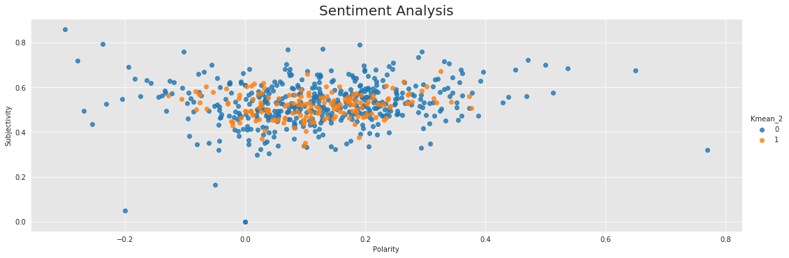
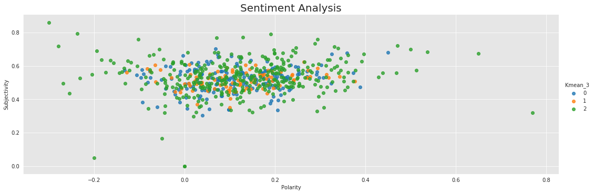
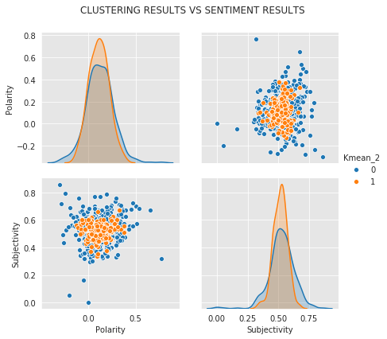
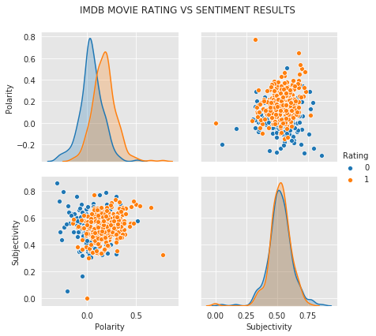
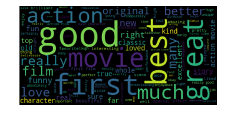
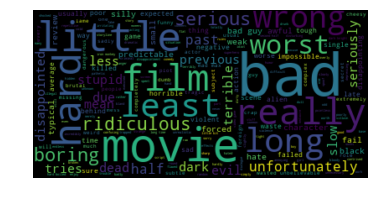

# Sentiment Analysis

### Author: Kevin Okiah

**04/06/2019**


In this notebook, I explore Sentiment analysis(opinion mining) which is an NLP methodology for gauging opinions, feelings, Attitudes, or Emotions about a given subject from written or spoken language. I leverage TextBlob Module in python which compiles words labeled with sentiment score by Linguistic researchers based on their domain expertise. Sentiment of words can vary based on where it is in a sentence.

Using Textblob each word or Chunk from a corpus is labeled in terms of polarity and subjectivity and many other labels.
`Polarity` measures how positive or negative a word is. -1 is very negative. +1 is very positive.
`Subjectivity` on the other hand measures subjective, or opinionated a word is. 0 is fact. +1 is very much an opinion.

Sentiment analysis is performed on the same action Movie reviews collected from IMDB from previous notebooks. We Compare Sentiments to:
* K-Means clustering labels 
    * 2 Centers (ideal since we are dealing with positive and negative rating)
    * 3 Centers (gave us better cluster separation based on Silhoutte score)
* Movie Ratings collected from IMDB.
    * Positive Rating labeled as 1. (IMDB rating greater than 7/10)
    * Negative Rating Labeled as 0. (IMDB rating less than 5/10)


See results accompanying the commentary


**Reference:**

* https://planspace.org/20150607-textblob_sentiment/

* https://textblob.readthedocs.io/en/dev/

* https://github.com/adashofdata/nlp-in-python-tutorial/blob/master/3-Sentiment-Analysis.ipynb


```python
from textblob import TextBlob
import pickle
import pandas as pd
from TextCleaningToolkit import *
import seaborn as sns
import matplotlib.pyplot as plt
import re
import warnings
warnings.filterwarnings("ignore")
stopwords = nltk.corpus.stopwords.words('english')

%matplotlib inline

#leveraging Sarkar's codes
from normalization import normalize_corpus 
```


```python
data = pd.read_csv("ClusteredReviews_EngFeatures.csv", encoding='utf-8')
#data = pd.read_csv("ClusteredReviews.csv", encoding='utf-8')
data["Corpus"] = normalize_corpus(data.Review, lemmatize=False )
```


```python
data.head(2)
```


<div>
<style scoped>
    .dataframe tbody tr th:only-of-type {
        vertical-align: middle;
    }

    .dataframe tbody tr th {
        vertical-align: top;
    }

    .dataframe thead th {
        text-align: right;
    }
</style>
<table border="1" class="dataframe">
  <thead>
    <tr style="text-align: right;">
      <th></th>
      <th>Movie</th>
      <th>Review</th>
      <th>Review_Author</th>
      <th>Review_Date</th>
      <th>Review_Rating</th>
      <th>Review_Title</th>
      <th>Rating</th>
      <th>Tokens</th>
      <th>Chunks</th>
      <th>PCA1</th>
      <th>...</th>
      <th>Kmean_5</th>
      <th>Agglomerative_5</th>
      <th>Spectral_6</th>
      <th>MiniBatch_6</th>
      <th>Kmean_6</th>
      <th>Agglomerative_6</th>
      <th>AvgWordLength</th>
      <th>NumberOfUniqueWords</th>
      <th>NumberOfWords</th>
      <th>Corpus</th>
    </tr>
  </thead>
  <tbody>
    <tr>
      <th>0</th>
      <td>1 - Nenokkadine (2014) - IMDb</td>
      <td>Its the same excitement that bring to every to...</td>
      <td>s-vinaykumar12345610</td>
      <td>January/2014</td>
      <td>9/10</td>
      <td>Its like watching a color film during the bla...</td>
      <td>1</td>
      <td>[excitement, bring, every, tollywood, movie, g...</td>
      <td>[its the same excitement, bring, to, every tol...</td>
      <td>-58.502108</td>
      <td>...</td>
      <td>0</td>
      <td>2</td>
      <td>0</td>
      <td>4</td>
      <td>4</td>
      <td>2</td>
      <td>5.551020</td>
      <td>98</td>
      <td>134</td>
      <td>excitement bring every tollywood movie guy wat...</td>
    </tr>
    <tr>
      <th>1</th>
      <td>10,000 BC (2008) - IMDb</td>
      <td>I'm quite surprised at how many people are sla...</td>
      <td>dan-ragan-11</td>
      <td>July/2008</td>
      <td>6/10</td>
      <td>It is what it is.</td>
      <td>1</td>
      <td>[quite, surprise, many, people, slam, movie, h...</td>
      <td>[i, am quite surprised, at, how, many people, ...</td>
      <td>-91.744114</td>
      <td>...</td>
      <td>2</td>
      <td>0</td>
      <td>0</td>
      <td>4</td>
      <td>4</td>
      <td>5</td>
      <td>5.792208</td>
      <td>77</td>
      <td>108</td>
      <td>quite surprised many people slamming movie his...</td>
    </tr>
  </tbody>
</table>
<p>2 rows × 35 columns</p>
</div>


```python
pol = lambda x: TextBlob(x).sentiment.polarity
sub = lambda x: TextBlob(x).sentiment.subjectivity
```


```python
data['Polarity'] = data['Corpus'].apply(pol)
data['Subjectivity'] = data['Corpus'].apply(sub)
data.head(2)
```


<div>
<style scoped>
    .dataframe tbody tr th:only-of-type {
        vertical-align: middle;
    }

    .dataframe tbody tr th {
        vertical-align: top;
    }

    .dataframe thead th {
        text-align: right;
    }
</style>
<table border="1" class="dataframe">
  <thead>
    <tr style="text-align: right;">
      <th></th>
      <th>Movie</th>
      <th>Review</th>
      <th>Review_Author</th>
      <th>Review_Date</th>
      <th>Review_Rating</th>
      <th>Review_Title</th>
      <th>Rating</th>
      <th>Tokens</th>
      <th>Chunks</th>
      <th>PCA1</th>
      <th>...</th>
      <th>Spectral_6</th>
      <th>MiniBatch_6</th>
      <th>Kmean_6</th>
      <th>Agglomerative_6</th>
      <th>AvgWordLength</th>
      <th>NumberOfUniqueWords</th>
      <th>NumberOfWords</th>
      <th>Corpus</th>
      <th>Polarity</th>
      <th>Subjectivity</th>
    </tr>
  </thead>
  <tbody>
    <tr>
      <th>0</th>
      <td>1 - Nenokkadine (2014) - IMDb</td>
      <td>Its the same excitement that bring to every to...</td>
      <td>s-vinaykumar12345610</td>
      <td>January/2014</td>
      <td>9/10</td>
      <td>Its like watching a color film during the bla...</td>
      <td>1</td>
      <td>[excitement, bring, every, tollywood, movie, g...</td>
      <td>[its the same excitement, bring, to, every tol...</td>
      <td>-58.502108</td>
      <td>...</td>
      <td>0</td>
      <td>4</td>
      <td>4</td>
      <td>2</td>
      <td>5.551020</td>
      <td>98</td>
      <td>134</td>
      <td>excitement bring every tollywood movie guy wat...</td>
      <td>0.320513</td>
      <td>0.636538</td>
    </tr>
    <tr>
      <th>1</th>
      <td>10,000 BC (2008) - IMDb</td>
      <td>I'm quite surprised at how many people are sla...</td>
      <td>dan-ragan-11</td>
      <td>July/2008</td>
      <td>6/10</td>
      <td>It is what it is.</td>
      <td>1</td>
      <td>[quite, surprise, many, people, slam, movie, h...</td>
      <td>[i, am quite surprised, at, how, many people, ...</td>
      <td>-91.744114</td>
      <td>...</td>
      <td>0</td>
      <td>4</td>
      <td>4</td>
      <td>5</td>
      <td>5.792208</td>
      <td>77</td>
      <td>108</td>
      <td>quite surprised many people slamming movie his...</td>
      <td>0.168122</td>
      <td>0.349735</td>
    </tr>
  </tbody>
</table>
<p>2 rows × 37 columns</p>
</div>


```python
data.columns
```


    Index([              u'Movie',              u'Review',       u'Review_Author',
                   u'Review_Date',       u'Review_Rating',        u'Review_Title',
                        u'Rating',              u'Tokens',              u'Chunks',
                          u'PCA1',                u'PCA2',          u'Spectral_2',
                   u'MiniBatch_2',             u'Kmean_2',     u'Agglomerative_2',
                    u'Spectral_3',         u'MiniBatch_3',             u'Kmean_3',
               u'Agglomerative_3',          u'Spectral_4',         u'MiniBatch_4',
                       u'Kmean_4',     u'Agglomerative_4',          u'Spectral_5',
                   u'MiniBatch_5',             u'Kmean_5',     u'Agglomerative_5',
                    u'Spectral_6',         u'MiniBatch_6',             u'Kmean_6',
               u'Agglomerative_6',       u'AvgWordLength', u'NumberOfUniqueWords',
                 u'NumberOfWords',              u'Corpus',            u'Polarity',
                  u'Subjectivity'],
          dtype='object')


```python
x = []
for i in list(data.Review_Rating):
    x = x + [int(i.split('/')[0])]

data["Review_Rating"] =x
```


```python
# Let's plot the results
import matplotlib.pyplot as plt
import seaborn as sns
catcols = ['Kmean_2','Kmean_3','Rating']
           
def dfScatter(df=data, catcol='Rating'):
    sns.set_style("darkgrid", {"axes.facecolor": ".9"})
    sns.lmplot(x ='Polarity', y='Subjectivity', data=df, fit_reg=False, hue=catcol, legend=True, size=5, aspect=3)
    #sns.kdeplot(data.Polarity, data.Subjectivity,hue=catcol, shade=True, shade_lowest=False)

    plt.title('Sentiment Analysis', fontsize=20)

for i in catcols:           
    dfScatter(catcol=i)
```








The clustering results don't give us a super strong distinction in sentiment. Comparing the cluster Sentiments to IMDB movie rating we see a clear separation between positive reviews and Negative reviews. Positive reviews (1) with a have a more positive sentiement polarity on compared to Negative reviews (0)

## Clusters sentiments summary Statistics


```python
g = sns.pairplot(data, height=3,vars=['Polarity', 'Subjectivity'], hue='Kmean_2')
plt.subplots_adjust(top=0.9)
g.fig.suptitle('CLUSTERING RESULTS VS SENTIMENT RESULTS')
```


    Text(0.5,0.98,'CLUSTERING RESULTS VS SENTIMENT RESULTS')





```python
data.groupby('Kmean_2').agg({"Polarity":['count', 'min', 'mean', 'median', 'max', 'skew', 'std']})
```


<div>
<style scoped>
    .dataframe tbody tr th:only-of-type {
        vertical-align: middle;
    }

    .dataframe tbody tr th {
        vertical-align: top;
    }

    .dataframe thead tr th {
        text-align: left;
    }

    .dataframe thead tr:last-of-type th {
        text-align: right;
    }
</style>
<table border="1" class="dataframe">
  <thead>
    <tr>
      <th></th>
      <th colspan="7" halign="left">Polarity</th>
    </tr>
    <tr>
      <th></th>
      <th>count</th>
      <th>min</th>
      <th>mean</th>
      <th>median</th>
      <th>max</th>
      <th>skew</th>
      <th>std</th>
    </tr>
    <tr>
      <th>Kmean_2</th>
      <th></th>
      <th></th>
      <th></th>
      <th></th>
      <th></th>
      <th></th>
      <th></th>
    </tr>
  </thead>
  <tbody>
    <tr>
      <th>0</th>
      <td>448</td>
      <td>-0.300000</td>
      <td>0.123707</td>
      <td>0.122456</td>
      <td>0.770000</td>
      <td>0.209368</td>
      <td>0.142494</td>
    </tr>
    <tr>
      <th>1</th>
      <td>166</td>
      <td>-0.127814</td>
      <td>0.114013</td>
      <td>0.108915</td>
      <td>0.375996</td>
      <td>0.098050</td>
      <td>0.102182</td>
    </tr>
  </tbody>
</table>
</div>


As mentioned previously the reviews are not super well separated based clustering results. This indicates we probably had to do some extra data cleaning to get better results. Cluster 0 has a slightly more positive sentiment than Cluster 1.


```python
g = sns.pairplot(data, height=3,vars=['Polarity', 'Subjectivity'], hue='Rating')
plt.subplots_adjust(top=0.9)
g.fig.suptitle('IMDB MOVIE RATING VS SENTIMENT RESULTS')
```


    Text(0.5,0.98,'IMDB MOVIE RATING VS SENTIMENT RESULTS')





```python
data.groupby('Rating').agg({"Polarity":['count', 'min', 'mean', 'median', 'max', 'skew', 'std']})
```


<div>
<style scoped>
    .dataframe tbody tr th:only-of-type {
        vertical-align: middle;
    }

    .dataframe tbody tr th {
        vertical-align: top;
    }

    .dataframe thead tr th {
        text-align: left;
    }

    .dataframe thead tr:last-of-type th {
        text-align: right;
    }
</style>
<table border="1" class="dataframe">
  <thead>
    <tr>
      <th></th>
      <th colspan="7" halign="left">Polarity</th>
    </tr>
    <tr>
      <th></th>
      <th>count</th>
      <th>min</th>
      <th>mean</th>
      <th>median</th>
      <th>max</th>
      <th>skew</th>
      <th>std</th>
    </tr>
    <tr>
      <th>Rating</th>
      <th></th>
      <th></th>
      <th></th>
      <th></th>
      <th></th>
      <th></th>
      <th></th>
    </tr>
  </thead>
  <tbody>
    <tr>
      <th>0</th>
      <td>264</td>
      <td>-0.300000</td>
      <td>0.046295</td>
      <td>0.037811</td>
      <td>0.5125</td>
      <td>-0.019798</td>
      <td>0.114280</td>
    </tr>
    <tr>
      <th>1</th>
      <td>350</td>
      <td>-0.144872</td>
      <td>0.177500</td>
      <td>0.176794</td>
      <td>0.7700</td>
      <td>0.605923</td>
      <td>0.117092</td>
    </tr>
  </tbody>
</table>
</div>


There is a clear difference in sentiment between positive IMDB movie reviews and Negative Movie reviews as indicated in the distribution and summary statistics above. Positive Reviews(1) have a higher sentiment polarity Median(0.177) vs Negative reviews (0) with a median sentiment of 0.037.

We this we can conclude positivee review rating score is directly correlated with the sentiment conveyed by the movie reviewer

## Sentiment analysis with chunking


```python
data.Chunks[0].split(',')# sample Chunks
```


    [u'[its the same excitement',
     u' bring',
     u' to',
     u' every tollywood movie guy',
     u' when',
     u' they',
     u' have watched',
     u' a film',
     u' in',
     u' full',
     u' color',
     u" '",
     u' during',
     u' the times',
     u' of',
     u' black',
     u' white',
     u' cinematography',
     u' usually most',
     u' of',
     u" '",
     u' tollywood',
     u' films',
     u' has',
     u' typically',
     u' a nice formulae',
     u' start',
     u' with',
     u' a fight',
     u' a song',
     u' chase',
     u' the villains',
     u' two more fights',
     u' 10 jokes',
     u' fight',
     u' in',
     u' climax and end',
     u' this film',
     u' is',
     u' completely different',
     u' a film',
     u' could set',
     u' standards',
     u' to',
     u' the upcoming ones',
     u' a completely different road',
     u' has been put',
     u' up',
     u' this film',
     u' might be',
     u' of',
     u' the best films',
     u' in',
     u' tollywood',
     u' makes',
     u' you',
     u' to',
     u' be',
     u' in',
     u' the script',
     u' till',
     u' the end',
     u' not',
     u' like',
     u' other movies',
     u' defines',
     u' the laws',
     u' of',
     u' the physics',
     u' every other director',
     u' are using',
     u' the usual formulae',
     u' should see',
     u' this and try',
     u' to',
     u' change',
     u' the way',
     u' how',
     u' it',
     u' has been taken',
     u' up by',
     u' mr sukumar',
     u' its',
     u' awesome',
     u' its a huge leap',
     u' for',
     u' tollywood',
     u' excellent cinematography',
     u' excellent script',
     u' thou it',
     u' has loosened',
     u' a bit',
     u' in',
     u' the middle',
     u' excellent direction',
     u' most stunning background music',
     u' good crew',
     u' i',
     u' must also appreciate',
     u' the background music',
     u' ...]']


```python
ChunkedSentiment = pd.DataFrame()
ChunkedSentiments = pd.DataFrame() # super list

for i in range(0,data.shape[0]):
    #print(i)
    ChunkedSentiment = pd.DataFrame()
    try:
        ChunkedSentiment['Chunk'] =data.Chunks[i].split(',')
        ChunkedSentiment['Sentiment'] = ChunkedSentiment['Chunk'].apply(pol)
        ChunkedSentiment['Movie'] = data.Movie[i]
        ChunkedSentiment['Review_Score'] = data.Review_Rating[i]
        ChunkedSentiment['Rating'] = data.Rating[i]
    except ValueError as e:
        print(e)
        print(i)
    except AttributeError as e:
        #print(e)
        print(i)
    ChunkedSentiments=ChunkedSentiments.append(ChunkedSentiment)

```

    168
    177
    240
    436
    563


```python
ChunkedSentiments.head()
```


<div>
<style scoped>
    .dataframe tbody tr th:only-of-type {
        vertical-align: middle;
    }

    .dataframe tbody tr th {
        vertical-align: top;
    }

    .dataframe thead th {
        text-align: right;
    }
</style>
<table border="1" class="dataframe">
  <thead>
    <tr style="text-align: right;">
      <th></th>
      <th>Chunk</th>
      <th>Sentiment</th>
      <th>Movie</th>
      <th>Review_Score</th>
      <th>Rating</th>
    </tr>
  </thead>
  <tbody>
    <tr>
      <th>0</th>
      <td>[its the same excitement</td>
      <td>0.0</td>
      <td>1 - Nenokkadine (2014) - IMDb</td>
      <td>9</td>
      <td>1</td>
    </tr>
    <tr>
      <th>1</th>
      <td>bring</td>
      <td>0.0</td>
      <td>1 - Nenokkadine (2014) - IMDb</td>
      <td>9</td>
      <td>1</td>
    </tr>
    <tr>
      <th>2</th>
      <td>to</td>
      <td>0.0</td>
      <td>1 - Nenokkadine (2014) - IMDb</td>
      <td>9</td>
      <td>1</td>
    </tr>
    <tr>
      <th>3</th>
      <td>every tollywood movie guy</td>
      <td>0.0</td>
      <td>1 - Nenokkadine (2014) - IMDb</td>
      <td>9</td>
      <td>1</td>
    </tr>
    <tr>
      <th>4</th>
      <td>when</td>
      <td>0.0</td>
      <td>1 - Nenokkadine (2014) - IMDb</td>
      <td>9</td>
      <td>1</td>
    </tr>
  </tbody>
</table>
</div>


```python
#filter  neutral sentiments
Filteredsentiments = ChunkedSentiments[ChunkedSentiments.Sentiment!=0.0]
```


```python
Filteredsentiments.sort_values('Sentiment').head(20)
```


<div>
<style scoped>
    .dataframe tbody tr th:only-of-type {
        vertical-align: middle;
    }

    .dataframe tbody tr th {
        vertical-align: top;
    }

    .dataframe thead th {
        text-align: right;
    }
</style>
<table border="1" class="dataframe">
  <thead>
    <tr style="text-align: right;">
      <th></th>
      <th>Chunk</th>
      <th>Sentiment</th>
      <th>Movie</th>
      <th>Review_Score</th>
      <th>Rating</th>
    </tr>
  </thead>
  <tbody>
    <tr>
      <th>27</th>
      <td>the worst way</td>
      <td>-1.0</td>
      <td>Henry V (1989) - IMDb</td>
      <td>2</td>
      <td>0</td>
    </tr>
    <tr>
      <th>63</th>
      <td>terrible</td>
      <td>-1.0</td>
      <td>Outcast (2014) - IMDb</td>
      <td>6</td>
      <td>1</td>
    </tr>
    <tr>
      <th>44</th>
      <td>boring</td>
      <td>-1.0</td>
      <td>Outcast (2014) - IMDb</td>
      <td>6</td>
      <td>1</td>
    </tr>
    <tr>
      <th>11</th>
      <td>boring</td>
      <td>-1.0</td>
      <td>How to Train Your Dragon (2010) - IMDb</td>
      <td>10</td>
      <td>1</td>
    </tr>
    <tr>
      <th>93</th>
      <td>menacing poseur-ship.the script</td>
      <td>-1.0</td>
      <td>Highlander: The Final Dimension (1994) - IMDb</td>
      <td>4</td>
      <td>0</td>
    </tr>
    <tr>
      <th>39</th>
      <td>terrible</td>
      <td>-1.0</td>
      <td>Star Wars: Episode VI - Return of the Jedi (19...</td>
      <td>5</td>
      <td>0</td>
    </tr>
    <tr>
      <th>92</th>
      <td>evil immortal</td>
      <td>-1.0</td>
      <td>Highlander: Endgame (2000) - IMDb</td>
      <td>1</td>
      <td>0</td>
    </tr>
    <tr>
      <th>73</th>
      <td>awful</td>
      <td>-1.0</td>
      <td>Ong-bak 3 (2010) - IMDb</td>
      <td>3</td>
      <td>0</td>
    </tr>
    <tr>
      <th>69</th>
      <td>horribly</td>
      <td>-1.0</td>
      <td>Ong-bak 3 (2010) - IMDb</td>
      <td>3</td>
      <td>0</td>
    </tr>
    <tr>
      <th>35</th>
      <td>evil</td>
      <td>-1.0</td>
      <td>Rurouni Kenshin Part II: Kyoto Inferno (2014) ...</td>
      <td>2</td>
      <td>0</td>
    </tr>
    <tr>
      <th>22</th>
      <td>worst</td>
      <td>-1.0</td>
      <td>Bodyguard (2011) - IMDb</td>
      <td>1</td>
      <td>0</td>
    </tr>
    <tr>
      <th>75</th>
      <td>a horrible experience</td>
      <td>-1.0</td>
      <td>Cats &amp; Dogs: The Revenge of Kitty Galore (2010...</td>
      <td>4</td>
      <td>0</td>
    </tr>
    <tr>
      <th>75</th>
      <td>really boring</td>
      <td>-1.0</td>
      <td>The Road Warrior (1981) - IMDb</td>
      <td>10</td>
      <td>1</td>
    </tr>
    <tr>
      <th>22</th>
      <td>worst</td>
      <td>-1.0</td>
      <td>Lost in Space (1998) - IMDb</td>
      <td>2</td>
      <td>0</td>
    </tr>
    <tr>
      <th>53</th>
      <td>the dreadfully insipid titanic</td>
      <td>-1.0</td>
      <td>Watchmen (2009) - IMDb</td>
      <td>10</td>
      <td>1</td>
    </tr>
    <tr>
      <th>73</th>
      <td>worst</td>
      <td>-1.0</td>
      <td>The Road Warrior (1981) - IMDb</td>
      <td>4</td>
      <td>0</td>
    </tr>
    <tr>
      <th>38</th>
      <td>the worst film</td>
      <td>-1.0</td>
      <td>Cats &amp; Dogs: The Revenge of Kitty Galore (2010...</td>
      <td>4</td>
      <td>0</td>
    </tr>
    <tr>
      <th>3</th>
      <td>the equally terrible ending</td>
      <td>-1.0</td>
      <td>Star Trek (2009) - IMDb</td>
      <td>1</td>
      <td>0</td>
    </tr>
    <tr>
      <th>36</th>
      <td>the worst film</td>
      <td>-1.0</td>
      <td>Cats &amp; Dogs: The Revenge of Kitty Galore (2010...</td>
      <td>4</td>
      <td>0</td>
    </tr>
    <tr>
      <th>14</th>
      <td>awful</td>
      <td>-1.0</td>
      <td>Lost in Space (1998) - IMDb</td>
      <td>2</td>
      <td>0</td>
    </tr>
  </tbody>
</table>
</div>


Chunks that get assigned negative sentiments carry common negative words with negative connotations like `boring`, `horrible` , `terrible`, `worst` etc.


```python
Filteredsentiments.sort_values('Sentiment').tail(20)
```


<div>
<style scoped>
    .dataframe tbody tr th:only-of-type {
        vertical-align: middle;
    }

    .dataframe tbody tr th {
        vertical-align: top;
    }

    .dataframe thead th {
        text-align: right;
    }
</style>
<table border="1" class="dataframe">
  <thead>
    <tr style="text-align: right;">
      <th></th>
      <th>Chunk</th>
      <th>Sentiment</th>
      <th>Movie</th>
      <th>Review_Score</th>
      <th>Rating</th>
    </tr>
  </thead>
  <tbody>
    <tr>
      <th>12</th>
      <td>best actor</td>
      <td>1.0</td>
      <td>Anniyan (2005) - IMDb</td>
      <td>10</td>
      <td>1</td>
    </tr>
    <tr>
      <th>68</th>
      <td>impressive velocity pursuits</td>
      <td>1.0</td>
      <td>Agent Cody Banks (2003) - IMDb</td>
      <td>6</td>
      <td>1</td>
    </tr>
    <tr>
      <th>30</th>
      <td>best movie</td>
      <td>1.0</td>
      <td>RoboCop (1987) - IMDb</td>
      <td>10</td>
      <td>1</td>
    </tr>
    <tr>
      <th>78</th>
      <td>best</td>
      <td>1.0</td>
      <td>Welcome to the Jungle (2013) - IMDb</td>
      <td>3</td>
      <td>0</td>
    </tr>
    <tr>
      <th>73</th>
      <td>perfect</td>
      <td>1.0</td>
      <td>The Mountain II (2016) - IMDb</td>
      <td>10</td>
      <td>1</td>
    </tr>
    <tr>
      <th>92</th>
      <td>wonderful</td>
      <td>1.0</td>
      <td>3:10 to Yuma (2007) - IMDb</td>
      <td>8</td>
      <td>1</td>
    </tr>
    <tr>
      <th>42</th>
      <td>perfectly</td>
      <td>1.0</td>
      <td>Superhero Movie (2008) - IMDb</td>
      <td>10</td>
      <td>1</td>
    </tr>
    <tr>
      <th>63</th>
      <td>a masterful job</td>
      <td>1.0</td>
      <td>Avengers: Infinity War (2018) - IMDb</td>
      <td>10</td>
      <td>1</td>
    </tr>
    <tr>
      <th>74</th>
      <td>excellent</td>
      <td>1.0</td>
      <td>Grindhouse (2007) - IMDb</td>
      <td>9</td>
      <td>1</td>
    </tr>
    <tr>
      <th>28</th>
      <td>perfect</td>
      <td>1.0</td>
      <td>Blues Brothers 2000 (1998) - IMDb</td>
      <td>6</td>
      <td>1</td>
    </tr>
    <tr>
      <th>46</th>
      <td>the best movie john woo</td>
      <td>1.0</td>
      <td>A Better Tomorrow (1986) - IMDb</td>
      <td>8</td>
      <td>1</td>
    </tr>
    <tr>
      <th>6</th>
      <td>masterfully woven</td>
      <td>1.0</td>
      <td>Avengers: Infinity War (2018) - IMDb</td>
      <td>10</td>
      <td>1</td>
    </tr>
    <tr>
      <th>2</th>
      <td>the best mcu film</td>
      <td>1.0</td>
      <td>Captain America: Civil War (2016) - IMDb</td>
      <td>4</td>
      <td>0</td>
    </tr>
    <tr>
      <th>1</th>
      <td>best movie</td>
      <td>1.0</td>
      <td>Postal (2007) - IMDb</td>
      <td>5</td>
      <td>0</td>
    </tr>
    <tr>
      <th>25</th>
      <td>best</td>
      <td>1.0</td>
      <td>Captain America: Civil War (2016) - IMDb</td>
      <td>10</td>
      <td>1</td>
    </tr>
    <tr>
      <th>3</th>
      <td>best and</td>
      <td>1.0</td>
      <td>The Matrix (1999) - IMDb</td>
      <td>10</td>
      <td>1</td>
    </tr>
    <tr>
      <th>69</th>
      <td>those magnificent men</td>
      <td>1.0</td>
      <td>It's a Mad Mad Mad Mad World (1963) - IMDb</td>
      <td>10</td>
      <td>1</td>
    </tr>
    <tr>
      <th>10</th>
      <td>the best time</td>
      <td>1.0</td>
      <td>Cyborg (1989) - IMDb</td>
      <td>3</td>
      <td>0</td>
    </tr>
    <tr>
      <th>5</th>
      <td>best</td>
      <td>1.0</td>
      <td>Cyborg (1989) - IMDb</td>
      <td>3</td>
      <td>0</td>
    </tr>
    <tr>
      <th>38</th>
      <td>wonderful</td>
      <td>1.0</td>
      <td>A Sound of Thunder (2005) - IMDb</td>
      <td>7</td>
      <td>1</td>
    </tr>
  </tbody>
</table>
</div>


Chunks with positive sentiment polarity have common words with positive sentiment such as `good`, `wonderful`, `best` etc.

### Extra

#### Exploring the sentiments with word cloud

What are the common words in positive Sentiment chunks vs Negative Chunks?


```python
#polarity Positive (sentiment>0), Negative (sentiment <0)
Filteredsentiments = Filteredsentiments.assign(Polarity = np.where(Filteredsentiments['Sentiment']>0, "Positive", "Negative"))
```


```python
Filteredsentiments.head()
```


<div>
<style scoped>
    .dataframe tbody tr th:only-of-type {
        vertical-align: middle;
    }

    .dataframe tbody tr th {
        vertical-align: top;
    }

    .dataframe thead th {
        text-align: right;
    }
</style>
<table border="1" class="dataframe">
  <thead>
    <tr style="text-align: right;">
      <th></th>
      <th>Chunk</th>
      <th>Sentiment</th>
      <th>Movie</th>
      <th>Review_Score</th>
      <th>Rating</th>
      <th>Polarity</th>
    </tr>
  </thead>
  <tbody>
    <tr>
      <th>9</th>
      <td>full</td>
      <td>0.350000</td>
      <td>1 - Nenokkadine (2014) - IMDb</td>
      <td>9</td>
      <td>1</td>
      <td>Positive</td>
    </tr>
    <tr>
      <th>15</th>
      <td>black</td>
      <td>-0.166667</td>
      <td>1 - Nenokkadine (2014) - IMDb</td>
      <td>9</td>
      <td>1</td>
      <td>Negative</td>
    </tr>
    <tr>
      <th>18</th>
      <td>usually most</td>
      <td>0.500000</td>
      <td>1 - Nenokkadine (2014) - IMDb</td>
      <td>9</td>
      <td>1</td>
      <td>Positive</td>
    </tr>
    <tr>
      <th>24</th>
      <td>typically</td>
      <td>-0.166667</td>
      <td>1 - Nenokkadine (2014) - IMDb</td>
      <td>9</td>
      <td>1</td>
      <td>Negative</td>
    </tr>
    <tr>
      <th>25</th>
      <td>a nice formulae</td>
      <td>0.600000</td>
      <td>1 - Nenokkadine (2014) - IMDb</td>
      <td>9</td>
      <td>1</td>
      <td>Positive</td>
    </tr>
  </tbody>
</table>
</div>


```python
from wordcloud import WordCloud
```


```python
positive = Filteredsentiments[Filteredsentiments.Polarity=='Positive']
join_Chunks_pos = " "
join_Chunks_pos = join_Chunks_pos.join(positive.Chunk)  #Words for positive sentiments
join_Chunks_neg = " "
negative = Filteredsentiments[Filteredsentiments.Polarity=='Negative']
join_Chunks_neg = join_Chunks_neg.join(negative.Chunk) #Words for negative sentiments
```


```python
# Generate a word cloud image
wordcloud_pos = WordCloud(max_font_size=70).generate(join_Chunks_pos)
wordcloud_neg = WordCloud(max_font_size=70).generate(join_Chunks_neg)
```


```python
plt.imshow(wordcloud_pos, interpolation='bilinear')
plt.axis("off")

```


    (-0.5, 399.5, 199.5, -0.5)





```python
plt.imshow(wordcloud_neg, interpolation='bilinear')
plt.axis("off")

```


    (-0.5, 399.5, 199.5, -0.5)





```python
%load_ext version_information
%version_information pandas, numpy, nltk, re, contractions, pattern, requests, bs4, selenium, lxml, urllib3, pyvirtualdisplay, spacy
```

    The version_information extension is already loaded. To reload it, use:
      %reload_ext version_information


<table><tr><th>Software</th><th>Version</th></tr><tr><td>Python</td><td>2.7.15 64bit [GCC 7.3.0]</td></tr><tr><td>IPython</td><td>5.8.0</td></tr><tr><td>OS</td><td>Linux 4.15.0 46 generic x86_64 with debian buster sid</td></tr><tr><td>pandas</td><td>0.24.2</td></tr><tr><td>numpy</td><td>1.16.2</td></tr><tr><td>nltk</td><td>3.4</td></tr><tr><td>re</td><td>2.2.1</td></tr><tr><td>contractions</td><td>0.0.17</td></tr><tr><td>pattern</td><td>2.6</td></tr><tr><td>requests</td><td>2.21.0</td></tr><tr><td>bs4</td><td>4.7.1</td></tr><tr><td>selenium</td><td>3.141.0</td></tr><tr><td>lxml</td><td>4.3.2</td></tr><tr><td>urllib3</td><td>1.24.1</td></tr><tr><td>pyvirtualdisplay</td><td>0.2.1</td></tr><tr><td>spacy</td><td>2.0.18</td></tr><tr><td colspan='2'>Thu Apr 04 20:25:14 2019 CDT</td></tr></table>


