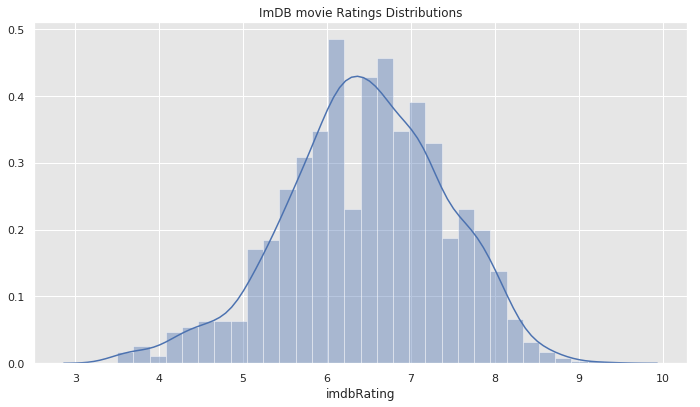
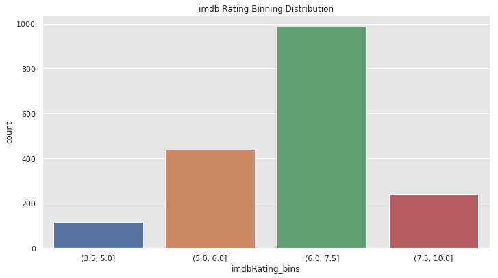
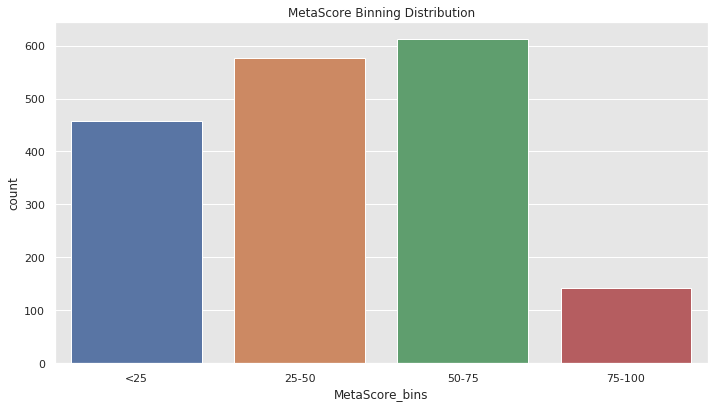
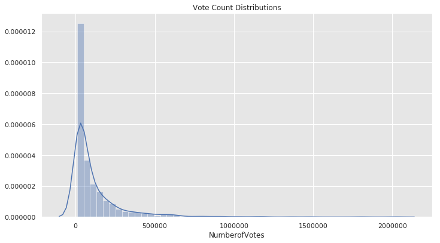
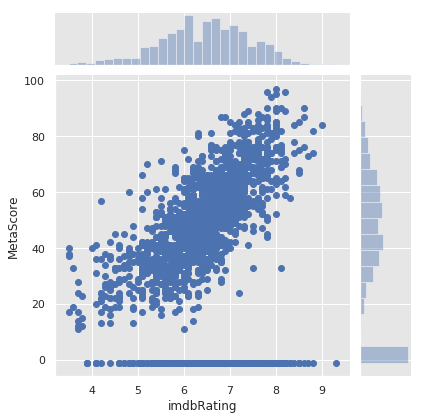

## Webscrapping : IMDB Action Movie Reviews
#### Author: Kevin Okiah
#### 02/27/2019

The focus of this notebook is to demonstate how to go about scrapping movie reviews, and rating from imdb. Reviews scrapped on  this Notebook will be used down the line for clustering and topic modeling.

one positive and one negative review are scrapped for 190 movies  for a total of ~ 380 reviews. For this analysis, a positive review is considered to be a review with a review rating of greater than 7/10 where as a negative review is a review with a rating less than 5/10.

Some basic EDA and data visualization is performed on the ratings for the movies.

The reviews collected are then cleaned following the same text cleaning approaches discuss discussed in previous notebooks leveraging `TextCleaningToolkit.py`. The review preprocessing approach includes:

1. Break review into sentences/lines
2. Change sentences to lower case
3. Expland contractions for each sentence. Turning shortforms like Can't to Can not
4. NP Chunk from pattern.en import parsetree 
5. Break lines into tokens
6. Remove punctuation marks
7. remove stopwords
8. Perform lemmatization


I wrap up this notebook by chunking  the reviews using pattern

**Tools Used**
* Selenium
* BeautifulSoup
* NLTK
* urllib
* lxml
* spacy


```python
import numpy as np
import pandas as pd
import selenium
from lxml import html
import urllib3
from bs4 import BeautifulSoup
import lxml
import urllib 
import nltk
import string
import request
#from urllib import request
import urllib
from pyvirtualdisplay import Display
from selenium import webdriver  #We will use selenimun to navigate between pages
import warnings
warnings.filterwarnings("ignore")
import pickle
import time 
import spacy
spacy.prefer_gpu()
#!python -m spacy download en   ## download models
nlp = spacy.load('en')
import seaborn as sns
import matplotlib.pyplot as plt
from selenium.common.exceptions import TimeoutException
from selenium.common.exceptions import WebDriverException, NoSuchElementException
from IPython.display import display, HTML
from TextCleaningToolkit import *
%matplotlib inline

display = Display(visible=0, size=(800, 600))
display.start()
driver = webdriver.Chrome()


%matplotlib inline

http = urllib3.PoolManager()

def get_url_Bs(url):
    tree = BeautifulSoup(url)
    return tree

def get_url_Sel(url):
    tree = html.document_fromstring(url)
    return tree

base_url ='https://www.imdb.com'

```

1.	Compile a list of static links (permalinks) to individual user movie reviews from one particular website. This will be your working dataset for this assignment, as well as for assignments 7 and 8, which together will make up your semester project.

>a.	It does not matter if you use a crawler or if you manually collect the links, but you will need at least 100 movie review links. Note that, as of this writing, the robots.txt file of IMDB.com allows the crawling of user reviews.

>b.	Each link should be to a web page that has only one user review of only one movie, e.g., the user review permalinks on the IMDB site.

>c.	Choose reviews of movies that are all in the same genre, e.g., sci-fi, mystery, romance, superhero, etc. 

>d.	Make sure your collection includes reviews of several movies in your chosen genre and that it includes a mix of negative and positive reviews.  


**Scrapping Approach**

For my scrappying, I chose to scrape actions movies from url "https://www.imdb.com/search/title?title_type=feature&user_rating=3.5,&num_votes=10000,&genres=action&sort=user_rating,desc". This filter returns 1,813 action movies titles with IMDB rating >3.5 and number of votes >10000. This gives me the flexiblity to select best and worst movies based on IMDB rating and also to have some data to perform some visualisation as shown below. After pulling the movie list, I saved it in an pandas objectto avoid having to rerun the query which could take a while.


```python
next_page ='//*[contains(concat( " ", @class, " " ), concat( " ", "next-page", " " ))]' #xpath for next page
```


```python
def get_MoviesUrls(max_page =37,imdb_actions_all_movies_list="https://www.imdb.com/search/title?title_type=feature&user_rating=3.5,&num_votes=10000,&genres=action&sort=user_rating,desc" ):
    '''
    Functions Get Pages for Urls for movies
    max_page = max number of pages to parse. each page = 50 movies for a total of 1800 movies
    
    ** Feature Film, Rating Count at least 10,000, Action (Sorted by IMDb Rating Ascending), user Rating> 3.5
    imdb_actions_all_movies_list = "https://www.imdb.com/search/title?title_type=feature&num_votes=10000,
    &genres=action&sort=user_rating,asc"

    '''

    driver.get(imdb_actions_all_movies_list) # access the base url
    
    movies_urls = [] #list of all urls

    for i in range(max_page):
        try:
            driver.set_page_load_timeout(3)
            Current_Page_url = driver.current_url #get url for the current page
            myurl = http.request('GET', Current_Page_url).data
            tree = get_url_Sel(myurl)
            links = tree.xpath('//a/@href') # links to one page
            '''
            #pulling urls for movies form one page
            1. one page as 50 movies
            2. Url for a movie_page starts with '/title' and ends with either '=adv_li_tt' or '=adv_li_i'
            '''
            for i in links:
                if i.startswith('/title') & i.endswith('=adv_li_tt'):
                    print(base_url+i)
                    movies_urls =movies_urls+ [base_url+i]  #append the reconstruct movie page url to movies list
            driver.find_element_by_xpath(next_page).click() #click next button
            time.sleep(3) # adding a wait time to ensure th page loads

        except request.HTTPError as err:
            if err.code == 404:
                print(err.code, " Error!!!")
            else:
                raise
        except TimeoutException  as e:
            isrunning = 0
            #print("Exception has been thrown. " + str(e))
            print("TimeoutException!!  ", str(e))
        except WebDriverException  as wb:
            isrunning = 0
            #print("Exception has been thrown. " + str(e))
            print("WebDirverException!!  ", str(wb))
    return(movies_urls)
```

movies_urls = get_MoviesUrls()# commented out so us not to rerun it multipletimes
pickle.dump(movies_urls, open( "movies_url.p", "wb" ) , protocol=2) # save list as pickle


```python
with open('movies_url.p', 'rb') as f:
     movies_urls = pickle.load(f)
```


```python
len(movies_urls)
```


    1810


## IMDB Rating


```python
def get_Movie_Reviews_urls_and_imdbRating(Movies_Urls=movies_urls):#[1171:1850]):
    '''
    Function tracks a movies IMDBRating and returns urls review pages.
    
    We will use the imdb rating to select the worst movies and good movies to pull reviews
    '''
    Titles =[]
    Movie_Url =[]
    Reviews_url =[]
    imdbRating = []
    NumberofVotes =[]
    Movies_ReviewsPages = {}
    Metascore = []
    metacore_xpath ='//*[contains(concat( " ", @class, " " ), concat( " ", "titleReviewBarItem", " " ))]'
    for movie in Movies_Urls:
        try:
            driver.get(movie) #get page for a given movie
            imdbRaT= driver.find_element_by_class_name('imdbRating').text.splitlines()[0].split('/')[0]
            Votes =driver.find_element_by_class_name('imdbRating').text.splitlines()[1]
            try:
                metascore =int(driver.find_element_by_xpath(metacore_xpath).text.split()[0])
            except NoSuchElementException  as f:
                print("NoSuchElementException!!  ", str(f))
                metascore ='NA'
            except ValueError:
                metascore ='NA'
            imdbRating =imdbRating + [imdbRaT]
            NumberofVotes =  NumberofVotes+[Votes ]
            Title = driver.title #movie title
            Titles = Titles+[Title]
            Movie_Url = Movie_Url+ [movie]
            review_url =movie.split('?ref')[0]+'reviews?ref_=tt_ql_3'
            Reviews_url =Reviews_url +[review_url]
            Metascore =  Metascore + [metascore]
            time.sleep(3)
            print(review_url)
        except request.HTTPError as err:
            if err.code == 404:
                print(err.code, " Error!!!")
            else:
                raise
        except TimeoutException  as e:
            isrunning = 0
            #print("Exception has been thrown. " + str(e))
            print("TimeoutException!!  ", str(e))
        except WebDriverException  as wb:
            isrunning = 0
            #print("Exception has been thrown. " + str(e))
            print("WebDirverException!!  ", str(wb))
    Movies_ReviewsPages.update({'Title': Titles, 'imdbRating':imdbRating,'NumberofVotes':NumberofVotes,
                                'MetaScore':Metascore,'Movie Page':  Movie_Url, "Movie's Review Page": Reviews_url})

    return(pd.DataFrame.from_dict(Movies_ReviewsPages))

```

##### data save in pickle to avoid rerunning this bloack of code
Movies_RatingsA = get_Movie_Reviews_urls_and_imdbRating()
pickle.dump(Movies_RatingsA, open( "Movies_RatingsA.p", "wb" ), protocol=2 ) # save dataframe as pickle

## Data Visualisation

In this section I perform some basic EDA and Data visualization of imdbRating, NumberofVotes , Metascore and create some binning features to visualize the movie rating


```python
# reaload picked data          
with open('Movies_RatingsA.p', 'rb') as f:
     Movies_RatingsA = pickle.load(f)

Movies_RatingsA
```


<div>
<style scoped>
    .dataframe tbody tr th:only-of-type {
        vertical-align: middle;
    }

    .dataframe tbody tr th {
        vertical-align: top;
    }

    .dataframe thead th {
        text-align: right;
    }
</style>
<table border="1" class="dataframe">
  <thead>
    <tr style="text-align: right;">
      <th></th>
      <th>Title</th>
      <th>imdbRating</th>
      <th>NumberofVotes</th>
      <th>MetaScore</th>
      <th>Movie Page</th>
      <th>Movie's Review Page</th>
    </tr>
  </thead>
  <tbody>
    <tr>
      <th>0</th>
      <td>The Mountain II (2016) - IMDb</td>
      <td>9.3</td>
      <td>99,822</td>
      <td>NA</td>
      <td>https://www.imdb.com/title/tt5813916/?ref_=adv...</td>
      <td>https://www.imdb.com/title/tt5813916/reviews?r...</td>
    </tr>
    <tr>
      <th>1</th>
      <td>The Dark Knight (2008) - IMDb</td>
      <td>9.0</td>
      <td>2,025,570</td>
      <td>84</td>
      <td>https://www.imdb.com/title/tt0468569/?ref_=adv...</td>
      <td>https://www.imdb.com/title/tt0468569/reviews?r...</td>
    </tr>
    <tr>
      <th>2</th>
      <td>Vikram Vedha (2017) - IMDb</td>
      <td>8.8</td>
      <td>17,684</td>
      <td>NA</td>
      <td>https://www.imdb.com/title/tt6148156/?ref_=adv...</td>
      <td>https://www.imdb.com/title/tt6148156/reviews?r...</td>
    </tr>
    <tr>
      <th>3</th>
      <td>Inception (2010) - IMDb</td>
      <td>8.8</td>
      <td>1,804,838</td>
      <td>74</td>
      <td>https://www.imdb.com/title/tt1375666/?ref_=adv...</td>
      <td>https://www.imdb.com/title/tt1375666/reviews?r...</td>
    </tr>
    <tr>
      <th>4</th>
      <td>Star Wars: Episode V - The Empire Strikes Back...</td>
      <td>8.8</td>
      <td>1,033,505</td>
      <td>82</td>
      <td>https://www.imdb.com/title/tt0080684/?ref_=adv...</td>
      <td>https://www.imdb.com/title/tt0080684/reviews?r...</td>
    </tr>
    <tr>
      <th>5</th>
      <td>The Matrix (1999) - IMDb</td>
      <td>8.7</td>
      <td>1,478,881</td>
      <td>73</td>
      <td>https://www.imdb.com/title/tt0133093/?ref_=adv...</td>
      <td>https://www.imdb.com/title/tt0133093/reviews?r...</td>
    </tr>
    <tr>
      <th>6</th>
      <td>Harakiri (1962) - IMDb</td>
      <td>8.7</td>
      <td>23,879</td>
      <td>NA</td>
      <td>https://www.imdb.com/title/tt0056058/?ref_=adv...</td>
      <td>https://www.imdb.com/title/tt0056058/reviews?r...</td>
    </tr>
    <tr>
      <th>7</th>
      <td>Rangasthalam (2018) - IMDb</td>
      <td>8.6</td>
      <td>14,938</td>
      <td>NA</td>
      <td>https://www.imdb.com/title/tt7392212/?ref_=adv...</td>
      <td>https://www.imdb.com/title/tt7392212/reviews?r...</td>
    </tr>
    <tr>
      <th>8</th>
      <td>Spider-Man: Into the Spider-Verse (2018) - IMDb</td>
      <td>8.6</td>
      <td>126,704</td>
      <td>87</td>
      <td>https://www.imdb.com/title/tt4633694/?ref_=adv...</td>
      <td>https://www.imdb.com/title/tt4633694/reviews?r...</td>
    </tr>
    <tr>
      <th>9</th>
      <td>Black Friday (2004) - IMDb</td>
      <td>8.6</td>
      <td>15,867</td>
      <td>76</td>
      <td>https://www.imdb.com/title/tt0400234/?ref_=adv...</td>
      <td>https://www.imdb.com/title/tt0400234/reviews?r...</td>
    </tr>
    <tr>
      <th>10</th>
      <td>Star Wars: Episode IV - A New Hope (1977) - IMDb</td>
      <td>8.6</td>
      <td>1,103,343</td>
      <td>90</td>
      <td>https://www.imdb.com/title/tt0076759/?ref_=adv...</td>
      <td>https://www.imdb.com/title/tt0076759/reviews?r...</td>
    </tr>
    <tr>
      <th>11</th>
      <td>K.G.F: Chapter 1 (2018) - IMDb</td>
      <td>8.5</td>
      <td>20,284</td>
      <td>NA</td>
      <td>https://www.imdb.com/title/tt7838252/?ref_=adv...</td>
      <td>https://www.imdb.com/title/tt7838252/reviews?r...</td>
    </tr>
    <tr>
      <th>12</th>
      <td>Dangal (2016) - IMDb</td>
      <td>8.5</td>
      <td>116,381</td>
      <td>NA</td>
      <td>https://www.imdb.com/title/tt5074352/?ref_=adv...</td>
      <td>https://www.imdb.com/title/tt5074352/reviews?r...</td>
    </tr>
    <tr>
      <th>13</th>
      <td>Thani Oruvan (2015) - IMDb</td>
      <td>8.5</td>
      <td>13,371</td>
      <td>NA</td>
      <td>https://www.imdb.com/title/tt4987556/?ref_=adv...</td>
      <td>https://www.imdb.com/title/tt4987556/reviews?r...</td>
    </tr>
    <tr>
      <th>14</th>
      <td>Avengers: Infinity War (2018) - IMDb</td>
      <td>8.5</td>
      <td>593,350</td>
      <td>68</td>
      <td>https://www.imdb.com/title/tt4154756/?ref_=adv...</td>
      <td>https://www.imdb.com/title/tt4154756/reviews?r...</td>
    </tr>
    <tr>
      <th>15</th>
      <td>Gladiator (2000) - IMDb</td>
      <td>8.5</td>
      <td>1,190,828</td>
      <td>67</td>
      <td>https://www.imdb.com/title/tt0172495/?ref_=adv...</td>
      <td>https://www.imdb.com/title/tt0172495/reviews?r...</td>
    </tr>
    <tr>
      <th>16</th>
      <td>Terminator 2: Judgment Day (1991) - IMDb</td>
      <td>8.5</td>
      <td>892,177</td>
      <td>75</td>
      <td>https://www.imdb.com/title/tt0103064/?ref_=adv...</td>
      <td>https://www.imdb.com/title/tt0103064/reviews?r...</td>
    </tr>
    <tr>
      <th>17</th>
      <td>Raiders of the Lost Ark (1981) - IMDb</td>
      <td>8.5</td>
      <td>798,052</td>
      <td>85</td>
      <td>https://www.imdb.com/title/tt0082971/?ref_=adv...</td>
      <td>https://www.imdb.com/title/tt0082971/reviews?r...</td>
    </tr>
    <tr>
      <th>18</th>
      <td>Vishwaroopam (2013) - IMDb</td>
      <td>8.4</td>
      <td>37,699</td>
      <td>NA</td>
      <td>https://www.imdb.com/title/tt2199711/?ref_=adv...</td>
      <td>https://www.imdb.com/title/tt2199711/reviews?r...</td>
    </tr>
    <tr>
      <th>19</th>
      <td>The Dark Knight Rises (2012) - IMDb</td>
      <td>8.4</td>
      <td>1,364,522</td>
      <td>78</td>
      <td>https://www.imdb.com/title/tt1345836/?ref_=adv...</td>
      <td>https://www.imdb.com/title/tt1345836/reviews?r...</td>
    </tr>
    <tr>
      <th>20</th>
      <td>Oldboy (2003) - IMDb</td>
      <td>8.4</td>
      <td>449,976</td>
      <td>74</td>
      <td>https://www.imdb.com/title/tt0364569/?ref_=adv...</td>
      <td>https://www.imdb.com/title/tt0364569/reviews?r...</td>
    </tr>
    <tr>
      <th>21</th>
      <td>Aliens (1986) - IMDb</td>
      <td>8.4</td>
      <td>591,139</td>
      <td>84</td>
      <td>https://www.imdb.com/title/tt0090605/?ref_=adv...</td>
      <td>https://www.imdb.com/title/tt0090605/reviews?r...</td>
    </tr>
    <tr>
      <th>22</th>
      <td>1 - Nenokkadine (2014) - IMDb</td>
      <td>8.3</td>
      <td>40,825</td>
      <td>NA</td>
      <td>https://www.imdb.com/title/tt2375559/?ref_=adv...</td>
      <td>https://www.imdb.com/title/tt2375559/reviews?r...</td>
    </tr>
    <tr>
      <th>23</th>
      <td>Athadu (2005) - IMDb</td>
      <td>8.3</td>
      <td>10,208</td>
      <td>NA</td>
      <td>https://www.imdb.com/title/tt0471571/?ref_=adv...</td>
      <td>https://www.imdb.com/title/tt0471571/reviews?r...</td>
    </tr>
    <tr>
      <th>24</th>
      <td>Neon Genesis Evangelion: The End of Evangelion...</td>
      <td>8.3</td>
      <td>25,213</td>
      <td>NA</td>
      <td>https://www.imdb.com/title/tt0169858/?ref_=adv...</td>
      <td>https://www.imdb.com/title/tt0169858/reviews?r...</td>
    </tr>
    <tr>
      <th>25</th>
      <td>Star Wars: Episode VI - Return of the Jedi (19...</td>
      <td>8.3</td>
      <td>847,104</td>
      <td>58</td>
      <td>https://www.imdb.com/title/tt0086190/?ref_=adv...</td>
      <td>https://www.imdb.com/title/tt0086190/reviews?r...</td>
    </tr>
    <tr>
      <th>26</th>
      <td>Yojimbo (1961) - IMDb</td>
      <td>8.3</td>
      <td>95,013</td>
      <td>NA</td>
      <td>https://www.imdb.com/title/tt0055630/?ref_=adv...</td>
      <td>https://www.imdb.com/title/tt0055630/reviews?r...</td>
    </tr>
    <tr>
      <th>27</th>
      <td>Dragon Ball Super: Broly (2018) - IMDb</td>
      <td>8.2</td>
      <td>13,211</td>
      <td>59</td>
      <td>https://www.imdb.com/title/tt7961060/?ref_=adv...</td>
      <td>https://www.imdb.com/title/tt7961060/reviews?r...</td>
    </tr>
    <tr>
      <th>28</th>
      <td>Baahubali: The Beginning (2015) - IMDb</td>
      <td>8.2</td>
      <td>91,866</td>
      <td>NA</td>
      <td>https://www.imdb.com/title/tt2631186/?ref_=adv...</td>
      <td>https://www.imdb.com/title/tt2631186/reviews?r...</td>
    </tr>
    <tr>
      <th>29</th>
      <td>Gangs of Wasseypur (2012) - IMDb</td>
      <td>8.2</td>
      <td>67,728</td>
      <td>89</td>
      <td>https://www.imdb.com/title/tt1954470/?ref_=adv...</td>
      <td>https://www.imdb.com/title/tt1954470/reviews?r...</td>
    </tr>
    <tr>
      <th>...</th>
      <td>...</td>
      <td>...</td>
      <td>...</td>
      <td>...</td>
      <td>...</td>
      <td>...</td>
    </tr>
    <tr>
      <th>1760</th>
      <td>Thunderbirds (2004) - IMDb</td>
      <td>4.2</td>
      <td>12,355</td>
      <td>36</td>
      <td>https://www.imdb.com/title/tt0167456/?ref_=adv...</td>
      <td>https://www.imdb.com/title/tt0167456/reviews?r...</td>
    </tr>
    <tr>
      <th>1761</th>
      <td>Wing Commander (1999) - IMDb</td>
      <td>4.2</td>
      <td>15,556</td>
      <td>21</td>
      <td>https://www.imdb.com/title/tt0131646/?ref_=adv...</td>
      <td>https://www.imdb.com/title/tt0131646/reviews?r...</td>
    </tr>
    <tr>
      <th>1762</th>
      <td>Fair Game (1995) - IMDb</td>
      <td>4.2</td>
      <td>11,265</td>
      <td>13</td>
      <td>https://www.imdb.com/title/tt0113010/?ref_=adv...</td>
      <td>https://www.imdb.com/title/tt0113010/reviews?r...</td>
    </tr>
    <tr>
      <th>1763</th>
      <td>Stop! Or My Mom Will Shoot (1992) - IMDb</td>
      <td>4.2</td>
      <td>35,604</td>
      <td>NA</td>
      <td>https://www.imdb.com/title/tt0105477/?ref_=adv...</td>
      <td>https://www.imdb.com/title/tt0105477/reviews?r...</td>
    </tr>
    <tr>
      <th>1764</th>
      <td>Jeepers Creepers III (2017) - IMDb</td>
      <td>4.1</td>
      <td>14,071</td>
      <td>NA</td>
      <td>https://www.imdb.com/title/tt1139592/?ref_=adv...</td>
      <td>https://www.imdb.com/title/tt1139592/reviews?r...</td>
    </tr>
    <tr>
      <th>1765</th>
      <td>The Last Airbender (2010) - IMDb</td>
      <td>4.1</td>
      <td>136,188</td>
      <td>20</td>
      <td>https://www.imdb.com/title/tt0938283/?ref_=adv...</td>
      <td>https://www.imdb.com/title/tt0938283/reviews?r...</td>
    </tr>
    <tr>
      <th>1766</th>
      <td>Torque (2004) - IMDb</td>
      <td>4.1</td>
      <td>25,701</td>
      <td>41</td>
      <td>https://www.imdb.com/title/tt0329691/?ref_=adv...</td>
      <td>https://www.imdb.com/title/tt0329691/reviews?r...</td>
    </tr>
    <tr>
      <th>1767</th>
      <td>Inspector Gadget (1999) - IMDb</td>
      <td>4.1</td>
      <td>41,486</td>
      <td>36</td>
      <td>https://www.imdb.com/title/tt0141369/?ref_=adv...</td>
      <td>https://www.imdb.com/title/tt0141369/reviews?r...</td>
    </tr>
    <tr>
      <th>1768</th>
      <td>The Patriot (1998) - IMDb</td>
      <td>4.1</td>
      <td>11,052</td>
      <td>NA</td>
      <td>https://www.imdb.com/title/tt0120786/?ref_=adv...</td>
      <td>https://www.imdb.com/title/tt0120786/reviews?r...</td>
    </tr>
    <tr>
      <th>1769</th>
      <td>Beowulf (1999) - IMDb</td>
      <td>4.1</td>
      <td>10,552</td>
      <td>NA</td>
      <td>https://www.imdb.com/title/tt0120604/?ref_=adv...</td>
      <td>https://www.imdb.com/title/tt0120604/reviews?r...</td>
    </tr>
    <tr>
      <th>1770</th>
      <td>Highlander II: The Quickening (1991) - IMDb</td>
      <td>4.1</td>
      <td>40,808</td>
      <td>31</td>
      <td>https://www.imdb.com/title/tt0102034/?ref_=adv...</td>
      <td>https://www.imdb.com/title/tt0102034/reviews?r...</td>
    </tr>
    <tr>
      <th>1771</th>
      <td>RoboCop 3 (1993) - IMDb</td>
      <td>4.0</td>
      <td>41,750</td>
      <td>40</td>
      <td>https://www.imdb.com/title/tt0107978/?ref_=adv...</td>
      <td>https://www.imdb.com/title/tt0107978/reviews?r...</td>
    </tr>
    <tr>
      <th>1772</th>
      <td>Singularity (2017) - IMDb</td>
      <td>3.9</td>
      <td>11,993</td>
      <td>NA</td>
      <td>https://www.imdb.com/title/tt7312940/?ref_=adv...</td>
      <td>https://www.imdb.com/title/tt7312940/reviews?r...</td>
    </tr>
    <tr>
      <th>1773</th>
      <td>Thugs of Hindostan (2018) - IMDb</td>
      <td>3.9</td>
      <td>14,457</td>
      <td>NA</td>
      <td>https://www.imdb.com/title/tt5970844/?ref_=adv...</td>
      <td>https://www.imdb.com/title/tt5970844/reviews?r...</td>
    </tr>
    <tr>
      <th>1774</th>
      <td>Street Fighter (1994) - IMDb</td>
      <td>3.9</td>
      <td>60,038</td>
      <td>NA</td>
      <td>https://www.imdb.com/title/tt0111301/?ref_=adv...</td>
      <td>https://www.imdb.com/title/tt0111301/reviews?r...</td>
    </tr>
    <tr>
      <th>1775</th>
      <td>In the Name of the King: A Dungeon Siege Tale ...</td>
      <td>3.8</td>
      <td>41,892</td>
      <td>15</td>
      <td>https://www.imdb.com/title/tt0460780/?ref_=adv...</td>
      <td>https://www.imdb.com/title/tt0460780/reviews?r...</td>
    </tr>
    <tr>
      <th>1776</th>
      <td>The Adventures of Pluto Nash (2002) - IMDb</td>
      <td>3.8</td>
      <td>22,630</td>
      <td>12</td>
      <td>https://www.imdb.com/title/tt0180052/?ref_=adv...</td>
      <td>https://www.imdb.com/title/tt0180052/reviews?r...</td>
    </tr>
    <tr>
      <th>1777</th>
      <td>Speed 2: Cruise Control (1997) - IMDb</td>
      <td>3.8</td>
      <td>68,678</td>
      <td>23</td>
      <td>https://www.imdb.com/title/tt0120179/?ref_=adv...</td>
      <td>https://www.imdb.com/title/tt0120179/reviews?r...</td>
    </tr>
    <tr>
      <th>1778</th>
      <td>Street Fighter: The Legend of Chun-Li (2009) -...</td>
      <td>3.7</td>
      <td>21,634</td>
      <td>17</td>
      <td>https://www.imdb.com/title/tt0891592/?ref_=adv...</td>
      <td>https://www.imdb.com/title/tt0891592/reviews?r...</td>
    </tr>
    <tr>
      <th>1779</th>
      <td>Dungeons &amp; Dragons (2000) - IMDb</td>
      <td>3.7</td>
      <td>30,118</td>
      <td>14</td>
      <td>https://www.imdb.com/title/tt0190374/?ref_=adv...</td>
      <td>https://www.imdb.com/title/tt0190374/reviews?r...</td>
    </tr>
    <tr>
      <th>1780</th>
      <td>Mortal Kombat: Annihilation (1997) - IMDb</td>
      <td>3.7</td>
      <td>41,995</td>
      <td>11</td>
      <td>https://www.imdb.com/title/tt0119707/?ref_=adv...</td>
      <td>https://www.imdb.com/title/tt0119707/reviews?r...</td>
    </tr>
    <tr>
      <th>1781</th>
      <td>Batman &amp; Robin (1997) - IMDb</td>
      <td>3.7</td>
      <td>215,481</td>
      <td>28</td>
      <td>https://www.imdb.com/title/tt0118688/?ref_=adv...</td>
      <td>https://www.imdb.com/title/tt0118688/reviews?r...</td>
    </tr>
    <tr>
      <th>1782</th>
      <td>The Avengers (1998) - IMDb</td>
      <td>3.7</td>
      <td>38,483</td>
      <td>12</td>
      <td>https://www.imdb.com/title/tt0118661/?ref_=adv...</td>
      <td>https://www.imdb.com/title/tt0118661/reviews?r...</td>
    </tr>
    <tr>
      <th>1783</th>
      <td>Superman IV: The Quest for Peace (1987) - IMDb</td>
      <td>3.7</td>
      <td>38,875</td>
      <td>24</td>
      <td>https://www.imdb.com/title/tt0094074/?ref_=adv...</td>
      <td>https://www.imdb.com/title/tt0094074/reviews?r...</td>
    </tr>
    <tr>
      <th>1784</th>
      <td>Dragon Wars: D-War (2007) - IMDb</td>
      <td>3.6</td>
      <td>22,724</td>
      <td>33</td>
      <td>https://www.imdb.com/title/tt0372873/?ref_=adv...</td>
      <td>https://www.imdb.com/title/tt0372873/reviews?r...</td>
    </tr>
    <tr>
      <th>1785</th>
      <td>Ballistic: Ecks vs. Sever (2002) - IMDb</td>
      <td>3.6</td>
      <td>18,073</td>
      <td>19</td>
      <td>https://www.imdb.com/title/tt0308208/?ref_=adv...</td>
      <td>https://www.imdb.com/title/tt0308208/reviews?r...</td>
    </tr>
    <tr>
      <th>1786</th>
      <td>Spy Kids 4-D: All the Time in the World (2011)...</td>
      <td>3.5</td>
      <td>19,511</td>
      <td>37</td>
      <td>https://www.imdb.com/title/tt1517489/?ref_=adv...</td>
      <td>https://www.imdb.com/title/tt1517489/reviews?r...</td>
    </tr>
    <tr>
      <th>1787</th>
      <td>Dance Flick (2009) - IMDb</td>
      <td>3.5</td>
      <td>11,049</td>
      <td>40</td>
      <td>https://www.imdb.com/title/tt1153706/?ref_=adv...</td>
      <td>https://www.imdb.com/title/tt1153706/reviews?r...</td>
    </tr>
    <tr>
      <th>1788</th>
      <td>Delta Farce (2007) - IMDb</td>
      <td>3.5</td>
      <td>10,130</td>
      <td>17</td>
      <td>https://www.imdb.com/title/tt0800003/?ref_=adv...</td>
      <td>https://www.imdb.com/title/tt0800003/reviews?r...</td>
    </tr>
    <tr>
      <th>1789</th>
      <td>The Adventures of Sharkboy and Lavagirl 3-D (2...</td>
      <td>3.5</td>
      <td>26,267</td>
      <td>38</td>
      <td>https://www.imdb.com/title/tt0424774/?ref_=adv...</td>
      <td>https://www.imdb.com/title/tt0424774/reviews?r...</td>
    </tr>
  </tbody>
</table>
<p>1790 rows × 6 columns</p>
</div>


```python
Movies_Ratings = Movies_RatingsA.copy()
```


```python
Movies_Ratings.dtypes
```


    Title                  object
    imdbRating             object
    NumberofVotes          object
    MetaScore              object
    Movie Page             object
    Movie's Review Page    object
    dtype: object


```python
# replace mising Metascore with -1 and convert data types for imdbratin, Metascore and Number of votes fo numeric.

Movies_Ratings.imdbRating = Movies_Ratings.imdbRating.astype(float)
Movies_Ratings.MetaScore= Movies_Ratings.MetaScore.replace(to_replace='NA', value=-1, inplace=False).astype(int)
Movies_Ratings.NumberofVotes =Movies_Ratings.NumberofVotes.str.replace(',', '').astype(int)
```


```python
Movies_Ratings.dtypes
```


    Title                   object
    imdbRating             float64
    NumberofVotes            int64
    MetaScore                int64
    Movie Page              object
    Movie's Review Page     object
    dtype: object


```python
Movies_Ratings.head()
```


<div>
<style scoped>
    .dataframe tbody tr th:only-of-type {
        vertical-align: middle;
    }

    .dataframe tbody tr th {
        vertical-align: top;
    }

    .dataframe thead th {
        text-align: right;
    }
</style>
<table border="1" class="dataframe">
  <thead>
    <tr style="text-align: right;">
      <th></th>
      <th>Title</th>
      <th>imdbRating</th>
      <th>NumberofVotes</th>
      <th>MetaScore</th>
      <th>Movie Page</th>
      <th>Movie's Review Page</th>
    </tr>
  </thead>
  <tbody>
    <tr>
      <th>0</th>
      <td>The Mountain II (2016) - IMDb</td>
      <td>9.3</td>
      <td>99822</td>
      <td>-1</td>
      <td>https://www.imdb.com/title/tt5813916/?ref_=adv...</td>
      <td>https://www.imdb.com/title/tt5813916/reviews?r...</td>
    </tr>
    <tr>
      <th>1</th>
      <td>The Dark Knight (2008) - IMDb</td>
      <td>9.0</td>
      <td>2025570</td>
      <td>84</td>
      <td>https://www.imdb.com/title/tt0468569/?ref_=adv...</td>
      <td>https://www.imdb.com/title/tt0468569/reviews?r...</td>
    </tr>
    <tr>
      <th>2</th>
      <td>Vikram Vedha (2017) - IMDb</td>
      <td>8.8</td>
      <td>17684</td>
      <td>-1</td>
      <td>https://www.imdb.com/title/tt6148156/?ref_=adv...</td>
      <td>https://www.imdb.com/title/tt6148156/reviews?r...</td>
    </tr>
    <tr>
      <th>3</th>
      <td>Inception (2010) - IMDb</td>
      <td>8.8</td>
      <td>1804838</td>
      <td>74</td>
      <td>https://www.imdb.com/title/tt1375666/?ref_=adv...</td>
      <td>https://www.imdb.com/title/tt1375666/reviews?r...</td>
    </tr>
    <tr>
      <th>4</th>
      <td>Star Wars: Episode V - The Empire Strikes Back...</td>
      <td>8.8</td>
      <td>1033505</td>
      <td>82</td>
      <td>https://www.imdb.com/title/tt0080684/?ref_=adv...</td>
      <td>https://www.imdb.com/title/tt0080684/reviews?r...</td>
    </tr>
  </tbody>
</table>
</div>


```python
np.unique(Movies_Ratings.imdbRating)
```


    array([3.5, 3.6, 3.7, 3.8, 3.9, 4. , 4.1, 4.2, 4.3, 4.4, 4.5, 4.6, 4.7,
           4.8, 4.9, 5. , 5.1, 5.2, 5.3, 5.4, 5.5, 5.6, 5.7, 5.8, 5.9, 6. ,
           6.1, 6.2, 6.3, 6.4, 6.5, 6.6, 6.7, 6.8, 6.9, 7. , 7.1, 7.2, 7.3,
           7.4, 7.5, 7.6, 7.7, 7.8, 7.9, 8. , 8.1, 8.2, 8.3, 8.4, 8.5, 8.6,
           8.7, 8.8, 9. , 9.3])


```python
#Create binning features for imdb Rating and Metascore
bins = pd.IntervalIndex.from_tuples([(3.5, 5), (5, 6), (6, 7.5), (7.5, 10)])
Movies_Ratings = Movies_Ratings.assign(imdbRating_bins = pd.cut(np.array(Movies_Ratings['imdbRating']), 
                                              bins))
Movies_Ratings = Movies_Ratings.assign(MetaScore_bins = pd.cut(np.array(Movies_Ratings['MetaScore']), 
                                              4, labels =['<25', '25-50', '50-75', '75-100']))
```


```python
Movies_Ratings.head()
```


<div>
<style scoped>
    .dataframe tbody tr th:only-of-type {
        vertical-align: middle;
    }

    .dataframe tbody tr th {
        vertical-align: top;
    }

    .dataframe thead th {
        text-align: right;
    }
</style>
<table border="1" class="dataframe">
  <thead>
    <tr style="text-align: right;">
      <th></th>
      <th>Title</th>
      <th>imdbRating</th>
      <th>NumberofVotes</th>
      <th>MetaScore</th>
      <th>Movie Page</th>
      <th>Movie's Review Page</th>
      <th>imdbRating_bins</th>
      <th>MetaScore_bins</th>
    </tr>
  </thead>
  <tbody>
    <tr>
      <th>0</th>
      <td>The Mountain II (2016) - IMDb</td>
      <td>9.3</td>
      <td>99822</td>
      <td>-1</td>
      <td>https://www.imdb.com/title/tt5813916/?ref_=adv...</td>
      <td>https://www.imdb.com/title/tt5813916/reviews?r...</td>
      <td>(7.5, 10.0]</td>
      <td>&lt;25</td>
    </tr>
    <tr>
      <th>1</th>
      <td>The Dark Knight (2008) - IMDb</td>
      <td>9.0</td>
      <td>2025570</td>
      <td>84</td>
      <td>https://www.imdb.com/title/tt0468569/?ref_=adv...</td>
      <td>https://www.imdb.com/title/tt0468569/reviews?r...</td>
      <td>(7.5, 10.0]</td>
      <td>75-100</td>
    </tr>
    <tr>
      <th>2</th>
      <td>Vikram Vedha (2017) - IMDb</td>
      <td>8.8</td>
      <td>17684</td>
      <td>-1</td>
      <td>https://www.imdb.com/title/tt6148156/?ref_=adv...</td>
      <td>https://www.imdb.com/title/tt6148156/reviews?r...</td>
      <td>(7.5, 10.0]</td>
      <td>&lt;25</td>
    </tr>
    <tr>
      <th>3</th>
      <td>Inception (2010) - IMDb</td>
      <td>8.8</td>
      <td>1804838</td>
      <td>74</td>
      <td>https://www.imdb.com/title/tt1375666/?ref_=adv...</td>
      <td>https://www.imdb.com/title/tt1375666/reviews?r...</td>
      <td>(7.5, 10.0]</td>
      <td>75-100</td>
    </tr>
    <tr>
      <th>4</th>
      <td>Star Wars: Episode V - The Empire Strikes Back...</td>
      <td>8.8</td>
      <td>1033505</td>
      <td>82</td>
      <td>https://www.imdb.com/title/tt0080684/?ref_=adv...</td>
      <td>https://www.imdb.com/title/tt0080684/reviews?r...</td>
      <td>(7.5, 10.0]</td>
      <td>75-100</td>
    </tr>
  </tbody>
</table>
</div>


```python
sns.set(font_scale=1)
sns.set_style("darkgrid", {"axes.facecolor": ".9"})

a4_dims = (11.7, 6.27)
fig, ax = plt.subplots(figsize=a4_dims)
sns.distplot(Movies_Ratings.imdbRating)
plt.title("ImDB movie Ratings Distributions")
```


    Text(0.5, 1.0, 'ImDB movie Ratings Distributions')





The 1810 movies pulled show a normal IMDB rating distribution from 3.5 to 9.


```python
#Bar Char
```


```python
f, ax = plt.subplots(figsize=(11.7, 6.27))
sns.countplot(x="imdbRating_bins",  data=Movies_Ratings )
plt.title('imdb Rating Binning Distribution')
```


    Text(0.5, 1.0, 'imdb Rating Binning Distribution')





Most action movies have imdb ratings between 6 and 7.5


```python
f, ax = plt.subplots(figsize=(11.7, 6.27))
sns.countplot(x="MetaScore_bins",  data=Movies_Ratings )
plt.title('MetaScore Binning Distribution')
```


    Text(0.5, 1.0, 'MetaScore Binning Distribution')





```python
sns.set(font_scale=1)
sns.set_style("darkgrid", {"axes.facecolor": ".9"})

a4_dims = (11.7, 6.27)
fig, ax = plt.subplots(figsize=a4_dims)
sns.distplot(Movies_Ratings.NumberofVotes)
plt.title("Vote Count Distributions")
```


    Text(0.5, 1.0, 'Vote Count Distributions')





Most of the movies have votecounts less than 10000


```python
# joint Plots
```


```python
a4_dims = (11.7, 6.27)

sns.jointplot(x="imdbRating", y="MetaScore", data=Movies_Ratings);
#plt.title("Number of votes vs ImDB movie Ratings Distributions")
```





The is a strong positive correlation between imdbRating and movie Metascore as expected.

### Selecting movies to get reviews

I selected movies based on imdb rating. I treat movies with imdb Rating greater than 7.8 as best movies and those with imdb Rating <5.1 as worst movies generating a list og 119 best movies and 120 worst movies respectively


```python
best_movies =Movies_Ratings[Movies_Ratings.imdbRating>7.8] # imDB Rating >7.8
worst_movies=Movies_Ratings[(Movies_Ratings.imdbRating<5.1)]  # imDB Rating<5
```


```python
len(np.unique(best_movies.Title))#.shape
```


    119


```python
len((worst_movies.Title))#.shape
```


    120


```python
Best100_and_Worst100 = pd.concat([best_movies, worst_movies], ignore_index =True) # join the two 
```


```python
Best100_and_Worst100=Best100_and_Worst100.reset_index()
#Best100_and_Worst100.pop("index")
```


```python
Best100_and_Worst100.head()
```


<div>
<style scoped>
    .dataframe tbody tr th:only-of-type {
        vertical-align: middle;
    }

    .dataframe tbody tr th {
        vertical-align: top;
    }

    .dataframe thead th {
        text-align: right;
    }
</style>
<table border="1" class="dataframe">
  <thead>
    <tr style="text-align: right;">
      <th></th>
      <th>index</th>
      <th>Title</th>
      <th>imdbRating</th>
      <th>NumberofVotes</th>
      <th>MetaScore</th>
      <th>Movie Page</th>
      <th>Movie's Review Page</th>
      <th>imdbRating_bins</th>
      <th>MetaScore_bins</th>
    </tr>
  </thead>
  <tbody>
    <tr>
      <th>0</th>
      <td>0</td>
      <td>The Mountain II (2016) - IMDb</td>
      <td>9.3</td>
      <td>99822</td>
      <td>-1</td>
      <td>https://www.imdb.com/title/tt5813916/?ref_=adv...</td>
      <td>https://www.imdb.com/title/tt5813916/reviews?r...</td>
      <td>(7.5, 10.0]</td>
      <td>&lt;25</td>
    </tr>
    <tr>
      <th>1</th>
      <td>1</td>
      <td>The Dark Knight (2008) - IMDb</td>
      <td>9.0</td>
      <td>2025570</td>
      <td>84</td>
      <td>https://www.imdb.com/title/tt0468569/?ref_=adv...</td>
      <td>https://www.imdb.com/title/tt0468569/reviews?r...</td>
      <td>(7.5, 10.0]</td>
      <td>75-100</td>
    </tr>
    <tr>
      <th>2</th>
      <td>2</td>
      <td>Vikram Vedha (2017) - IMDb</td>
      <td>8.8</td>
      <td>17684</td>
      <td>-1</td>
      <td>https://www.imdb.com/title/tt6148156/?ref_=adv...</td>
      <td>https://www.imdb.com/title/tt6148156/reviews?r...</td>
      <td>(7.5, 10.0]</td>
      <td>&lt;25</td>
    </tr>
    <tr>
      <th>3</th>
      <td>3</td>
      <td>Inception (2010) - IMDb</td>
      <td>8.8</td>
      <td>1804838</td>
      <td>74</td>
      <td>https://www.imdb.com/title/tt1375666/?ref_=adv...</td>
      <td>https://www.imdb.com/title/tt1375666/reviews?r...</td>
      <td>(7.5, 10.0]</td>
      <td>75-100</td>
    </tr>
    <tr>
      <th>4</th>
      <td>4</td>
      <td>Star Wars: Episode V - The Empire Strikes Back...</td>
      <td>8.8</td>
      <td>1033505</td>
      <td>82</td>
      <td>https://www.imdb.com/title/tt0080684/?ref_=adv...</td>
      <td>https://www.imdb.com/title/tt0080684/reviews?r...</td>
      <td>(7.5, 10.0]</td>
      <td>75-100</td>
    </tr>
  </tbody>
</table>
</div>


```python
Best100_and_Worst100.shape
```


    (239, 9)


### Pulling Movie from IMDB Reviews

Using the function below, I pull 25 reviews for the ~239 movies listed above. Along with the review I store, the review title, review Author, review date, review rating and store in a pandas dataframe for futher analysis


```python
#Reference : https://stackoverflow.com/questions/47788605/how-to-use-python-to-press-the-load-more-in-imdb-to-get-more-reviews?noredirect=1&lq=1

import requests
from urllib.parse import urljoin
from bs4 import BeautifulSoup

def get_reviews(movie_title ="Place Holder",url = "https://www.imdb.com/title/tt1502712/reviews?ref_=tt_ql_3" ):
    '''
    Functions takes a reviews page url and returns a page df with 10 movie reviews
    '''
    Review_Title =[]
    Review_Author =[]
    Review_Date =[]
    Review_Rating =[]
    Review =[]
    Data_Reviews ={}
    
    res = requests.get(url)
    soup = BeautifulSoup(res.text,"lxml")

    main_content = urljoin(url,soup.select(".load-more-data")[0]['data-ajaxurl'])  ##extracting the link leading to the page containing everything available here
    response = requests.get(main_content)
    broth = BeautifulSoup(response.text,"lxml")

    for item in broth.select(".review-container"):
        #print(item)
        title = item.select(".title")[0].text.splitlines()
        Review_Title =Review_Title + title
        review = str(item.select(".text")[0].text)
        Review =Review +[review]
        try:
            score= item.select(".ipl-ratings-bar")[0].text.split('\n')[7]
            Review_Rating =Review_Rating +[score]
        except:
            score="?"
            Review_Rating =Review_Rating +[score]

        reviewer= item.select(".display-name-date")[0].text.split('\n')[1].split()[0]
        review_date= str(item.select(".display-name-date")[0].text.split('\n')[1].split()[1])+'/'+str(item.select(".display-name-date")[0].text.split('\n')[1].split()[2])
        Review_Author =Review_Author +[reviewer]
        Review_Date =Review_Date +[review_date]
    Data_Reviews.update({"Movie":movie_title, 
                         "Review_Title":Review_Title, 
                         "Review_Author":Review_Author,
                         "Review_Date":Review_Date,
                         "Review_Rating":Review_Rating,
                         "Review":Review}) 
    return(pd.DataFrame.from_dict(Data_Reviews))
```

I have commented code block below to avoid re-rerunning reviews Query. Below I tag review with Ratings greater than 6/10 as positive (1) and the rest as Negative (0)


```python
'''
Reviews_perMovie = pd.DataFrame() #25 reviews per movie
for i in range(Best100_and_Worst100.shape[0]):
    #Title =Best100_and_Worst100.Title[i]
    try:
        temp =get_reviews(movie_title =Best100_and_Worst100["Title"][i], url = Best100_and_Worst100["Movie's Review Page"][i])
        Reviews_perMovie =pd.concat([Reviews_perMovie, temp], ignore_index =False)
        print(i, Best100_and_Worst100["Title"][i], 'success!!!')
    except:
        print('fail')

#### create review rating 1 for positve 0 for negative
Reviews_perMovie = Reviews_perMovie[Reviews_perMovie.Review_Rating!= "?"] # drop row whos review rating ins ?
Reviews_perMovie = Reviews_perMovie.assign(Rating = np.where(Reviews_perMovie['Review_Rating'].isin(['10/10','8/10', '9/10', '6/10', '7/10']), 1, 0))
Final_Movie_List =pd.DataFrame()
for i in np.unique(Reviews_perMovie.Movie):
    Temp = Reviews_perMovie[Reviews_perMovie.Movie==i]
    #select one positive and one negative movie
    Temp_Positive = Temp[Temp.Rating==1]
    Temp_Negative = Temp[Temp.Rating==0]
    if(len(Temp_Positive)!=0 or len(Temp_Negative)!=0): #filter to only movies with a positive and negative review
        Final_Movie_List = pd.concat([Final_Movie_List,Temp_Positive.head(1)])
        Final_Movie_List = pd.concat([Final_Movie_List,Temp_Negative.head(1)])
        
#### Save final review dataframe list
pickle.dump(Final_Movie_List, open( "Final_Movie_List.p", "wb" ) , protocol=2)# save dataframe as pickle
'''
```


    '\nReviews_perMovie = pd.DataFrame() #25 reviews per movie\nfor i in range(Best100_and_Worst100.shape[0]):\n    #Title =Best100_and_Worst100.Title[i]\n    try:\n        temp =get_reviews(movie_title =Best100_and_Worst100["Title"][i], url = Best100_and_Worst100["Movie\'s Review Page"][i])\n        Reviews_perMovie =pd.concat([Reviews_perMovie, temp], ignore_index =False)\n        print(i, Best100_and_Worst100["Title"][i], \'success!!!\')\n    except:\n        print(\'fail\')\n\n#### create review rating 1 for positve 0 for negative\nReviews_perMovie = Reviews_perMovie[Reviews_perMovie.Review_Rating!= "?"] # drop row whos review rating ins ?\nReviews_perMovie = Reviews_perMovie.assign(Rating = np.where(Reviews_perMovie[\'Review_Rating\'].isin([\'10/10\',\'8/10\', \'9/10\', \'6/10\', \'7/10\']), 1, 0))\nFinal_Movie_List =pd.DataFrame()\nfor i in np.unique(Reviews_perMovie.Movie):\n    Temp = Reviews_perMovie[Reviews_perMovie.Movie==i]\n    #select one positive and one negative movie\n    Temp_Positive = Temp[Temp.Rating==1]\n    Temp_Negative = Temp[Temp.Rating==0]\n    if(len(Temp_Positive)!=0 or len(Temp_Negative)!=0): #filter to only movies with a positive and negative review\n        Final_Movie_List = pd.concat([Final_Movie_List,Temp_Positive.head(1)])\n        Final_Movie_List = pd.concat([Final_Movie_List,Temp_Negative.head(1)])\n        \n#### Save final review dataframe list\npickle.dump(Final_Movie_List, open( "Final_Movie_List.p", "wb" ) , protocol=2)# save dataframe as pickle\n'


### CODE that follows is run on python2.7 to take advantage of pattern for chunking


```python
#final Review list
with open('Final_Movie_List.p', 'rb') as f:
     Final_Movie_List = pickle.load(f)
Final_Movie_List .head()
```


<div>
<style scoped>
    .dataframe tbody tr th:only-of-type {
        vertical-align: middle;
    }

    .dataframe tbody tr th {
        vertical-align: top;
    }

    .dataframe thead th {
        text-align: right;
    }
</style>
<table border="1" class="dataframe">
  <thead>
    <tr style="text-align: right;">
      <th></th>
      <th>Movie</th>
      <th>Review_Title</th>
      <th>Review_Author</th>
      <th>Review_Date</th>
      <th>Review_Rating</th>
      <th>Review</th>
      <th>Rating</th>
    </tr>
  </thead>
  <tbody>
    <tr>
      <th>0</th>
      <td>1 - Nenokkadine (2014) - IMDb</td>
      <td>Its like watching a color film during the bla...</td>
      <td>s-vinaykumar12345610</td>
      <td>January/2014</td>
      <td>9/10</td>
      <td>Its the same excitement that bring to every to...</td>
      <td>1</td>
    </tr>
    <tr>
      <th>0</th>
      <td>24 (2016) - IMDb</td>
      <td>Worth the TIME!!</td>
      <td>naveensankaran186</td>
      <td>May/2016</td>
      <td>9/10</td>
      <td>Vikram K Kumar is the real hero! All his work ...</td>
      <td>1</td>
    </tr>
    <tr>
      <th>20</th>
      <td>24 (2016) - IMDb</td>
      <td>Such a disappointment .....</td>
      <td>tmyuran24</td>
      <td>June/2016</td>
      <td>5/10</td>
      <td>This review is not intended to hurt anyone. I ...</td>
      <td>0</td>
    </tr>
    <tr>
      <th>0</th>
      <td>A Sound of Thunder (2005) - IMDb</td>
      <td>Best bad movie of the year!</td>
      <td>mooshki3</td>
      <td>September/2005</td>
      <td>7/10</td>
      <td>I live for movies like this.Saw it in a theate...</td>
      <td>1</td>
    </tr>
    <tr>
      <th>2</th>
      <td>A Sound of Thunder (2005) - IMDb</td>
      <td>Prepare to thunder towards the exit</td>
      <td>TheMovieMark1</td>
      <td>September/2005</td>
      <td>4/10</td>
      <td>What exactly is the sound of thunder? If this ...</td>
      <td>0</td>
    </tr>
  </tbody>
</table>
</div>


The function below cleans the reviews from above dataframe, breaks review into tokens using the same approach as previous homeworks as shown in steps below and also chunks the sentences. I create two new columns the `Final_Movie_List` 'Tokens' and 'Chunks'


```python
def Clean_Review_and_Chunk(raw):
    '''
    ** Function to clean, chunk and tokenize review **
    # Steps
    1. Break review into sentences/lines
    2. Change senteces to lower case
    3. Expland contractions for each sentence. Turning shortforms like Can't to Can not
    4. NP Chunk from pattern.en import parsetree 
    5. Break lines into tokens
    6.  Remove punctuation marks
    7. remove stopwords
    8. Perform lemmatization
    reference: https://nickcdryan.com/2017/02/13/shallow-parsing-for-entity-recognition-with-nltk-and-machine-learning/
    '''
    from pattern.en import parsetree 
    Tokens =[]
    Tree =[]
    Temp = list(raw.splitlines())
    Chunk = []
    Clean_Sentence =[]
    CleanTokens =[]
    
    for i in Temp:
        sentence = expand_contractions(i)#expand contractions
        Clean_Sentence = Clean_Sentence + [sentence.lower()]
        Tokens = Tokens + Tokenizer_Tool(sentence.lower(),'word_tokenize')#tokenize sentences
    words = [word for word in Tokens if word.isalpha()]#Remove punctuations
    CleanTokens = remove_stopwords(words)#Remove stopwords
    CleanTokens =lemming(CleanTokens) #Lemmetization of the tokens to get root words
    for i in Clean_Sentence: #Chunks sentences
        tree = parsetree(i)
        Tree = Tree + tree
    for sentence_tree in Tree: 
        Chunk = Chunk + sentence_tree.chunks 
    return Chunk, CleanTokens
```


```python
#Sample chunked review and cleaned tokens
T, Tokens =Clean_Review_and_Chunk(list(Final_Movie_List.Review)[0])  
print(Tokens)
T
```

    [u'excitement', u'bring', u'every', u'tollywood', u'movie', u'guy', u'watch', u'film', u'full', u'time', u'white', u'cinematography', u'usually', u'film', u'typically', u'nice', u'formula', u'start', u'fight', u'song', u'chase', u'villain', u'two', u'fight', u'joke', u'fight', u'climax', u'end', u'film', u'completely', u'different', u'film', u'could', u'set', u'standard', u'upcoming', u'one', u'completely', u'different', u'road', u'put', u'film', u'might', u'one', u'best', u'film', u'tollywood', u'make', u'script', u'till', u'end', u'like', u'movie', u'defines', u'law', u'physic', u'every', u'director', u'use', u'usual', u'formula', u'see', u'try', u'change', u'way', u'take', u'mr', u'sukumar', u'awesome', u'huge', u'leap', u'tollywood', u'excellent', u'cinematography', u'excellent', u'script', u'thou', u'loosen', u'bit', u'middle', u'excellent', u'direction', u'stun', u'background', u'music', u'good', u'crew', u'must', u'also', u'appreciate', u'background', u'music', u'mr', u'devi', u'sri', u'prasad', u'really', u'do', u'excellent', u'experiment', u'tune', u'music', u'tone', u'use', u'different', u'version', u'come', u'theatre', u'still', u'hear', u'music', u'awesome', u'understand', u'must', u'put', u'complete', u'concentration', u'movie', u'body', u'tell', u'crap', u'mean', u'see', u'movie', u'like', u'dark', u'bad', u'give', u'nostalgia', u'end', u'proud', u'write', u'review', u'movie', u'like']


    [Chunk('its the same excitement/NP'),
     Chunk('bring/VP'),
     Chunk('to/PP'),
     Chunk('every tollywood movie guy/NP'),
     Chunk('when/ADVP'),
     Chunk('they/NP'),
     Chunk('have watched/VP'),
     Chunk('a film/NP'),
     Chunk('in/PP'),
     Chunk('full/NP'),
     Chunk('color/NP'),
     Chunk(''/VP'),
     Chunk('during/PP'),
     Chunk('the times/NP'),
     Chunk('of/PP'),
     Chunk('black/ADJP'),
     Chunk('white/NP'),
     Chunk('cinematography/NP'),
     Chunk('usually most/ADVP'),
     Chunk('of/PP'),
     Chunk(''/VP'),
     Chunk('tollywood/NP'),
     Chunk('films/NP'),
     Chunk('has/VP'),
     Chunk('typically/ADVP'),
     Chunk('a nice formulae/NP'),
     Chunk('start/VP'),
     Chunk('with/PP'),
     Chunk('a fight/NP'),
     Chunk('a song/NP'),
     Chunk('chase/VP'),
     Chunk('the villains/NP'),
     Chunk('two more fights/NP'),
     Chunk('10 jokes/NP'),
     Chunk('fight/NP'),
     Chunk('in/PP'),
     Chunk('climax and end/NP'),
     Chunk('this film/NP'),
     Chunk('is/VP'),
     Chunk('completely different/ADJP'),
     Chunk('a film/NP'),
     Chunk('could set/VP'),
     Chunk('standards/NP'),
     Chunk('to/PP'),
     Chunk('the upcoming ones/NP'),
     Chunk('a completely different road/NP'),
     Chunk('has been put/VP'),
     Chunk('up/PP'),
     Chunk('this film/NP'),
     Chunk('might be/VP'),
     Chunk('of/PP'),
     Chunk('the best films/NP'),
     Chunk('in/PP'),
     Chunk('tollywood/NP'),
     Chunk('makes/VP'),
     Chunk('you/NP'),
     Chunk('to/PP'),
     Chunk('be/VP'),
     Chunk('in/PP'),
     Chunk('the script/NP'),
     Chunk('till/PP'),
     Chunk('the end/NP'),
     Chunk('not/ADVP'),
     Chunk('like/PP'),
     Chunk('other movies/NP'),
     Chunk('defines/VP'),
     Chunk('the laws/NP'),
     Chunk('of/PP'),
     Chunk('the physics/NP'),
     Chunk('every other director/NP'),
     Chunk('are using/VP'),
     Chunk('the usual formulae/NP'),
     Chunk('should see/VP'),
     Chunk('this and try/NP'),
     Chunk('to/PP'),
     Chunk('change/VP'),
     Chunk('the way/NP'),
     Chunk('how/ADVP'),
     Chunk('it/NP'),
     Chunk('has been taken/VP'),
     Chunk('up by/PP'),
     Chunk('mr sukumar/NP'),
     Chunk('its/NP'),
     Chunk('awesome/ADJP'),
     Chunk('its a huge leap/NP'),
     Chunk('for/PP'),
     Chunk('tollywood/NP'),
     Chunk('excellent cinematography/NP'),
     Chunk('excellent script/NP'),
     Chunk('thou it/NP'),
     Chunk('has loosened/VP'),
     Chunk('a bit/NP'),
     Chunk('in/PP'),
     Chunk('the middle/NP'),
     Chunk('excellent direction/NP'),
     Chunk('most stunning background music/NP'),
     Chunk('good crew/NP'),
     Chunk('i/NP'),
     Chunk('must also appreciate/VP'),
     Chunk('the background music/NP'),
     Chunk('mr devi sri prasad/NP'),
     Chunk('has really done/VP'),
     Chunk('an excellent experiment/NP'),
     Chunk('with/PP'),
     Chunk('tuning/VP'),
     Chunk('the same music tone/NP'),
     Chunk('using/VP'),
     Chunk('it/NP'),
     Chunk('for/VP'),
     Chunk('the different versions/NP'),
     Chunk('so/ADVP'),
     Chunk('when/ADVP'),
     Chunk('you/NP'),
     Chunk('come/VP'),
     Chunk('out of/PP'),
     Chunk('the theatre/NP'),
     Chunk('you/NP'),
     Chunk('can still hear/VP'),
     Chunk('the same music/NP'),
     Chunk('is/VP'),
     Chunk('awesome/ADJP'),
     Chunk('to/PP'),
     Chunk('understand/VP'),
     Chunk('it you/NP'),
     Chunk('must put/VP'),
     Chunk('your complete concentration/NP'),
     Chunk('on/PP'),
     Chunk('the movie/NP'),
     Chunk('if/PP'),
     Chunk('some body/NP'),
     Chunk('tells/VP'),
     Chunk('you/NP'),
     Chunk('that/VP'),
     Chunk('is crap/VP'),
     Chunk('them it/NP'),
     Chunk('means/VP'),
     Chunk('that/PP'),
     Chunk('they/NP'),
     Chunk('have not seen/VP'),
     Chunk('movies/NP'),
     Chunk('like/PP'),
     Chunk('dark knight/inception/breaking/NP'),
     Chunk('bad/ADJP'),
     Chunk('give/VP'),
     Chunk('the nostalgia/NP'),
     Chunk('in/PP'),
     Chunk('the end/NP'),
     Chunk('proud/ADJP'),
     Chunk('to/PP'),
     Chunk('write/VP'),
     Chunk('a review/NP'),
     Chunk('about/PP'),
     Chunk('a movie/NP'),
     Chunk('like/PP')]


```python
import copy
Chunks = []
Tokens =[]
for i in list(Final_Movie_List.Review):
    try:
        chunk, token =Clean_Review_and_Chunk(i)
        Chunks.append(chunk)
        Tokens.append(token)
    except:
        print('failed to Chunk!!! Attaching empty string')
        Chunks.append("")
        Tokens.append("")
Final_Movie_List['Tokens'] = Tokens
Final_Movie_List['Chunks'] = Chunks
Final_Movie_List =Final_Movie_List.reset_index()
del Final_Movie_List['index']        
    
```

    failed to Chunk!!! Attaching empty string


```python
Final_Movie_List.tail(4)
```


<div>
<style scoped>
    .dataframe tbody tr th:only-of-type {
        vertical-align: middle;
    }

    .dataframe tbody tr th {
        vertical-align: top;
    }

    .dataframe thead th {
        text-align: right;
    }
</style>
<table border="1" class="dataframe">
  <thead>
    <tr style="text-align: right;">
      <th></th>
      <th>Movie</th>
      <th>Review_Title</th>
      <th>Review_Author</th>
      <th>Review_Date</th>
      <th>Review_Rating</th>
      <th>Review</th>
      <th>Rating</th>
      <th>Tokens</th>
      <th>Chunks</th>
    </tr>
  </thead>
  <tbody>
    <tr>
      <th>383</th>
      <td>Zoom (2006) - IMDb</td>
      <td>Classic slapstick Allen and Chase</td>
      <td>DocVW15</td>
      <td>February/2007</td>
      <td>8/10</td>
      <td>I actually watched this movie before I read an...</td>
      <td>1</td>
      <td>[actually, watch, movie, read, review, comment...</td>
      <td>[i, actually watched, this movie, before, i re...</td>
    </tr>
    <tr>
      <th>384</th>
      <td>Zoom (2006) - IMDb</td>
      <td>Oh, for a kid's movie, you need to give it a ...</td>
      <td>Smells_Like_Cheese27</td>
      <td>February/2007</td>
      <td>5/10</td>
      <td>I rented this movie for my cousin, it was his ...</td>
      <td>0</td>
      <td>[rent, movie, cousin, pick, watch, soon, get, ...</td>
      <td>[i, rented, this movie, for, my cousin, it, wa...</td>
    </tr>
    <tr>
      <th>385</th>
      <td>xXx: State of the Union (2005) - IMDb</td>
      <td>Action-packed!!!</td>
      <td>darkstar_ae16</td>
      <td>May/2005</td>
      <td>7/10</td>
      <td>From the creators of "Die Another Day"! XXX: T...</td>
      <td>1</td>
      <td>[creator, die, another, day, xxx, next, level,...</td>
      <td>[from, the creators, of, die, another day, xxx...</td>
    </tr>
    <tr>
      <th>386</th>
      <td>xXx: State of the Union (2005) - IMDb</td>
      <td>xXx2: Coma State</td>
      <td>pkeevers30</td>
      <td>April/2005</td>
      <td>2/10</td>
      <td>A film that should be retitled xXx2: Don't Say...</td>
      <td>0</td>
      <td>[film, retitled, say, warn, impressive, first,...</td>
      <td>[a film, that should be retitled, do not say, ...</td>
    </tr>
  </tbody>
</table>
</div>


```python
### Save final review dataframe list
pickle.dump(Final_Movie_List, open( "Final_Movie_List_clean.p", "wb" ) , protocol=2)# save dataframe as pickle
```


```python
import pickle
with open('Final_Movie_List_clean.p', 'rb') as f:
     Final_Movie_List_clean = pickle.load(f)
```


```python
Final_Movie_List_clean.shape
```


    (387, 9)


A total os 387 reviews were pulled. one movie did not have a negative review (review <5)

Movie chunks are saved in pandas object for future labs. below I diplay some sample movie reviews chunks.


```python
print("############### Sampled Chunks ##################")
for i in range(6,10):
    print('---------------------------------------------------------------------------------------------------')
    print('Movie Title :',Final_Movie_List_clean.Movie[i], "Postive = 1/ Negative = 0, Review Rating: ", Final_Movie_List_clean.Rating[i] )
    print('---------------------------------------------------------------------------------------------------')
    print(Final_Movie_List_clean.Chunks[i])
```

    ############### Sampled Chunks ##################
    ---------------------------------------------------------------------------------------------------
    ('Movie Title :', u'Aftershock (2012) - IMDb', 'Postive = 1/ Negative = 0, Review Rating: ', 1)
    ---------------------------------------------------------------------------------------------------
    [Chunk('i/NP'), Chunk('would not call/VP'), Chunk('this a horror film/NP'), Chunk('a dark disaster film/NP'), Chunk('is/VP'), Chunk('more appropriate/ADJP'), Chunk('the film/NP'), Chunk('is fun/VP'), Chunk('lively/ADJP'), Chunk('well done/VP'), Chunk('acted/VP'), Chunk('if/PP'), Chunk('not/ADVP'), Chunk('for/PP'), Chunk('oddly timed/VP'), Chunk('inappropriate character reveal/NP'), Chunk('just makes/VP'), Chunk('you/NP'), Chunk('scratch/VP'), Chunk('your head/NP'), Chunk('go/VP'), Chunk('it/NP'), Chunk('was fun/VP'), Chunk('reveal/ADJP'), Chunk('was not even needed/VP'), Chunk('especially when/ADVP'), Chunk('it/NP'), Chunk('did happen/VP'), Chunk('it/NP'), Chunk('literally took/VP'), Chunk('me/NP'), Chunk('out/VP'), Chunk('of/PP'), Chunk('the film/NP'), Chunk('until/PP'), Chunk('it/NP'), Chunk('was resolved/VP'), Chunk('if/PP'), Chunk('your looking/NP'), Chunk('for/PP'), Chunk('something/NP'), Chunk('on/PP'), Chunk('the dark end/NP'), Chunk('with/PP'), Chunk('horror type feel then check it/NP'), Chunk('out/ADVP'), Chunk('it/NP'), Chunk('was/VP'), Chunk('good/ADJP'), Chunk('it/NP'), Chunk('flowed/VP'), Chunk('really well/ADVP'), Chunk('made/VP'), Chunk('sense/NP'), Chunk('how/ADVP'), Chunk('the characters/NP'), Chunk('got/VP'), Chunk('from/PP'), Chunk('one place/NP'), Chunk('to/PP'), Chunk('well structured/VP'), Chunk('honest/ADJP')]
    ---------------------------------------------------------------------------------------------------
    ('Movie Title :', u'Aftershock (2012) - IMDb', 'Postive = 1/ Negative = 0, Review Rating: ', 0)
    ---------------------------------------------------------------------------------------------------
    [Chunk('unfortunately/ADVP'), Chunk('this movie/NP'), Chunk('looks/VP'), Chunk('a lot/NP'), Chunk('better/ADJP'), Chunk('in/PP'), Chunk('the trailer/NP'), Chunk('than/PP'), Chunk('it/NP'), Chunk('actually is/VP'), Chunk('i/NP'), Chunk('am giving/VP'), Chunk('it/NP'), Chunk('points/VP'), Chunk('for/PP'), Chunk('defying/VP'), Chunk('expectations/NP'), Chunk('essentially/ADVP'), Chunk('is/VP'), Chunk('a big flop/NP'), Chunk('of/PP'), Chunk('a movie/NP'), Chunk('the narrative/NP'), Chunk('is/VP'), Chunk('unconventional/ADJP'), Chunk('to/PP'), Chunk('say/VP'), Chunk('least/ADJP'), Chunk('it/NP'), Chunk('spends/VP'), Chunk('staggering/ADJP'), Chunk('introducing/VP'), Chunk('three serious douchebags/NP'), Chunk('one american/NP'), Chunk('two chileans/NP'), Chunk('not explained/VP'), Chunk('how/ADVP'), Chunk('they/NP'), Chunk('came/VP'), Chunk('to/PP'), Chunk('be roving/VP'), Chunk('around/PP'), Chunk('chile/NP'), Chunk('they/NP'), Chunk('have money/VP'), Chunk('not/ADVP'), Chunk('a lot/NP'), Chunk('of/PP'), Chunk('responsibility/NP'), Chunk('you/NP'), Chunk('would imagine/VP'), Chunk('that after/PP'), Chunk('minutes/VP'), Chunk('these guys/NP'), Chunk('are going/VP'), Chunk('to/PP'), Chunk('be/VP'), Chunk('the major characters/NP'), Chunk('surprise/NP'), Chunk('only/ADVP'), Chunk('of/PP'), Chunk('these guys/NP'), Chunk('survives/VP'), Chunk('any distance/NP'), Chunk('into/PP'), Chunk('the disaster/NP'), Chunk('during/PP'), Chunk('the latter half/NP'), Chunk('of/PP'), Chunk('movie/VP'), Chunk('the main characters/NP'), Chunk('are/VP'), Chunk('three girls/NP'), Chunk('are considerably less fleshed/VP'), Chunk('out than/PP'), Chunk('the guys we/NP'), Chunk('met/VP'), Chunk('first off.that/NP'), Chunk('is/VP'), Chunk('not/ADVP'), Chunk('the only narrative flaw/NP'), Chunk('why/ADVP'), Chunk('is/VP'), Chunk('such/VP'), Chunk('an effort/NP'), Chunk('made/VP'), Chunk('to/PP'), Chunk('introduce/VP'), Chunk('the girl/NP'), Chunk('with/PP'), Chunk('the wu-tang tattoo/NP'), Chunk('is/VP'), Chunk('she/NP'), Chunk('going/VP'), Chunk('to/PP'), Chunk('feature/VP'), Chunk('in/PP'), Chunk('the rest/NP'), Chunk('of/PP'), Chunk('the film/NP'), Chunk('nope/NP'), Chunk('are/VP'), Chunk('any of/NP'), Chunk('the character backgrounds/NP'), Chunk('actually important/ADJP'), Chunk('to/PP'), Chunk('the story/NP'), Chunk('how/ADVP'), Chunk('they/NP'), Chunk('act/VP'), Chunk('under/PP'), Chunk('pressure/NP'), Chunk('not really/ADVP'), Chunk('how/ADVP'), Chunk('come/VP'), Chunk('during/PP'), Chunk('the cable car crash/NP'), Chunk('whatever/PP'), Chunk('it/NP'), Chunk('is/VP'), Chunk('crowded/VP'), Chunk('street/NP'), Chunk('suddenly becomes utterly deserted/VP'), Chunk('i/NP'), Chunk('guess/VP'), Chunk('the main purpose/NP'), Chunk('of/PP'), Chunk('this story/NP'), Chunk('is/VP'), Chunk('to/PP'), Chunk('show/VP'), Chunk('us/NP'), Chunk('that/VP'), Chunk('during/PP'), Chunk('a disaster death/NP'), Chunk('comes/VP'), Chunk('randomly/ADVP'), Chunk('even/ADVP'), Chunk('to/PP'), Chunk('people/NP'), Chunk('think/VP'), Chunk('they/NP'), Chunk('are/VP'), Chunk('the lead characters/NP')]
    ---------------------------------------------------------------------------------------------------
    ('Movie Title :', u'Aliens (1986) - IMDb', 'Postive = 1/ Negative = 0, Review Rating: ', 1)
    ---------------------------------------------------------------------------------------------------
    [Chunk('aliens/NP'), Chunk('is/VP'), Chunk('the best epic/NP'), Chunk('sci-fi classic action movie/NP'), Chunk('of/PP'), Chunk('all time/NP'), Chunk('of/PP'), Chunk('my/NP'), Chunk('personal favorite best/ADJP'), Chunk('action/VP'), Chunk('sci-fi flicks/NP'), Chunk('that/PP'), Chunk('i love/NP'), Chunk('to/PP'), Chunk('death/VP'), Chunk('just/ADVP'), Chunk('like/PP'), Chunk('i/NP'), Chunk('love/VP'), Chunk('the terminator/NP'), Chunk('i/NP'), Chunk('love/VP'), Chunk('this movie/NP'), Chunk('to/PP'), Chunk('death/VP'), Chunk('james/NP'), Chunk('cameron/VP'), Chunk('classic masterpiece/NP'), Chunk('the now classic science fiction film/NP'), Chunk('was/VP'), Chunk('only/ADVP'), Chunk('the third feature/NP'), Chunk('directed/VP'), Chunk('by/PP'), Chunk('james/NP'), Chunk('cameron/VP'), Chunk('following/VP'), Chunk('piranha part/NP'), Chunk('the terminator/NP'), Chunk('it/NP'), Chunk('is/VP'), Chunk('the sequel/NP'), Chunk('to/PP'), Chunk('the 1979 film/NP'), Chunk('alien/ADJP'), Chunk('alien/NP'), Chunk('is/VP'), Chunk('a masterpiece i love/NP'), Chunk('that/PP'), Chunk('film/NP'), Chunk('i/NP'), Chunk('love/VP'), Chunk('this movie/NP'), Chunk('more sorry/VP'), Chunk('is/VP'), Chunk('my/NP'), Chunk('personal/ADJP'), Chunk('opinion/VP'), Chunk('is/VP'), Chunk('my movie/NP'), Chunk('i/NP'), Chunk('am not saying/VP'), Chunk('it/NP'), Chunk('is/VP'), Chunk('better/ADJP'), Chunk('than/PP'), Chunk('the original movie/NP'), Chunk('it/NP'), Chunk('is right/VP'), Chunk('up/PP'), Chunk('there/ADVP'), Chunk('with/PP'), Chunk('alien/VP'), Chunk('a real classic/NP'), Chunk('ellen/VP'), Chunk('ripley/NP'), Chunk('sigourney weaver/NP'), Chunk('the sole survivor/NP'), Chunk('from/PP'), Chunk('original/ADJP'), Chunk('alien/ADJP'), Chunk('returns/VP'), Chunk('to/PP'), Chunk('earth/NP'), Chunk('after/PP'), Chunk('drifting/VP'), Chunk('trough space/NP'), Chunk('in/VP'), Chunk('hyper sleep/NP'), Chunk('for/PP'), Chunk('57 years/NP'), Chunk('although/PP'), Chunk('her story/NP'), Chunk('about/PP'), Chunk('the alien encounter/NP'), Chunk('is met/VP'), Chunk('with/PP'), Chunk('skepticism/NP'), Chunk('she/NP'), Chunk('agrees/VP'), Chunk('to/PP'), Chunk('accompany/VP'), Chunk('a team/NP'), Chunk('of/PP'), Chunk('high-tech marines/NP'), Chunk('back/ADVP'), Chunk('to/PP'), Chunk('lv-426/VP'), Chunk('this time it/NP'), Chunk('is war/VP'), Chunk('it/NP'), Chunk('has/VP'), Chunk('great cast i/NP'), Chunk('love/VP'), Chunk('the marines/NP'), Chunk('fighting/VP'), Chunk('aliens/NP'), Chunk('in/PP'), Chunk('this movie/NP'), Chunk('the movie stars/NP'), Chunk('sigourney weaver/NP'), Chunk('michael biehn/NP'), Chunk('carrie/VP'), Chunk('henn/NP'), Chunk('paul reiser/NP'), Chunk('lance/NP'), Chunk('henriksen/VP'), Chunk('bill paxton/NP'), Chunk('william hope/NP'), Chunk('jenette goldstein/NP'), Chunk('al matthews/NP'), Chunk('mark rolston/NP'), Chunk('ricco ross/NP'), Chunk('colette hiller/NP'), Chunk('daniel kash/NP'), Chunk('cynthia dale scott and tip/NP'), Chunk('tipping/VP'), Chunk('they/NP'), Chunk('are/VP'), Chunk('believable/ADJP'), Chunk('love/VP'), Chunk('the characters/NP'), Chunk('beside/PP'), Chunk('ellen/VP'), Chunk('ripley/NP'), Chunk('newt/NP'), Chunk('corporal hicks/NP'), Chunk('bishop/NP'), Chunk('private hudson/NP'), Chunk('private vasquez/NP'), Chunk('sergeant apone/NP'), Chunk('private drake/NP'), Chunk('private frost/NP'), Chunk('corporal ferro/NP'), Chunk('private spunkmeyer/NP'), Chunk('corporal dietrich/NP'), Chunk('private crowe i/NP'), Chunk('love/VP'), Chunk('those platoon/NP'), Chunk('of/PP'), Chunk('us colonial marines/NP'), Chunk('i know/VP'), Chunk('i/NP'), Chunk('have not mentioned/VP'), Chunk('burke/NP'), Chunk('because/PP'), Chunk('he/NP'), Chunk('was/VP'), Chunk('the bad guy/NP'), Chunk('i/NP'), Chunk('do/VP'), Chunk('not/ADVP'), Chunk('like/PP'), Chunk('him/NP'), Chunk('most/ADVP'), Chunk('of/PP'), Chunk('the characters/NP'), Chunk('in/PP'), Chunk('this movie i love/NP'), Chunk('i know it/NP'), Chunk('is/VP'), Chunk('a sci-fi action film/NP'), Chunk('it/NP'), Chunk('also does/VP'), Chunk('a have/NP'), Chunk('a horror/NP'), Chunk('mixed/VP'), Chunk('together people/NP'), Chunk('just do not see/VP'), Chunk('that/ADVP'), Chunk('is plenty/VP'), Chunk('of/PP'), Chunk('horror/NP'), Chunk('in/PP'), Chunk('it/NP'), Chunk('the nightmare sequence/NP'), Chunk('in/PP'), Chunk('the beginning/NP'), Chunk('the creepy atmosphere/NP'), Chunk('of/PP'), Chunk('the lv-426 colony/NP'), Chunk('the heart/NP'), Chunk('pounding/VP'), Chunk('face hugger/NP'), Chunk('on/PP'), Chunk('the loose scene/NP'), Chunk('in/PP'), Chunk('the medical bay/NP'), Chunk('you/NP'), Chunk('see mother/VP'), Chunk('of/PP'), Chunk('those aliens/NP'), Chunk('cocooned/VP'), Chunk('all the humans/NP'), Chunk('killed/VP'), Chunk('them you/NP'), Chunk('see ripley finding/VP'), Chunk('the nest/NP'), Chunk('fight/VP'), Chunk('the alien queen/NP'), Chunk('on/PP'), Chunk('the end/NP'), Chunk('ripley/NP'), Chunk('faces/VP'), Chunk('her fear/NP'), Chunk('gets/VP'), Chunk('over/PP'), Chunk('her ptsd/NP'), Chunk('by/PP'), Chunk('going/VP'), Chunk('in by/PP'), Chunk('herself/NP'), Chunk('to/PP'), Chunk('rescue/VP'), Chunk('girl/fight/VP'), Chunk('the aliens/and destroy/NP'), Chunk('the entire nest...battles/NP'), Chunk('on/PP'), Chunk('with/PP'), Chunk('an alien queen/NP'), Chunk('whips its/NP'), Chunk('ass...and/ADJP'), Chunk('by/PP'), Chunk('the end/NP'), Chunk('now/ADVP'), Chunk('both her/NP'), Chunk('newt/NP'), Chunk('can dream without/VP'), Chunk('worry/ADJP'), Chunk('of/PP'), Chunk('any more nightmares/NP'), Chunk('plagued/VP'), Chunk('ripley/NP'), Chunk('at/PP'), Chunk('the beginning/NP'), Chunk('of/PP'), Chunk('the film).this/NP'), Chunk('is/VP'), Chunk('the finest action movie/NP'), Chunk('of/PP'), Chunk('all time/NP'), Chunk('yet/ADVP'), Chunk('believe/VP'), Chunk('it/NP'), Chunk('not/ADVP'), Chunk('it/NP'), Chunk('is/VP'), Chunk('not/ADVP'), Chunk('the action/NP'), Chunk('in/PP'), Chunk('the film itself/NP'), Chunk('makes/VP'), Chunk('be/VP'), Chunk('the case/NP'), Chunk('is/VP'), Chunk('especially odd/ADJP'), Chunk('in/PP'), Chunk('a movie/NP'), Chunk('with/PP'), Chunk('100 million budget/NP'), Chunk('in/PP'), Chunk('with/PP'), Chunk('multiple huge explosions/NP'), Chunk('with/PP'), Chunk('thousands/NP'), Chunk('of/PP'), Chunk('bullets/NP'), Chunk('fired/VP'), Chunk('scores/NP'), Chunk('from/PP'), Chunk('james/NP'), Chunk('horner/VP'), Chunk('of/PP'), Chunk('stuntmen used.10/10 i/NP'), Chunk('have/VP'), Chunk('the blu-ray disc/NP'), Chunk('which/PP'), Chunk('it/NP'), Chunk('also have/VP'), Chunk('a special edition version/NP'), Chunk('on/PP'), Chunk('it/NP'), Chunk('i used/VP'), Chunk('to/PP'), Chunk('had/VP'), Chunk('this film/NP'), Chunk('on/PP'), Chunk('dvd but i throw it/NP'), Chunk('away/ADVP'), Chunk('because/PP'), Chunk('i/NP'), Chunk('bought/VP'), Chunk('blu-ray/ADJP'), Chunk('i am/VP'), Chunk('very happy/ADJP'), Chunk('about/PP'), Chunk('it/NP'), Chunk('i/NP'), Chunk('love/VP'), Chunk('this film/NP'), Chunk('to/PP'), Chunk('death/VP'), Chunk('it/NP'), Chunk('is/VP'), Chunk('my personal favorite sci-fi action film/NP'), Chunk('even lance/NP'), Chunk('henriksen/VP'), Chunk('from/PP'), Chunk('hard target/NP'), Chunk('the terminator/NP'), Chunk('is/VP'), Chunk('in/PP'), Chunk('here/ADVP'), Chunk('he/NP'), Chunk('is/VP'), Chunk('the good guy/NP')]
    ---------------------------------------------------------------------------------------------------
    ('Movie Title :', u'Aliens vs. Predator: Requiem (2007) - IMDb', 'Postive = 1/ Negative = 0, Review Rating: ', 1)
    ---------------------------------------------------------------------------------------------------
    [Chunk('i/NP'), Chunk('did not read/VP'), Chunk('any reviews/NP'), Chunk('of/PP'), Chunk('avpr/NP'), Chunk('before/PP'), Chunk('going/VP'), Chunk('to/PP'), Chunk('see/VP'), Chunk('it/NP'), Chunk('as/VP'), Chunk('i feel they/NP'), Chunk('skew/VP'), Chunk('the experience/NP'), Chunk('afterward i read/NP'), Chunk('several/ADJP'), Chunk('to/PP'), Chunk('see/VP'), Chunk('how/ADVP'), Chunk('the movie/NP'), Chunk('was received/VP'), Chunk('i/NP'), Chunk('am disappointed/VP'), Chunk('at/PP'), Chunk('the number/NP'), Chunk('of/PP'), Chunk('people/NP'), Chunk('are bagging/VP'), Chunk('this movie/NP'), Chunk('when/ADVP'), Chunk('simply compared/VP'), Chunk('to/PP'), Chunk('previous/VP'), Chunk('alien titles.i/NP'), Chunk('loved/VP'), Chunk('the original alien movies/NP'), Chunk('especially/ADVP'), Chunk('not so much/ADJP'), Chunk('4 and i/NP'), Chunk('disliked/VP'), Chunk('while/PP'), Chunk('was/VP'), Chunk('not/ADVP'), Chunk('a smash/NP'), Chunk('hit/VP'), Chunk('it/NP'), Chunk('had/VP'), Chunk('the elements/NP'), Chunk('hallmarks/NP'), Chunk('present/ADJP'), Chunk('that/PP'), Chunk('made/VP'), Chunk('the original predator/NP'), Chunk('alien/ADJP'), Chunk('movies/VP'), Chunk('hit/VP'), Chunk('the same/NP'), Chunk('can be said/VP'), Chunk('for/PP'), Chunk('avpr.the movie/NP'), Chunk('is slanted/VP'), Chunk('toward/PP'), Chunk('horror/NP'), Chunk('gore/VP'), Chunk('rather then/ADVP'), Chunk('the suspense/NP'), Chunk('that/PP'), Chunk('made/VP'), Chunk('the originals/NP'), Chunk('so unique/ADJP'), Chunk('while/PP'), Chunk('is/VP'), Chunk('not/ADVP'), Chunk('my cup/NP'), Chunk('of/PP'), Chunk('tea/NP'), Chunk('i/NP'), Chunk('did enjoy/VP'), Chunk('the action/NP'), Chunk('thrill/NP'), Chunk('of/PP'), Chunk('the movie/NP'), Chunk('was/VP'), Chunk('there.when you/NP'), Chunk('compare avpr/VP'), Chunk('to/PP'), Chunk('the original alien/NP'), Chunk('predator movies/NP'), Chunk('i agree/NP'), Chunk('that/PP'), Chunk('it/NP'), Chunk('in/VP'), Chunk('no way stacks/NP'), Chunk('up/PP'), Chunk('is comparing/VP'), Chunk('it/NP'), Chunk('to/PP'), Chunk('best/ADJP'), Chunk('in/PP'), Chunk('the business/NP'), Chunk('the originals/NP'), Chunk('were/VP'), Chunk('ground/NP'), Chunk('breaking/VP'), Chunk('unique/ADJP'), Chunk('hit/VP'), Chunk('a much more innocent audience/NP'), Chunk('these days you/NP'), Chunk('need/VP'), Chunk('to/PP'), Chunk('do/VP'), Chunk('alot/ADVP'), Chunk('to/PP'), Chunk('stun/VP'), Chunk('an audience/NP'), Chunk('i/NP'), Chunk('think/VP'), Chunk('is/VP'), Chunk('why/ADVP'), Chunk('these additions/NP'), Chunk('are being/VP'), Chunk('so poorly received.avpr/ADJP'), Chunk('for/PP'), Chunk('me/NP'), Chunk('was/VP'), Chunk('like/PP'), Chunk('the movie doom/NP'), Chunk('had/VP'), Chunk('little/ADJP'), Chunk('to/PP'), Chunk('nothing/VP'), Chunk('to/PP'), Chunk('do/VP'), Chunk('with/PP'), Chunk('it/NP'), Chunk('is/VP'), Chunk('roots/NP'), Chunk('is aggrivating/VP'), Chunk('expected/VP'), Chunk('yet/ADVP'), Chunk('despite/PP'), Chunk('was still entertaining/VP'), Chunk('from/PP'), Chunk('a purely action/horror movie/NP'), Chunk('standing/VP'), Chunk('point/NP'), Chunk('was/VP'), Chunk('a decent horror/NP'), Chunk('flic/ADJP'), Chunk('with/PP'), Chunk('great cgi/NP'), Chunk('several plot twists/NP'), Chunk('was/VP'), Chunk('it a credit/NP'), Chunk('to/PP'), Chunk('the alien/NP'), Chunk('predator franchise/NP'), Chunk('you/NP'), Chunk('would want/VP'), Chunk('to/PP'), Chunk('make/VP'), Chunk('one hell/NP'), Chunk('of/PP'), Chunk('movie/VP'), Chunk('these days/NP'), Chunk('to/PP'), Chunk('compare/VP'), Chunk('to/PP'), Chunk('a classic/NP'), Chunk('of that/PP'), Chunk('caliber/NP')]


```python
%load_ext version_information
%version_information pandas, numpy, nltk, re, contractions, pattern3, requests, bs4, selenium, lxml, urllib3, pyvirtualdisplay, spacy
```


<table><tr><th>Software</th><th>Version</th></tr><tr><td>Python</td><td>3.6.8 64bit [GCC 7.3.0]</td></tr><tr><td>IPython</td><td>7.2.0</td></tr><tr><td>OS</td><td>Linux 4.15.0 46 generic x86_64 with debian buster sid</td></tr><tr><td>pandas</td><td>0.24.1</td></tr><tr><td>numpy</td><td>1.16.1</td></tr><tr><td>nltk</td><td>3.4</td></tr><tr><td>re</td><td>2.2.1</td></tr><tr><td>contractions</td><td>0.0.17</td></tr><tr><td>pattern3</td><td>2.6</td></tr><tr><td>requests</td><td>2.21.0</td></tr><tr><td>bs4</td><td>4.7.1</td></tr><tr><td>selenium</td><td>3.141.0</td></tr><tr><td>lxml</td><td>4.3.2</td></tr><tr><td>urllib3</td><td>1.24.1</td></tr><tr><td>pyvirtualdisplay</td><td>0.2.1</td></tr><tr><td>spacy</td><td>2.0.18</td></tr><tr><td colspan='2'>Sun Mar 24 17:31:06 2019 CDT</td></tr></table>


